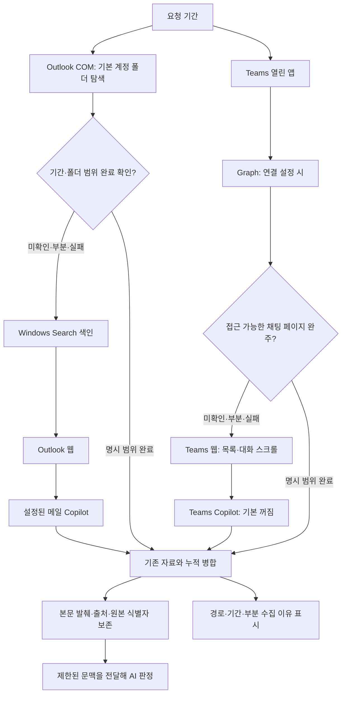

# LM25 v25.5 — 메일·Teams 수집 개선

2026-09-30. 이 버전은 읽을 수 있는 자료를 더 넓게 수집하고, 재시도 시 보존하며, 수집하지 못한 범위를 드러냅니다. 조직의 권한·라이선스를 새로 부여하거나 메일함 전체를 자동으로 보장하는 버전은 아닙니다.

## v25.5: 0건 제보에 따른 수정

LM25의 변경 때문에 기존 경로에서 읽을 수 있던 자료가 빠지는 경우를 합성 환경에서 재현했습니다. 아래는 코드에서 확인한 결함이며, 제보 PC의 실행 로그를 확인한 결과는 아닙니다.

| 위치 | 0건 또는 누락이 생기는 조건 | 수정 |
|---|---|---|
| Outlook CSV 저장 | 실행기는 `py -3`로 동작하지만 수집기는 Python을 못 찾음 | 실행 중인 Python을 전달하고, 단독 실행은 내장 Python·PATH·`py -3` 순으로 확인 |
| Outlook 기본 폴더 | 전체 저장소의 루트 조회만 실패해도 받은편지함·보낸편지함까지 버림 | 접근 가능한 기본 폴더는 계속 수집하고, 전체 범위는 미완료로 표시 |
| Teams 앱 날짜 | 날짜 구분선을 놓치거나 반복된 구분선·방 이름이 중복 제거되어 누락·오귀속 | 날짜·방 이름의 순서를 보존하고 창마다 구분. 날짜 미확인·기간 밖 제외 건수를 별도 기록 |
| Teams 상시 샘플러 | 기간 옵션이 없는데도 새 90일 제한으로 이전 대화를 제외 | 명시적으로 기간을 요청한 실행에만 기간 필터 적용 |
| Teams 웹 전환 | 그룹방 이름을 첫 참가자로 축약하거나, 이전 방의 메시지 수 변화만 보고 대기 종료 | 전체 방 이름/ID가 맞는지 기다림. 다른 방·확인되지 않은 방은 여전히 수집 제외 |
| 메일·Teams 분석 | 추가 본문의 ‘개인정보 처리 안내’ 등이 기본 제외 단어에 걸려 정상 제목 신호도 버림 | 해당 추가 본문만 AI 입력에서 제외하고 안전한 제목·요약은 유지. 사적인 제목 필터는 유지 |

**수집 카드의 0건과 분석 신호의 0건은 다릅니다.** 위 본문 필터는 이미 저장한 CSV 건수를 바꾸지 않고 분석 단계에 영향을 줍니다. 수집 카드부터 0건이면 수집 경로의 실패·생략·기간·실행 폴더를 먼저 확인해야 합니다.

실행한 LM25 폴더에서 아래 명령으로 저장된 결과만 확인할 수 있습니다. 앱·브라우저를 열거나 새 수집을 하지 않습니다.

```powershell
powershell -NoProfile -ExecutionPolicy Bypass -File collect\Diagnose-Collectors.ps1 -SavedOnly
```

`report/collect_diag.txt`에 CSV 건수, 요청 기간, 경로별 상태·사유, Teams 날짜 제외 건수가 기록됩니다. 메일 제목·본문·수신인과 채팅 내용은 이 모드의 출력에 넣지 않습니다. `blocked`·`failed`는 실패한 프로세스에서도 그대로 표시하며, Outlook 색인·웹·Copilot을 모두 COM으로 표시하던 안내도 수정했습니다.

새로 압축을 푼 배포본에는 과거 설치의 `data/`·`report/`·로그인 프로필이 포함되지 않습니다. 구버전에 쌓인 건수와 신규 설치의 첫 수집 건수는 같지 않을 수 있습니다. 기존 폴더를 지우지 말고 업데이트 시 개인 설정·자료를 보존하세요.

## 한눈에 보는 흐름



메일·일정은 따로 완료 여부를 판단합니다. 예를 들어 메일은 COM에서 완료했어도 일정이 미확인이면 일정만 보충합니다. 웹·Copilot 비활성, 로그인 필요, 시간 예산 소진은 생략·부분·실패로 남습니다. 일찍 얻은 한 행이나 새 CSV 파일만으로 전체 완료를 판정하지 않습니다.

## 달라진 내용과 실제 수준

| 영역 | 이전 취약점 | v25.4의 동작 | 여전히 확인할 수 없는 것 |
|---|---|---|---|
| 메일 COM | 받은편지함·보낸편지함 중심, 제목 단서 | 기본 Outlook 저장소의 하위 메일 폴더 탐색, 본문 발췌·메시지 ID·대화 ID·폴더 보존 | 다른 계정·공유 사서함·온라인 보관함 전체, 동기화되지 않은 자료, 첨부 본문 |
| 메일 폴더 범위 | 사용자 폴더의 메일 누락 | 기본 계정의 메일 폴더 재귀 탐색; 삭제·정크·임시보관·보낼편지함 제외 | 접근 거부 폴더·안전 상한 밖 폴더는 부분 표시 |
| Windows Search | 로컬 색인에 있는 자료만 보임 | 실제 색인 경로를 보충에 사용하고 기존 자료와 병합 | 전체 사서함 및 본문 보장 불가, 반복 일정 전개 한계 |
| Outlook 웹 | 목록 메타데이터, 재조회가 기존 CSV를 덮음 | 누적 저장; 선택적으로 열린 메일의 본문 영역을 식별해 발췌 | 기본은 메타데이터. DOM·로그인·검색 결과 범위에 의존 |
| Teams 앱 | 현재 화면 일부, 짧은 요약 | 화면 문맥과 추정 여부 보존, 자료를 얻어도 뒤 경로 보충 | 화면에 없는 전체 대화, 확정할 수 없는 날짜 |
| Teams 웹 | 대화 목록·스크롤 상한, 과거 날짜 도달 전 정지 | 가상 목록 탐색, 날짜를 포함한 중복 키, 기간 밖 메시지도 탐색 진행으로 인식, 페이지별 저장 | 숨긴/권한 없는 대화, UI 변경, 시간·건수·스크롤 상한 밖 기록 |
| Teams Graph | 오류·상한을 전체 성공과 구분하기 어려움 | 요청 생성일 범위의 페이지 탐색, 403·반복 페이지·상한 기록, 0건 정상과 조회 실패 구분 | `/me/chats` 범위 밖 채널 대화 및 권한 없는 자료 |
| Copilot 수집 | 응답을 원문과 혼동하기 쉬움 | 별도 출처 표시, 메타데이터·AI 제공 단서로 처리 | 누락 내용의 사실 확인, 전체 원문 보장 |
| AI 판정 | 100자 표시문 중심 | 별도 본문 발췌와 출처를 제한된 프롬프트에 전달 | 수집하지 못한 사실을 자동으로 검증해 채우지는 못함 |

`Graph 앱 연결 미설정`은 관리자 차단이 확인됐다는 뜻이 아닙니다. 조직이 Graph 접근을 허용하면 앱 연결·로그인이 필요하고, 허용하지 않으면 이용 가능한 COM·색인·웹·앱 경로만 사용합니다. Copilot을 통한 수집과 이미 모은 자료의 AI 판정은 별도 단계입니다. Teams Copilot 수집은 기본 꺼짐입니다.

## 본문과 AI가 읽는 양

```text
접근 가능한 원문 메시지
       │
       ├─ 화면 표시문: 기존 길이 유지(Teams 요약 200자, 분석 목록 100자)
       │
       └─ context_excerpt: 기본 최대 4,000자
                  │
                  └─ AI: 신호당 기본 800자, 앞·중간·끝 발췌
                       출처·생략 여부·시각 정밀도 함께 전달
```

첨부파일 내용은 이 수집 개선에 포함되지 않습니다. 긴 메일·긴 메시지는 발췌이므로 일부 문맥이 빠질 수 있습니다. AI가 제공받지 않은 대화를 이미 알고 있다는 전제로 판단하지 않습니다. 표본 선택·전체 프롬프트 예산도 적용되므로 저장된 모든 메시지가 매 요청마다 AI에 들어가는 것은 아닙니다.

기본 제외 단어가 추가 본문에 포함되면 `context_filtered=true`로 표시해 그 문맥을 전달하지 않습니다. 제목·요약이 안전하면 신호는 남지만, AI가 읽을 수 있는 본문 정보는 줄어듭니다. 제목·요약 자체가 제외 대상이면 기존대로 신호를 제외합니다.

Teams의 날짜 추정·날짜만 확인·AI 보고 시각은 ‘시각미확인’으로 구분합니다. 업무 내용 분류에는 남기되 시간 세션·PC 가동 하한·점심/저녁 흔적·야간 연장의 확정 시각 근거로 쓰지 않습니다.

## 사용과 설정

1. 새 LM25 폴더에서 `config/config.default.json`을 `config/config.json`으로 복사하고 본인 설정을 입력합니다. 기존 설치를 업데이트할 때는 개인 설정·자료를 별도로 보관하고 코드만 업데이트합니다.
2. 클래식 Outlook은 본인 프로필로 켜둡니다. 웹 경로는 전용 Edge 프로필에서 회사 계정 로그인 상태를 확인합니다.
3. 조회할 기간을 정해 분석을 실행합니다. 수집 후 대시보드의 **메일·Teams 수집 범위**를 확인합니다.
4. ‘부분 수집’의 이유를 보고 로그인·수집 기간·예산을 조정해 다시 실행합니다. 재시도 결과는 기존 자료와 합쳐집니다.

| 설정 | 기본 | 의미 |
|---|---:|---|
| `collection.contextChars` | 4000 | 수집 본문 발췌 상한. 분석 입력은 최대 4000자 보존 |
| `collection.aiContextChars` | 800 | 신호 하나의 AI 문맥 예산, 전체 프롬프트 예산도 적용 |
| `collection.mailAllFolders` | true | 기본 Outlook 계정의 하위 메일 폴더 탐색 |
| `collection.mailBody` | true | COM 메일 본문 발췌. `storeSubject=false`이면 본문도 저장하지 않음 |
| `collection.mailWebBody` | false | 웹 본문 읽기. **true이면 메일을 열기 때문에 읽음 상태가 바뀔 수 있음** |
| `collection.supplementBudgetSec` | 1200 | COM 이후 메일 보충 경로 총 예산(초) |
| `collection.teamsBudgetSec` | 1500 | Teams 경로 총 예산(초) |
| `teamsWebMaxChats` | 200 | 웹 대화방 탐색 상한 |
| `teamsWebMaxScrolls` | 80 | 대화별 메시지 스크롤 안전 상한 |
| `teamsWebBudgetSec` | 900 | Teams 웹 자체 시간 예산(초) |
| `preferApp` | true | Teams 열린 앱의 현재 관측을 먼저 보존한 뒤 보충 |
| `collectOnlyHeadless` | true | 추가 PC 수집에서는 웹·Copilot 창 생략 |

‘추가 PC 수집’은 기본적으로 COM·색인·열린 앱·설정된 Graph만 사용합니다. 그 PC에서 웹까지 보충하려면 일반 실행이나 웹 읽기 버튼을 사용합니다. 같은 계정도 PC별 Outlook 동기화, 검색 색인, 열린 Teams 화면, 전용 Edge 로그인, 누적 기록이 다르면 결과가 달라질 수 있습니다.

## 완료의 의미와 데이터 보존

- `complete`: 그 수집기가 명시한 요청 기간·접근 범위를 끝까지 확인. 조직 전체 또는 본문 전체를 뜻하지 않습니다.
- `partial`: 일부 관측만 확인. 앱·웹·Copilot은 전체 서버 범위를 증명할 수 없어 기본적으로 이 상태입니다.
- `failed` / `blocked`: 실행 실패 또는 접근·로그인 조건 미충족.
- `skipped`: 설정·실행 옵션·예산 또는 앞 경로의 범위 완료로 생략.

`data/collection_status/`에 경로별 최근 상태가 저장됩니다. 화면 조회 기간이 다르면 ‘다른 기간 기록’으로 표시합니다. 상태는 마지막 관측 시점의 결과이며 실시간 서버 전체와 대조한 인증서는 아닙니다.

CSV는 기존 행과 새 행을 합친 뒤 임시 파일을 원자적으로 교체합니다. 짧은 재조회·실패·좁은 기간 요청으로 이전 행을 지우지 않습니다. 동일 식별자의 긴 문맥과 정확한 시각을 더 약한 보충 결과로 덮지 않습니다. 서로 다른 명시 ID·계정·대화는 약한 제목 키로 합치지 않습니다. 원본 ID 체계가 다른 Graph·웹·앱 자료는 동일 메시지임을 확정할 수 없으면 중복 후보가 남을 수 있습니다. 삭제·수정 사항의 완전한 서버 동기화 기능은 아닙니다.

검증은 합성 TEMP 자료, 가짜 Graph 응답·DOM, PowerShell 저장 경로, 분석·AI 프롬프트 생성, 실제 UI 렌더 함수에 대해 수행합니다. 회사 메일·Teams·Copilot의 실제 연결 성공은 이 검증에 포함되지 않습니다.
