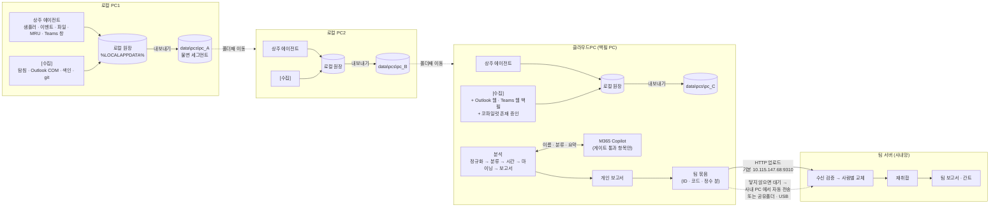
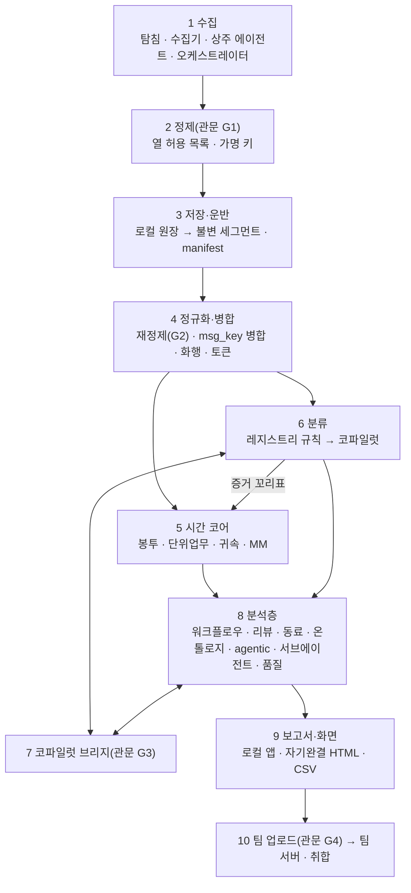
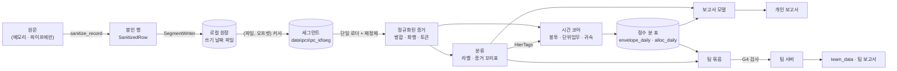
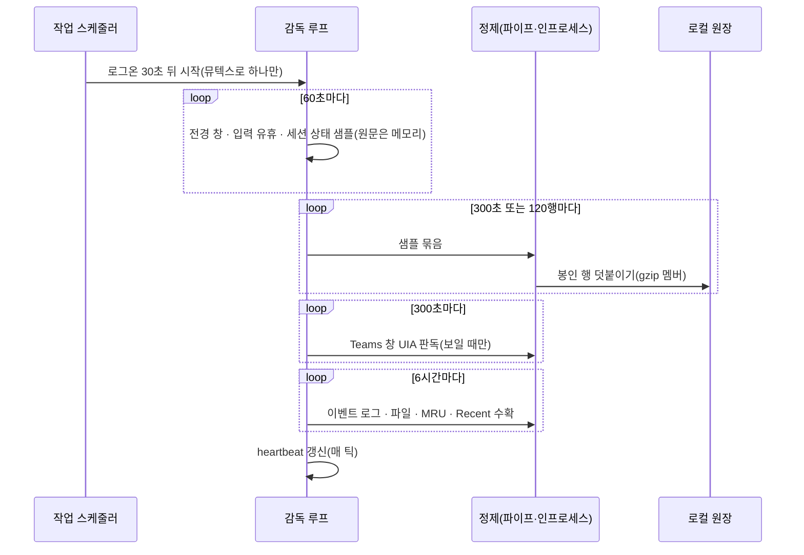
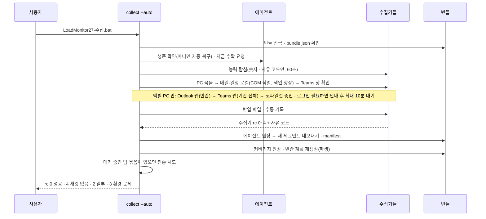
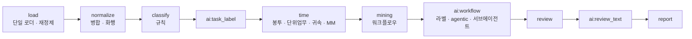
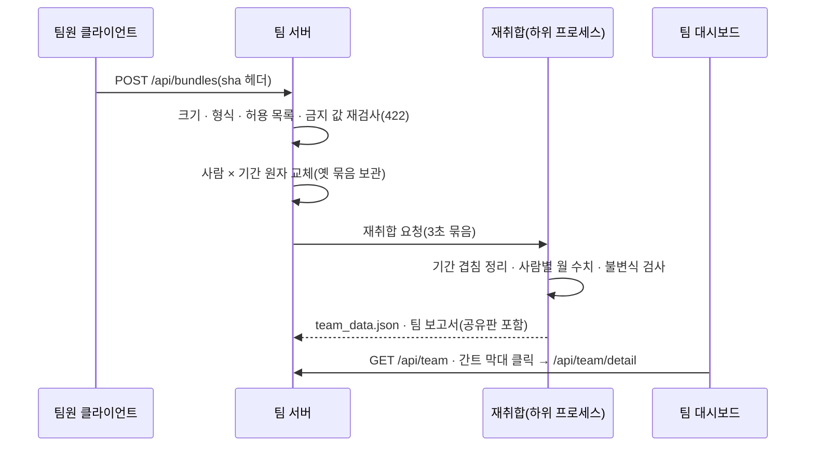
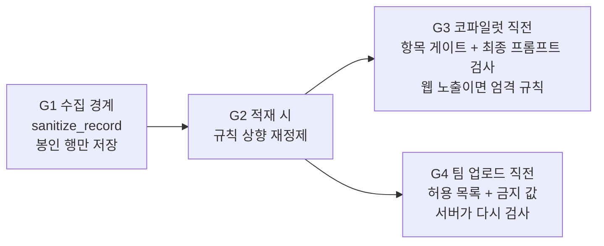

# LM27 전체 구조 (ARCHITECTURE.md)

| 항목 | 내용 |
|---|---|
| 판 | v1.0 (2026-10-05) — 설계 확정, 구현 전 |
| 독자 | LM27 을 처음 보는 사람, 구현자, 심사자 |
| 정본 | 이름·형식·키·코드가 이 문서와 다르면 **`docs\CONTRACT.md` 가 이긴다.** 이 문서는 사람이 읽는 설명이다 |
| 자리표시자 | 본인 홍길동 · 동료 김철수 · 과제A · 고객사A · example.com |

---

## 1. 목적 — 한 페이지

**LM27(LoadMonitor27)은 담당자 한 사람의 디지털 업무 신호로 '언제, 무슨 일을, 얼마나 했는지'를 추정해 개인 보고서와 팀 보고서를 만드는 도구다.**

### 1.1 무엇을 하나

- **모은다.** 팀즈 대화, 메일·일정, PC 사용 이력(상용·미지 프로그램 전경 사용, 문서 저장, git 커밋, 연산 작업)을 PC 마다 모은다. 한 사람이 PC1·PC2·클라우드PC 를 오가며 써도 된다.
- **거른다.** 저장하기 전에 개인정보(전화·계좌·주민·여권 등), 고객정보(수주 금액 등), 사적 대화, 광고 메일을 메모리 안에서 지운다. 코파일럿에 보내기 전에 한 번 더 거른다.
- **잰다.** 하루 근무 시간(**근무 봉투**)과 단위 업무(언제 시작해 언제 끝났고 실제로 몇 시간 투입했는지)를 추정한다. 1MM = 하루 8시간 × 그 달 근무일. 야간·주말·연장은 따로 센다.
- **나눈다.** 업무를 **업무 영역 → 과제 → 역할 업무 → 단위 업무**, 그리고 직교 축인 **업무 유형**으로 분류한다.
- **보여 준다.** 개인 보고서(시간·MM·초과 대시보드, 계층별 워크플로우, 주간·월간 리뷰, 같이 일한 동료, 업무 연관 그래프, agentic AI 매칭과 새 니즈, 서브에이전트 도입 검토)와 팀 보고서(영역별 MM 투입, 역할·단위·유형 분포, agentic 니즈 취합, 담당자별 다월 간트 → 막대를 누르면 그 사람의 그 업무 워크플로우).

### 1.2 왜 어려운가(사용자 원 요구의 주의사항)

| 어려움 | LM27 의 답 |
|---|---|
| MS 데이터가 어떤 사람은 읽히고 어떤 사람은 안 읽힌다(버전·색인·새 Outlook·정책). Graph 권한은 없다 | **능력 탐침**으로 PC 마다 '되는 경로·안 되는 이유'를 숫자와 사유 코드로 먼저 잰다. 경로를 **역할 분담**(로컬 색인 항상 + COM 정밀 → 빈칸만 웹 → 코파일럿은 존재 증인 → 반입 파일)하고, 일자×출처 **커버리지 원장**으로 빈칸을 추적한다 |
| 오프라인 지시·보고는 디지털 신호에 안 잡힌다 | 시작·종료 근거를 등급(A~E)으로 표시하고, 회의·조용한 기간·다음 의뢰 같은 대체 근거로 추정하며, 애매하면 **확인 질문**으로 사람에게 묻는다 |
| 병행 업무를 각각 세면 MM 이 부푼다 | 하루의 5분 슬롯 합집합(봉투)을 먼저 만들고, 그 슬롯을 업무에 **나누기만** 한다(Σ귀속 = 봉투, 날마다 검사) |
| 퇴근 후·새벽 메일 같은 예외 근무 | 능동 산출 신호(발신·저장·커밋·업무 앱 사용)가 있을 때만 그 신호들을 잇는 구간으로 인정한다 |
| 코파일럿 입출력 한도·오류 | 5계층 브리지(패킹·반분·재질의·저널·재개·예산), 완료 판정은 보수적으로, 막히면 **수동 붙여넣기** 대체 경로, 그래도 안 되면 규칙 라벨로 끝까지 간다 |
| 여러 PC | PC 마다 불변 세그먼트를 쌓고 **폴더째 옮긴다.** 다른 PC 자료는 건드리지 않는다 |

### 1.3 열 가지 원칙

1. **문서화·지원되는 사용자 인터페이스만** 읽는다(앱 내부 캐시·숨김 폴더·자격 증명·관리자 권한·정책 우회 금지).
2. **원문은 메모리에만.** 디스크에는 정제기를 통과한 열 허용 목록만 쓴다.
3. **첫 성공에서 멈추지 않는다.** 경로를 역할 분담하고 키로 병합하며 빈칸을 원장으로 관리한다.
4. **미관측은 0시간이 아니다.** 못 읽은 날과 일이 없던 날을 구분한다. 날짜만 아는 신호·코파일럿 요약은 시간 근거가 아니다.
5. **근무 봉투와 귀속을 나눈다.** 리드타임(의뢰~보고 경과)과 투입 시간을 따로 잰다.
6. **코파일럿은 이름·분류·요약만** 한다. 시간·MM 은 결정적 로컬 코드가 계산한다.
7. **불변 세그먼트 + 폴더째 이동.** 두 번들을 합쳐도 같은 결과(멱등)다.
8. **개인 = 팀.** 팀 보고서의 숫자는 개인 보고서와 같은 정수 분 표에서 나온다.
9. **사람이 하는 일은 로그인 한 번과 확인 질문 응답뿐.** 다른 사용자에게 수동 조작을 요구하지 않고 스스로 복구한다.
10. **관문을 1일차부터.** 시간 보존, 개인=팀, PII 카나리아 0건, 설정 키 단일 레지스트리, 인코딩, 합성 E2E 가 머지를 막는다.

---

## 2. 흐름 — PC1 → PC2 → 클라우드PC → 팀 서버

- **상주 에이전트**는 PC 마다 한 번 설치하면 매일 돌며 PC 사용 이력과 Teams 창을 그 PC 의 `%LOCALAPPDATA%` 에 쌓는다. 프로그램 폴더를 옮겨도 끊기지 않는다.
- **[수집]** 은 사용자가 그 PC 에 폴더가 있을 때 누르는 한 번의 실행이다(bat 더블클릭, 무질문). 메일·일정 로컬 경로를 읽고, 에이전트 원장을 번들 세그먼트로 내보내고, 빈칸 원장을 다시 만든다.
- **백필 PC**(기본 클라우드PC)만 계정 단위 자료의 기간 전체를 웹으로 채우고 코파일럿에 로그인한다. PC1·PC2 는 그 PC 이력과 로컬 경로만 맡는다. 겹치는 메일·메시지는 `msg_key` 로 병합된다.
- 팀 서버에는 **정제된 집계와 라벨만** 간다. 원문·시각 로그·개인 키는 가지 않는다.

---

## 3. 계층별 책임

| 계층 | 하는 일 | 하지 않는 일 | 코드 | 명세 |
|---|---|---|---|---|
| 1 수집 | PC 능력 탐침, 경로별 수집기 실행, 상주 에이전트(샘플·수확), rc 를 원장 상태·빈칸 계획으로 번역, 단계 감시 | 원문 저장, 시간 추론, 분류 | `collect\*`, `lm27\collect\`, `lm27\agent\` | COLLECTION · COLLECT_MAIL · COLLECT_TEAMS · COLLECT_PC |
| 2 정제 | PII·고객정보 토큰 치환, 사적·광고 판정, HMAC 가명 키, 열 허용 목록 행(봉인) 생성, 감사 건수 | 판정 결과를 원문과 함께 남기기 | `lm27\privacy\`, `lm27_pipe.py` | PRIVACY |
| 3 저장·운반 | 봉인 행을 PC 로컬 원장에 덧붙임, [수집] 때 불변 세그먼트로 내보냄, manifest·pc.json, 이동·합치기·소급 가림 | 다른 PC 자료 수정 | `lm27\store\`, `lm27\bundle\` | TEAM_AND_BUNDLE |
| 4 정규화·병합 | 단일 로더로 읽기, 규칙 상향 재정제, 같은 메시지 병합(출처 신뢰 순위), 화행 판정, 토큰 파생, 근태 대응 | 세그먼트 덮어쓰기 | `lm27\normalize\` | CONTRACT §2.7 |
| 5 시간 코어 | 근무 봉투(5분 슬롯), 단위업무 형성(시작·종료 근거·등급), 슬롯 귀속, MM·초과·가용, 확인 큐, 설명 원장 | 분류(라벨만 받아 롤업) | `lm27\time\` | WORKTIME_METHOD |
| 6 분류 | 레지스트리 병합, 결정적 규칙 분류, 명명 군집, 코파일럿 task_label, 새 과제 제안 큐, 사용자 수정 학습 | 시간 값 변경 | `lm27\hier\` | HIERARCHY |
| 7 코파일럿 브리지 | Edge 세션·전송·완료 판정·검증·재시도·저널·재개·예산, 수동 붙여넣기, 전송 직전 재검사 | 시간·MM 전송, 사용자 대신 로그인 | `lm27\bridge\` | COPILOT_BRIDGE |
| 8 분석층 | 과정 마이닝, 리뷰·초과 원인, 동료, 온톨로지·연관도, agentic 매칭·니즈, 서브에이전트 5기준, 측정 품질 | 새 시간 만들기, '절감 MM' 같은 수치 | `lm27\report\analysis\` | REPORTS |
| 9 보고서·화면 | 로컬 앱 6화면(127.0.0.1), 개인 보고서 모델·내보내기(전체판·가림판), 근거 드릴다운 | 외부 CDN, 원문 표시 | `lm27\report\`, `lm27\ui\`, `web\` | REPORTS |
| 10 팀 | 팀 묶음 빌드(허용 목록), 미리보기 = 실전송, 대기열·재시도·대체 주소·오프라인, 팀 서버 수신 검증·취합·팀 보고서·간트 | 원문·개인 키 수신 | `lm27\team\` | TEAM_AND_BUNDLE · REPORTS §7 |
| 공용 | 경로 로더, 설정 레지스트리, 원자 쓰기, 시간대, 자식 프로세스, 표준 출력 이벤트, 진입점 | — | `lm27\paths.py` `lm27\config.py` `lm27\util\` `lm27_cli.py` | CONTRACT |

---

## 4. 데이터 흐름

### 4.1 어디에 무엇이 남나

| 위치 | 내용 | 원문 | 어디까지 가나 |
|---|---|---|---|
| 프로세스 메모리 | 메일 본문·대화·창 제목·파일 경로 | 있음 | 어디에도 쓰지 않는다 |
| `%LOCALAPPDATA%\LoadMonitor27\agent\store\` | 정제된 행(로컬 원장) | 없음 | 그 PC 에 남고, [수집] 때 번들로 복사 |
| `data\pcs\<pc_id>\seg\` | 정제된 행(불변 세그먼트) | 없음 | 폴더와 함께 본인 PC 사이를 이동 |
| `data\keys\` | 가명 키링·업로드 토큰 | — | 폴더와 이동, **어떤 반출에도 넣지 않음** |
| `data\local_only\` | 동료 표시명 사전, 사적방 목록, 분류 수정 기록 | 표시명(로컬 전용) | 반출 금지 |
| `data\derived\` | 커버리지 원장, 빈칸 계획, 분석 결과 | 없음 | 언제든 다시 만든다 |
| `data\ai\` | 코파일럿 답(정제·검증 후) | 없음 | 보존, 번들 합치기 때 합집합 |
| `out\personal\` | 개인 보고서 전체판·가림판 | 전체판에 동료 표시명 | 본인 선택으로만 공유 |
| M365 Copilot | 게이트를 통과한 항목(가명 토큰·라벨) | 없음 | 시간·MM·개인 키는 보내지 않는다 |
| 팀 서버 | 팀 묶음(ID·코드·정수 분·정제된 단위업무 제목) | 없음 | 팀 보고서 |

---

## 5. 실행 시나리오

### 5.1 첫 설치 — 모든 PC(클라우드PC 포함) 첫날

1. `LoadMonitor27-에이전트설치.bat` 더블클릭(5초 안팎).
2. PC 식별(`pc_id`), 에이전트 실행 사본(동봉 파이썬·정제기)을 `%LOCALAPPDATA%\LoadMonitor27\agent\bin\` 에 복사, 하위 키 기록, 샘플러 자기 시험(py → ps), 작업 스케줄러 `LM27-<install_id>` 등록.
3. 번들에는 `pc.json` 최소 정보만 쓴다. 수집·탐침은 하지 않는다.
4. 에이전트가 살아나기 전 기간은 원장에 '미관측'으로 남는다(0시간이 아니다).

### 5.2 매일 — 상주 에이전트

죽거나 멈춘 에이전트는 다음 [수집]이나 화면이 생존 세 조건(등록·실행 경로·신선도)으로 알아채고 스스로 다시 등록한다. 사람은 아무것도 하지 않는다.

### 5.3 [수집] 한 번

- 각 단계는 끝날 때 결과 파일(`stage_result_<stage>.json`)을 남긴다. 예산·상한에 걸리면 '부분'으로 남기고 다음에 이어 읽는다.
- 같은 날 같은 사유로 막히면 '불가(잠정)', 서로 다른 날 두 번이면 '불가(확정)'이 되어 빈칸 계획이 다른 경로를 배정한다. 탐침 값이 바뀌면 자동으로 풀린다.

### 5.4 폴더 이동과 합치기

1. `LoadMonitor27-이동준비.bat`: 화면 서버를 멈추고, 폴더를 잡고 있는 프로세스를 찾아 보여 주고, `move_ready.json`(세그먼트 목록·sha)을 쓴다. 에이전트는 계속 돈다.
2. 폴더째 복사(드래그·USB·공유).
3. 도착 PC 첫 실행이 누락 세그먼트를 이름별로 보여 준다(다시 넣으면 해소).
4. 같은 번들을 두 곳에서 따로 수집했다면 `bundle merge` 로 합친다(합집합, 두 번 해도 같음).

### 5.5 분석 — 클라우드PC

- `ai:*` 단계는 코파일럿 브리지를 부른다. 클라우드PC 에서 사람이 Edge 전용 프로필에 한 번 로그인해 두면 된다. 원격 디버깅이 막힌 PC 는 **수동 붙여넣기**(프롬프트 파일 → 사람이 붙여넣고 답을 붙여넣기)로, 그것도 안 되면 규칙 라벨로 끝까지 간다.
- 결과는 `data\derived\analysis\<run_id>\` 에 쌓이고, 성공하면 '지금 보는 결과'(`current.json`)가 바뀐다.
- 확인 질문에 답하면 몇 초 뒤 코파일럿 없이 빠른 재분석(분류부터)이 돈다.

### 5.6 팀 업로드

1. `team build`: 허용 목록 빌더가 팀 묶음을 만든다(ID·코드·정수 분·정제된 단위업무 제목). 정제 게이트 G4 로 다시 검사한다.
2. 화면의 **미리보기 = 실전송 바이트**(sha 가 세 곳에서 같다). 항목별로 제목 가리기·빼기가 된다. 첫 전송은 사용자가 승인한다.
3. 전송 전에 `/api/hello` 로 상대가 LM27 팀 서버인지 확인한다. 이전 판 서버나 다른 앱이면 보내지 않고 사유를 보여 주며 대체 주소를 순서대로 시도한다.
4. 닿지 않으면 대기열에 두고 재시도한다. 클라우드PC 에서 사내 서버가 안 닿으면 폴더가 사내 PC 로 돌아와 [수집]이 끝날 때 **자동으로** 보낸다. 공유폴더·USB 오프라인 내보내기도 된다.

### 5.7 팀 취합

서버는 포트를 배타적으로 잡고, 포트가 점유되면 원인 프로세스와 대체 포트를 제안한다. 외부 요청이 오랫동안 없으면 '방화벽 차단 의심'을 진단한다.

---

## 6. 실패·복구 원칙

**세 가지 태도.** 개인정보와 시간 보존은 **fail-closed**(의심되면 멈추거나 버린다), 코파일럿은 **fail-soft**(규칙 라벨로 끝까지 간다), 수집 공백은 **fail-visible**(사유 코드로 남기고 숨기지 않는다).

| 상황 | 일어나는 일 | 사람이 할 일 |
|---|---|---|
| Outlook COM 이 무한 대기(구판 등록·마법사) | 자식 프로세스 20초 워치독이 끊고 `R-WIZARD`·`R-NOPROF`, 색인·웹으로 빈칸 배정 | 없음 |
| 새 Outlook 전용·색인 꺼짐·온라인 모드 | `blocked`(R-NEWOL·R-NOIDX·R-ONLINE), 백필 PC 의 Outlook 웹에 빈칸 배정 | 없음 |
| 웹 로그인 필요 | `R-LOGIN` 안내 후 최대 10분 대기, 로그인 전에는 '불가'로 확정하지 않음 | 전용 Edge 창에서 로그인 한 번 |
| Edge 원격 디버깅 정책 차단 | `R-EDGEPOL`, 코파일럿은 수동 붙여넣기, 메일·일정은 반입 파일 | 붙여넣기(선택) |
| 코파일럿 무라이선스·커넥터 없음 | 증인 경로 자동 꺼짐(`R-NOLIC`·`R-NOCONN`), 분석은 붙여넣기·규칙 | 없음 |
| 에이전트 정지·좀비 | 생존 세 조건으로 감지, 작업 재등록·재기동 | 없음 |
| 정제기 실패 | 그 묶음은 저장하지 않고 다음 주기에 다시 수집('정제기 실패' 표시) | 없음 |
| 세그먼트 변조·manifest 손상 | 변조분 격리, manifest 는 이전 판 → 전수 재구성 | 없음 |
| 두 실행이 동시에 | 번들 쓰기 잠금으로 대기 | 없음 |
| 번들이 읽기 전용 위치 | 번들 쓰기 중단, rc 3 + `R-BUNDLE-READONLY` | 폴더를 쓰기 가능한 곳으로 |
| 팀 서버 자리에 다른 앱 | 전송하지 않음(`wrong_server`), 대체 주소 시도 | 필요하면 주소 설정 |
| 시간 보존 법칙 위반 | 분석 중단(fail-closed), 로그 기록 | 없음(버그 신고) |
| 예산·상한 소진 | `partial` 로 남기고 다음 실행이 이어 읽음 | 없음 |

공통 규칙: 성공하기 전에는 이전 결과를 지우지 않는다. 빈 값으로 덮지 않는다. 재개는 입력 서명으로 판단한다. 모든 자식 프로세스는 감시되고(30초 하트비트, 15분 정체·45분 무진전이면 종료), 종료는 프로세스 트리째 한다.

---

## 7. 보안·개인정보 경계 요약

### 7.1 읽지 않는 것

Graph, Teams 내부 캐시(IndexedDB·LevelDB), 알림 DB(wpndatabase.db), OST/PST 직접 파싱, 숨김 메일 폴더, 자격 증명, 관리자 권한이 필요한 것, 보안 정책 우회. 다른 사용자의 자료(git 은 본인 신원만, 라이선스는 본인 행만).

### 7.2 저장하지 않는 것

메일·대화 본문 원문, 창 제목 원문, 파일 전체 경로, 주소·이름 평문(가명 키로만), 금액·계좌·전화 등 PII(토큰으로 치환), 사적·친목으로 판정된 텍스트, 광고 메일(건수만 감사).

### 7.3 네 개의 관문

- **가명 키 2층**: 본인 키링(PC1·PC2·클라우드PC 가 같은 키를 써야 병합이 된다 — 폴더와 이동하지만 어떤 반출에도 넣지 않음, 에이전트에는 하위 키만)과 팀 pepper(동료 가명이 팀원마다 같도록 팀 레지스트리로 배포).
- **카나리아 관문**: 합성 카나리아 문자열을 넣은 E2E 에서 세그먼트·프롬프트·팀 페이로드·가림판 보고서에 0건이어야 한다.
- **사람이 확인할 남은 결정**: 키링을 폴더와 함께 옮기는 해석, 코파일럿 전송 허용(사내 정보보안), 팀 서버 읽기 공개 범위와 평문 HTTP — `CONTRACT.md §12.1`.

---

## 8. 문서 지도

| 문서 | 다루는 것 | 먼저 읽을 사람 | 핵심 절 |
|---|---|---|---|
| **CONTRACT.md** | 단일 진실 원천: 배치·모듈·스키마·ID·설정 키·코드·진입점·rc·인코딩·불일치 해소·관문 | 모든 구현자 | §0 우선순위 · §10 해소 표 · §11 관문 |
| **ARCHITECTURE.md** | 이 문서: 목적·흐름·계층·시나리오·복구·보안 요약 | 처음 보는 사람 | 전부 |
| COLLECTION.md | 수집 공통 계약: 경로 ID, 공통 레코드의 뜻, 능력 탐침·사유 코드, 커버리지 원장, 빈칸 계획기, 병합, 오케스트레이션, 페르소나 시험 | 수집기 구현자 | §2 · §4 · §5 · §6 · §8 |
| COLLECT_MAIL.md | 메일·일정 9경로(COM·색인·OWA·코파일럿·반입), A단/B단, 로캘 무관 필터 | 메일 수집기 구현자 | §5 · §6 · §11 |
| COLLECT_TEAMS.md | 팀즈 경로(UIA·웹·코파일럿), 방향·대화 유형 판정, 날짜 미상 격리, 화행 어미 규칙 | 팀즈 수집기 구현자 | §4 · §7 · §8 |
| COLLECT_PC.md | 상주 샘플러·이벤트 수확·문서 증거·MRU·git·연산·수동 기록·프로그램 카탈로그 | PC 수집기·에이전트 구현자 | §3 · §4 · §5 · §6 |
| PRIVACY.md | 정제 규칙·저장 열 허용 목록(열의 정본)·HMAC 키·게이트 G1~G4·감사·회귀 말뭉치 | 모든 구현자(저장·전송 코드) | §3 · §9 · §10 · §13 · §14 · §18 |
| COPILOT_BRIDGE.md | 코파일럿 5계층 브리지, 단계 틀, 완료 판정, 재시도·재개·예산, 수동 붙여넣기, 가상 시계 시험 | 브리지 구현자 | §4~§7 · §9 · §10 · §11 |
| TEAM_AND_BUNDLE.md | 운반 번들·상주 에이전트 배치, 이동·합치기, 팀 묶음 스키마, 팀 서버·취합·오프라인 | 번들·팀 구현자 | §1 · §2 · §3 · §4 |
| WORKTIME_METHOD.md | 근무 봉투·단위업무·귀속·MM·초과·확인 큐·설명 원장, 83개 골든 시나리오 | 시간 코어 구현자 | §3 · §4 · §5 · §6 · §9 |
| HIERARCHY.md | 업무 계층 모델, 레지스트리, 규칙 분류기, task_label·과제 체계 부트스트랩, 병합 거버넌스, 학습 | 분류 구현자 | §1 · §2 · §4 · §6 · §9 · §11 |
| REPORTS.md | 로컬 앱 6화면, 개인·팀 보고서, 분석층 산식, 디자인 시스템, 산출 파일 | 화면·보고서 구현자 | §4 · §5 · §6 · §7 · §8 · §9 |

**읽는 순서.** 처음이면 이 문서 → CONTRACT §0·§1·§2 → 맡은 영역의 명세. 수집을 맡으면 COLLECTION → PRIVACY §3·§10 → COLLECT_* 하나. 분석을 맡으면 WORKTIME → HIERARCHY → REPORTS §4. 명세끼리 다르면 언제나 CONTRACT §10 을 먼저 본다.

---

## 9. 용어

| 용어 | 뜻 |
|---|---|
| 번들 | 프로그램 폴더 `data\` 안의 PC 별 불변 세그먼트 묶음. 폴더째 옮긴다 |
| 세그먼트 | 정제된 증거 행을 담은 불변 `.jsonl.gz` 파일(PC·kind 별) |
| 상주 에이전트 | PC 마다 한 번 설치되어 매일 PC 이력·Teams 창을 쌓는 작업 |
| 백필 PC | 계정 단위 자료(메일·팀즈·일정)를 웹으로 기간 전체 채우는 PC, 기본 클라우드PC |
| 경로 ID | 증거 출처 이름(예 `mail.com`, `teams.web`, `pc.sampler`) 21종 |
| 능력 탐침 | 수집 전에 그 PC 에서 각 경로가 되는지 숫자·사유 코드로 재는 단계 |
| 커버리지 원장 | 계정 × 날짜 × 종류 × 출처 × PC 셀마다 '읽음·0건·막힘·안 해 봄'을 적은 파생 장부 |
| 근무 봉투 | 하루 동안 일한 5분 슬롯의 합집합(모든 PC·경로) |
| 귀속 | 봉투 슬롯을 단위 업무에 나누는 것. 합이 봉투와 같아야 한다 |
| 업무 영역 · 과제 · 역할 업무 · 단위 업무 · 업무 유형 | 개발/양산/외부지원/공통/AX(+미분류) · 팀 레지스트리 ID · 과제 × 분야 × 기능 · 시작·종료 근거와 투입을 가진 인스턴스 · 개발·사무·현장·PM·PL·지원·교육 |
| 리드타임 · 투입 | 의뢰부터 보고까지 경과 시간 · 실제로 귀속된 작업 시간 |
| 확인 질문 | 애매한 경계·분류를 사람에게 묻는 큐(시간 Q01~Q18, 분류 H01~H06) |
| 게이트 | 저장·코파일럿·팀 업로드 직전의 정제 재검사 관문 |
| 팀 묶음 | 팀 서버로 보내는 허용 목록 JSON(`lm27.team_bundle`) |
| 1MM | 8시간 × 그 달 근무일(공휴일 제외). 초과 근무로 1MM 을 넘을 수 있다 |
