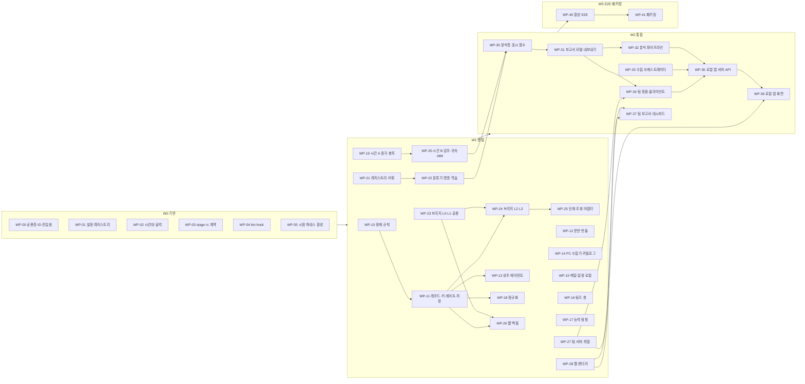

# LM27 구현 계획 (IMPLEMENTATION_PLAN.md)

| 항목 | 내용 |
|---|---|
| 판 | v1.1 (2026-10-05) — W0 통합 창 처리. v1.1 = §7 CR-01~CR-16 채택 표시(계약 v1.1), W0 에서 새로 생긴 이음매(`lint.ps1` ↔ `tests\fixtures\tree.py`)와 W1·W2 로 넘기는 항목을 각 WP '주의'에 'v1.1' 줄로 추가. v1.1 반증 점검 = W0 코드와 다시 대조해 기본 진입 bat 이름(`LoadMonitor27-UI.bat` — 계약 X-341)·UTC 문구(계약 §9.1)·WP-05 복제 범위·store 삭제 함수 자리(계약 O-16)·관문 정적/동적 경계(계약 X-342)를 맞춤. v1.0.1 = 반증 점검 보정(시험 파일 소유 겹침 해소, 계약 v1.0.1 X-300~X-317 반영) |
| 지위 | **작업 분할의 정본.** 누가 어느 파일을 어느 파동에 만드는가를 정한다. 이름·형식·키·코드·rc 는 `docs\CONTRACT.md` 가 정본이며, 이 문서와 다르면 계약이 이긴다 |
| 독자 | 오케스트레이터, 병렬 구현 에이전트, 심사자 |
| 근거 | CONTRACT v1.1 · ARCHITECTURE v1.0 · 명세 10종 · 결정 메모(계약 §0.4 D-1~D-19 요약) · 사용자 원 요구 |
| 범위 | 작업 패키지(WP) **35개**, 파동 4개(W0 기반 · W1 병렬 · W2 통합 · W3 E2E·패키징) |
| 제품 | LoadMonitor27(LM27) · 트리 `D:\배포\loadmon27` · 브랜치 `lm27` · 파이썬 패키지 `lm27` |
| 자리표시자 | 본인 홍길동 · 동료 김철수 · 과제A~F · 고객사A · 협력사 · example.com |
| 별개 프로젝트 | `D:\배포\LM26` 은 다른 도구의 별개 프로젝트다. **읽지도 쓰지도 않는다.** 이전 판 폴더(`loadmon2x`)는 읽기 전용 |

---

## 0. 읽는 법

### 0.1 용어

| 용어 | 뜻 |
|---|---|
| **WP** | 작업 패키지. 한 에이전트가 맡는 단위. 소유 파일 목록·읽을 명세·의존·이식 참조·완료 기준·규모를 가진다 |
| **소유 파일** | 그 WP 만 만들고 고치는 파일. 모든 파일은 정확히 한 WP 가 소유한다(겹침 0 — §8 대조표) |
| **착수 의존** | 그 WP 가 끝나야 시작할 수 있는 WP. 실제 코드를 import 해야 시험이 되는 경우 |
| **통합 의존** | 계약 시그니처로 먼저 짜고, 자기 시험은 가짜(자기 `tests\` 안)로 돌리며, 상대가 끝나면 실물로 다시 확인하는 WP |
| **통합 창** | 파동 끝의 관문 실행 + 변경 요청 처리 구간(§6). 다음 파동은 통합 창을 통과한 뒤 시작한다 |
| **CR** | 변경 요청. 남이 소유한 파일·계약을 바꿔야 할 때 직접 고치지 않고 보고에 적는다(§3.3, 착수 전 결정이 필요한 것은 §7) |
| **규모** | S(코드+시험 < 1,000줄) · M(1,000~2,500) · L(2,500~4,500) · XL(> 4,500). 줄 수는 ±50% 예상치 |

### 0.2 표기

- 명세 약칭은 계약과 같다: **계약** CONTRACT · **C** COLLECTION · **CM** COLLECT_MAIL · **CT** COLLECT_TEAMS · **CP** COLLECT_PC · **P** PRIVACY · **B** COPILOT_BRIDGE · **TAB** TEAM_AND_BUNDLE · **W** WORKTIME_METHOD · **H** HIERARCHY · **R** REPORTS. 결정 메모는 docs 밖에 있으므로 구현자는 **계약 §0.4 D-n** 으로 인용한다.
- 관문·시험 이름은 계약 §6.2 이름공간을 따른다: 계약 lint `L-01`~`L-30`, 계약 불변식 `T-01`~`T-24`, 명세 시험은 명세 접두를 붙인다 — `P-T19` · `B-T01` · `TAB-B01`(번들) · `TAB-U01`(팀 묶음) · `TAB-S01`(서버) · `TAB-A01`(취합) · `TAB-O01`(오프라인) · `W-G5` · `HG01`(H 골든) · `T-H01` · `G-H1` · `RPT-01` · `G-R1` · `G-B1` · `C-P1`(C 페르소나) · `CM-1` · `CT-1` · `CP-1`.
- 경로 별칭:

| 별칭 | 경로 | 성질 |
|---|---|---|
| `<ROOT>` | `D:\배포\loadmon27` | 개발 트리 |
| `<SURVEY>` | `%TEMP%\claude\D----\64a51721-9ee5-4a94-9a38-158457bc0490\scratchpad\lm26_survey` | 설계 조사·참조 구현(임시 폴더 — §9 위험 1) |
| `<DESIGN>` | `<SURVEY>\design` | 참조 구현(worktime_sim.py · worktime\ · A_ledger · B_graph · C_context_timeline · copilot_bridge · team_bundle_lm27 · hierarchy_lm27 · privacy · privacy_lm27 · reports · judge) |
| `<FILTER>` | `<SURVEY>\filter` | 정제 시제품(sanitize_proto.py · classify_proto.py · data\) |
| `<LM24>` | `D:\배포\loadmon24_v4` | 이전 판 소스 — **읽기만**, import·실행 금지(§2.8) |

### 0.3 WP 착수 절차(모든 에이전트)

1. 계약 §0~§2 · §8 · §9 · §11, 이 문서 §2(공통 규칙) · §3(소유 규칙) · §4(이음매) · 자기 WP 절을 읽는다.
2. 자기 WP 의 '읽을 명세' 절을 읽는다. 명세끼리 다르면 계약 §10 해소 표가 먼저다.
3. 이식 참조가 있는지 확인한다(없으면 명세의 코드 블록·표가 정본 — §9 위험 1).
4. 소유 파일만 만든다. 다른 파일이 바뀌어야 하면 CR 로 보고한다(§3.3).
5. 시험은 `%TEMP%` 복제 트리에서 합성 자료로만 돌린다(§2.9).
6. 완료 보고를 §2.12 형식으로 낸다.

---

## 1. 파동 개요

### 1.1 파동 표

| 파동 | 목적 | WP | 착수 조건 | 끝(통합 창 §6) |
|---|---|---|---|---|
| **W0 기반** | 모든 WP 가 기대는 하위층: 경로·설정 레지스트리·시간대·달력·jsonl/원자 쓰기·ID·stage/rc 계약·lint/hook·시험 하네스 | WP-00 ~ WP-05 (6개) | §7 CR 중 '착수 전' 표시 항목 결정 | §6.1 — 계약 v1.1 반영, tests\core 전부, lint 정적 |
| **W1 병렬** | 정제·저장·번들·에이전트·수집기·정규화·시간 코어·분류·브리지·팀 서버·웹 렌더러를 서로 가짜로 받으며 동시에 | WP-10 ~ WP-28 (19개) | W0 통합 창 통과. 파동 안 착수 의존(§1.4)은 그 WP 완료 후 | §6.2 — 단위·골든·시뮬 전부 + 교차 스모크 |
| **W2 통합** | 수집 오케스트레이터·분석 파이프라인·보고서·팀 묶음·로컬 앱 서버·화면·팀 보고서 | WP-30 ~ WP-37 (8개) | W1 통합 창 통과 | §6.3 — CLI 전 흐름 스모크, lint 전면 |
| **W3 E2E·패키징** | 합성 페르소나 E2E(PC1→PC2→클라우드PC→분석→업로드→팀 보고서)와 패키지 = 커밋 | WP-40 ~ WP-41 (2개) | W2 통합 창 통과 | §6.4 — 계약 T-01~T-24, 배포 관문 |

### 1.2 의존 그래프



### 1.3 임계 경로와 동시 실행

- **임계 경로(가장 긴 사슬)**: WP-02 → **WP-19 → WP-20**(시간 코어, XL) → WP-30 → WP-31 → WP-32 → WP-35 → WP-36 → WP-40 → WP-41. 두 번째로 긴 사슬은 WP-10 → WP-11 → WP-24 → WP-25 → WP-32.
- 따라서 W1 은 **WP-19 · WP-10 · WP-23 · WP-21 을 첫 묶음으로 가장 먼저** 띄운다.
- 권장 동시 실행 수: W0 6개 전부, W1 8~10개(아래 1차 묶음 11개 중 임계 경로 우선), W2 4~6개.
- W1 1차 묶음(착수 의존 없음): WP-10 · 12 · 14 · 15 · 16 · 17 · 19 · 21 · 23 · 27 · 28. 2차(파동 안 착수 의존): WP-11(←10) · WP-13(←11) · WP-18(←11) · WP-20(←19) · WP-22(←21) · WP-24(←23·11) · WP-26(←23·11) · WP-25(←24).
- 오케스트레이터는 W2 WP 중 착수 의존이 모두 끝난 것(예: WP-30 은 WP-20·22 완료 시)을 W1 통합 창 전에 **조기 착수**시킬 수 있다. 단, 그 WP 의 완료 판정은 W1 통합 창 뒤에 한다.

### 1.4 WP 요약 표

| WP | 이름 | 파동 | 규모 | 착수 의존 | 통합 의존 |
|---|---|---|---|---|---|
| WP-00 | 공용 하위층·식별자·진입점 | W0 | M | — | WP-01, 명령 소유 WP 전부 |
| WP-01 | 설정 레지스트리 | W0 | M | — (WP-00 시그니처) | WP-04 |
| WP-02 | 시간대·달력 | W0 | S | — | WP-19 |
| WP-03 | 단계 결과·rc 계약 | W0 | S | — (WP-00 시그니처) | WP-24 · 32 · 33 |
| WP-04 | lint·hook 관문 | W0 | M | — | 전 WP |
| WP-05 | 시험 하네스·합성 자료 | W0 | M | — | WP-11 |
| WP-10 | 정제 탐지 규칙 | W1 | L | W0 | — |
| WP-11 | 레코드·키·게이트·저장 지점 | W1 | XL | WP-10 | WP-27 |
| WP-12 | 운반 번들 | W1 | L | W0 | WP-11 · 13 |
| WP-13 | 상주 에이전트 | W1 | L | WP-11 | WP-12 · 14 · 16 |
| WP-14 | PC 수집기·카탈로그 | W1 | L | W0 | WP-11 · 13 |
| WP-15 | 메일·일정 로컬 수집기 | W1 | L | W0 | WP-11 · 17 · 33 |
| WP-16 | 팀즈 창 수집기 | W1 | M | W0 | WP-11 · 13 |
| WP-17 | 능력 탐침 | W1 | M | W0 | WP-12 · 33 |
| WP-18 | 정규화 | W1 | M | WP-11 | WP-12 |
| WP-19 | 시간 코어 A — 증거·봉투 | W1 | L | W0 | WP-18 · 22 |
| WP-20 | 시간 코어 B — 단위업무·귀속·MM | W1 | XL | WP-19 | WP-22 · 32 |
| WP-21 | 레지스트리·이름·어휘 | W1 | M | W0 | WP-11 · 27 |
| WP-22 | 분류기·명명·학습 | W1 | XL | WP-21 | WP-14 · 20 · 25 |
| WP-23 | 브리지 L0·L1·공용 | W1 | L | W0 | WP-24 · 26 |
| WP-24 | 브리지 L2·L3·수동·CLI | W1 | XL | WP-23 · 11 | WP-12 · 25 |
| WP-25 | 브리지 단계·조회 어댑터 | W1 | L | WP-24 | WP-11 · 22 · 30 |
| WP-26 | 웹 백필 수집기 | W1 | L | WP-23 · 11 | WP-33 |
| WP-27 | 팀 서버·취합·오프라인 | W1 | XL | W0 | WP-11 · 21 |
| WP-28 | 웹 렌더러·디자인 시스템 | W1 | L | W0 | WP-30 · 36 · 37 |
| WP-30 | 보고서 분석층·표시 함수 | W2 | XL | WP-20 · 21 · 22 | WP-25 · 28 |
| WP-31 | 보고서 모델·내보내기·드릴다운 | W2 | L | WP-30 | WP-28 · 32 · 36 |
| WP-32 | 분석 파이프라인 | W2 | M | WP-18 · 20 · 22 · 24 · 25 · 30 · 31 | — |
| WP-33 | 수집 오케스트레이터·원장·빈칸 계획 | W2 | L | WP-03 · 12 · 13 · 17 | WP-14 · 15 · 16 · 25 · 26 · 34 |
| WP-34 | 팀 묶음 빌더·대기열·클라이언트 | W2 | L | WP-27 · 31 · 22 | WP-33 · 35 |
| WP-35 | 로컬 앱 서버·API | W2 | L | WP-31 · 32 · 33 · 34 | WP-36 |
| WP-36 | 로컬 앱 화면·개인 보고서 화면 | W2 | L | WP-28 | WP-31 · 35 |
| WP-37 | 팀 보고서·대시보드 | W2 | L | WP-27 · 28 | WP-34 |
| WP-40 | 합성 E2E·페르소나 | W3 | L | W2 전부 | — |
| WP-41 | 패키징·배포 관문 | W3 | M | WP-40 | — |

---

## 2. 공통 규칙(모든 WP)

### 2.1 소유·변경

- **지정된 소유 파일만 쓴다.** 소유 밖 파일(다른 WP 의 파일, `docs\*`, 이전 판 폴더, 별개 프로젝트 `D:\배포\LM26`, 참조 구현 폴더)은 만들지도 고치지도 않는다.
- 남의 파일이 바뀌어야 하면 직접 고치지 않고 완료 보고의 CR 로 낸다(§3.3). 막히면 자기 쪽은 계약 시그니처대로 짜고 가짜로 시험한다.
- 계약 문구·관문 규칙 변경은 오케스트레이터가 계약 판을 올려 반영한다(계약 §0.5). 구현은 반영 전에도 계약 현행 문구를 따른다.

### 2.2 표준 라이브러리만

- 런타임은 동봉 CPython 3.11 embeddable(`<ROOT>\python\`, sqlite3·ctypes 포함). **pip·외부 패키지 금지**(계약 §9.1, D-1). ruff·node 는 개발 PC 의 lint 도구일 뿐 실행 경로에 들어가지 않는다.
- PowerShell 수집기는 Windows PowerShell 5.1(`-NoProfile -ExecutionPolicy Bypass`, P/Invoke 는 `Add-Type`, NDJSON 출력 전 `[Console]::OutputEncoding = [Text.UTF8Encoding]::new($false)`).
- `zoneinfo.ZoneInfo` 금지(L-04). UTC 는 `datetime.now(timezone.utc)` 또는 `datetime.now(UTC)`(`from datetime import UTC` — 같은 객체, 둘 다 허용, ruff UP017 꺼 둠 — 계약 §9.1·X-326)로만 만들고 naive `datetime.now()`·`utcnow()` 로 만들지 않는다. 수집 순간 오프셋은 `lm27.util.tz.capture_offset_min`.
- `except ImportError` 로 기능을 조용히 삼키지 않는다(L-06). `os.kill` 금지 — 종료는 `lm27.util.proc.kill_tree`(계약 §8.7).

### 2.3 진입점 sys.path

- `python311._pth` 는 스크립트 폴더를 sys.path 에 넣지 않는다. **`lm27_cli.py`·`lm27_pipe.py`·`agent_main.py`·`tools\*.py`·`collect\*.py` 는 첫 실행문에서 자기 루트를 `sys.path.insert(0, ROOT)`** 한다(L-05, 계약 §9.1).
- `python -m lm27 …` 형식은 코드·bat·ps1 어디에도 쓰지 않는다(L-05). 시험 실행만 표준 모듈 `-m unittest` 를 쓴다(CR-08).
- 실행 플래그: 수집기·파이프 `-X utf8 -I -B`, CLI·화면 `-X utf8 -B`. 표준 출력 UTF-8 설정은 진입점에서만.

### 2.4 hook_check·lint 통과

- 모든 편집은 PostToolUse 훅(`.claude\settings.json` → `tools\hook_check.py`)을 통과해야 한다. 훅이 실패를 돌려주면 그 자리에서 고친다.
- 인코딩(계약 §9.2): `.ps1` = UTF-8 **BOM** + CRLF · `.bat` = CP949(BOM 없음) + CRLF + 첫 줄 `@echo off`, 둘째 줄 `>nul chcp 949`, `pushd "%TEMP%"` · `.py` `.md` `.json` `.jsonl` `.js` `.css` `.html` `.svg` `.txt` `.toml` = UTF-8(BOM 없음) + LF. 제어문자 `0x00-0x08 0x0B 0x0C 0x0E-0x1F` 0(L-01).
- 완료 전 `powershell -NoProfile -File tools\lint.ps1` 이 자기 파일에 대해 무경고여야 한다(L-12 은 §7 CR-05 의 단계 규칙).

### 2.5 실명·계정·이메일·사내 코드네임 금지

- 코드·시험·주석·샘플·프롬프트 템플릿·커밋 메시지에 실명·계정·이메일·사내 코드네임을 넣지 않는다. 자리표시자(홍길동·김철수·과제A·고객사A·협력사·example.com)만 쓴다. 이메일 형식은 `example.com`·`*.example` 만(L-26).
- 레지스트리·설정의 **배포 기본값은 빈 값**(과제·별칭·코드네임·고객·구성원·규칙·카탈로그 0, 중립 예시만 — L-24, G-H13).
- 시험 카나리아 값은 저장소 텍스트에 리터럴로 두지 않고 런타임에 조립한다(WP-05 `canary.py`).

### 2.6 원문 디스크 금지

- 메일 본문·대화·창 제목·파일 전체 경로·주소·이름 평문은 **메모리와 파이프에만** 있다. 디스크에는 정제기를 통과한 열 허용 목록 행(봉인된 `SanitizedRow`)만 `lm27.store.SegmentWriter` 로 쓴다(계약 §1.5, D-11).
- PowerShell 수집기는 디스크에 쓰지 않는다 — NDJSON 을 stdout 으로만(L-09, 예외: ps 구현 `collect\agent\agent.ps1`·`harvest.ps1` 의 원문 없는 운영 파일 `heartbeat.json`·`run\harvest_done.json`·`run\.harvest.lock`·`agent\logs\` — 계약 X-307).
- 수집기의 커서·설정·본인 표시명은 stdin 제어 줄 `_in` 으로 받고, 진전은 마지막 줄 `_cursor` 로 낸다. 커서 저장은 정제 파이프(PS)·PY 수집기가 기록 성공 뒤에만 `save_raw_cursor(paths, pc_id, src, value)` 로 한다(계약 §7.3 · X-300 · X-301).
- 최종 파일 쓰기는 `lm27.util.fsx.atomic_write`(브리지는 `fsio`), 덧붙이기는 `SegmentWriter`·`fsx.append_line` 뿐(L-07). 로그에는 예외 유형·시각·건수만.
- 임시 파일·진단 덤프·로그·`stage_result`·감사에 원문 0. 예외는 계약 §1.5 의 두 경우(수동 붙여넣기 프롬프트, 진단 rawcap — 기본 꺼짐)뿐이며 둘 다 게이트를 통과한 텍스트다.

### 2.7 rc 계약

- 수집기 rc `0` 저장 · `1` 대상 없음 · `2` 로그인 필요 · `3` 드라이버 불가·불완전(사유 코드 필수) · `4` 신규 0. 예산·상한 소진은 rc 0 + `partial` + `cap_hit`/`budget_hit`(계약 §8.1). **`exit 0` 고정 금지.**
- 정제 파이프 종료 코드 0·2·3·5·6·99 → 계약 §8.2 번역. CLI 명령 rc 0 성공 · 1 내부 오류 · 2 부분/사람 조치 · 3 환경 실패 · 4 할 일 없음(계약 §8.3). 브리지 단계 rc = done·skipped 0 · partial 2 · failed 1(§8.4).
- 장기 단계는 `lm27.stage/1` 공통 필드를 finally 에서 원자 기록하고(§8.5), 30초마다 `progress` 이벤트(§8.6)를 낸다. **성공 전 무효화 금지 · 빈 값으로 덮지 않음 · 재개는 입력 서명 기준.**
- 사유 코드는 계약 §6.1 표에 있는 것만(L-13). 새 코드가 필요하면 CR.

### 2.8 이식 참조 사용 규칙

- 참조 구현(`<DESIGN>`·`<FILTER>`)과 LM24(`<LM24>`)는 **읽기만** 한다. 코드를 옮길 때는 '복사해 새 트리에서 다시 설계'(D-1·결정 §0) — 계약의 이름·키·경로로 바꾼다.
- `<LM24>` 모듈은 import·실행하지 않는다(이전 판 폴더에 `__pycache__` 가 생긴 관찰 — 계약 O-10). 참조 시뮬레이터를 실행해 대조해야 하면 `%TEMP%` 사본에서 `-B` 로 돌린다.
- 참조 구현의 알려진 차이: 시간 원점 `EPOCH` 2026-01-01 → **2020-01-01 로컬**(계약 X-174), 꼬리표 한글 → `regular` `extended` `night` `holiday`, 설정 키 이름 → 계약 §5.2·§5.4, 결과 단위 h·float → **정수 초·분**(§3.14), 내장 공휴일 표 → `config\calendar.json`(A_ledger 의 2026-09-28 대체공휴일은 오류).

### 2.9 시험 자료는 합성만

- 실제 메일·팀즈·일정·PC 이력·Edge 로그인·Copilot 접속을 시험에 쓰지 않는다. 입력은 WP-05 생성기와 각 WP 의 `tests\fixtures\wpNN\` 합성 자료뿐이다.
- 시험은 `%TEMP%` 복제 트리에서만 돈다(`assert ROOT != 실제 설치 경로`, 계약 §11.3). 주입점은 계약 §11.3 단일 목록(`LM_OUTLOOK_SELFTEST` · `LM_INDEX_FAKE` · `LM_OWA_FAKE` · `LM_TEAMSWEB_FAKE` · `LM_COPILOT_STUB` · `LM_NO_BROWSER` · `-TestSamples` · `-RawFile` · `-EventsCsv -Now -BootTime -OutDir` · `-RecentDir -MruTextDir -NoToolMru` · `-MruRegFile` · `-TestNow` · `VirtualClock` · `as_of`) 만 쓴다.
- 작업 스케줄러 실등록 시험은 이름 접두 `LM27T-` 로 등록하고 끝에 지운다. 포트는 로컬 앱 19280(+9) · 팀 서버 9310 · CDP 9343(+10). 8765~8767 · 9148~9167 · 9333 은 쓰지 않는다(L-28).
- `<SURVEY>` 안의 CSV(`filter\data` · `pc_history` · `time_mm\data`)는 형식 참고만 하고 그대로 복사해 시험 입력으로 쓰지 않는다.

### 2.10 경로·설정·쓰기·시각 단일원

- 데이터 경로 문자열은 `lm27.paths` 로만 만든다(L-08). `data\pcs` 는 `lm27\bundle\` 의 7개 모듈(loader·segment·manifest·export·pcreg·merge·move)만 읽고 쓴다. 다른 pc_id 폴더는 rename·이동·삭제하지 않는다.
- 설정은 `lm27.config.load_config()` 의 `Cfg` 로만 읽는다. 미등록 키 = 오류. 새 키가 필요하면 CR(레지스트리 소유 WP-01).
- 결정성: `canon_bytes`(ensure_ascii=False · sort_keys · NaN 금지), 정렬 키 명시, 무작위는 ID 생성에만. 시계는 주입한다(브리지 `lm27.bridge.clock`, 시간 코어 `as_of`, 수집 시험 가상 시계).

### 2.11 데이터 접근 경계

- 허용 경로만 구현한다(계약 §0.4 D-3): 클래식 Outlook COM, Windows Search 색인, 본인 전용 Edge 프로필 CDP(127.0.0.1), Teams 창 UIA, Office MRU·Recent, 사용자 권한 이벤트 로그, Win32 전경·유휴·세션, 지정 폴더 mtime, 본인 git log, 반입 파일, 수동 기록.
- 금지: Graph, 앱 내부 캐시(IndexedDB·LevelDB·wpndatabase.db·OST/PST 직접 파싱), 숨김 메일 폴더, 자격 증명, 관리자 권한, 정책 우회, 사용자 대신 로그인. 다른 사용자에게 수동 조작을 요구하는 설계 금지 — 스스로 복구한다.
- 팀 서버 기본 주소 `http://10.115.147.68:9310` 은 바꾸지 않는다(바꾸는 '옵션'만, L-21).

### 2.12 커밋·완료 보고

- 관문(§11.4 순서) 통과 후 커밋한다. 메시지는 한국어 상세(머리에 `[WP-nn]`), **소유 파일만 스테이징**(`git add -- <소유 파일>`), 푸시 전 최신으로 맞춘다. 실명·계정 0.
- 완료 보고 형식:

```text
WP-nn 완료 보고
- 변경 파일: (소유 목록과 대조 — 목록 밖 0건)
- 관문: hook_check ✔ / lint static ✔(해당 L-nn) / 단위 시험 n건 통과·실패 0 / 명세 시험 ID 별 결과
- 성능: (해당 시 측정값)
- 이식 출처: 참조 파일·줄 범위·바꾼 점
- CR: 번호 없는 요청(대상 파일 · 이유 · 제안 문구)
- 미결·위험: 
```

---

## 3. 소유 규칙 상세

### 3.1 패키지 `__init__.py`

- **빈 패키지 표지 8개는 WP-00 이 W0 에 미리 만든다**: `lm27\agent\` · `lm27\collect\` · `lm27\bundle\` · `lm27\normalize\` · `lm27\vocab\` · `lm27\pipeline\` · `lm27\ui\` · `lm27\team\` 의 `__init__.py`(내용은 docstring 한 줄). 이 파일들은 이후 바뀌지 않는다.
- **내용 있는 `__init__.py`** 는 그 패키지 본체 WP 가 소유한다: `lm27\__init__.py`(WP-00) · `lm27\util\__init__.py`(WP-00) · `lm27\privacy\__init__.py`·`lm27\store\__init__.py`(WP-11) · `lm27\time\__init__.py`(WP-20) · `lm27\hier\__init__.py`(WP-22) · `lm27\bridge\__init__.py`(WP-24) · `lm27\bridge\stages\__init__.py`(WP-25) · `lm27\report\analysis\__init__.py`(WP-30) · `lm27\report\__init__.py`(WP-31).
- 내용 있는 `__init__` 이 생기기 전에는 그 폴더가 namespace 패키지로 import 된다(3.11 지원). 그래서 **여러 WP 가 나눠 가진 패키지(time·hier·bridge·report)의 `__init__` 은 다른 WP 소유 하위 모듈을 최상위에서 import 하지 않는다** — 공개 함수 안에서 지연 import 한다(CR-09).

### 3.2 `tests\` 배치

- `tests\__init__.py` 와 모든 `tests\<영역>\__init__.py`, 공용 하네스 `tests\fixtures\{tree.py, canary.py, synth\*}` 는 WP-05 소유.
- 영역 폴더(계약 §2.19 + CR-02): `core\` `privacy\` `time\` `hier\` `bridge\` `report\` `web\` `bundle\` `team\` `collect\` `agent\` `normalize\` `pipeline\` `ui\` `e2e\` `fixtures\`. 한 영역을 여러 WP 가 쓰면 **파일 이름 접두로 나눈다**(각 WP 절의 '시험 파일' 줄).
- WP 전용 합성 자료는 `tests\fixtures\wpNN\`(그 WP 소유). 남의 `wpNN\` 은 읽기만 한다.
- 실행: `"<PY>" -X utf8 -B -m unittest discover -s <clone>\tests\<영역> -t <clone>`(`<clone>` = WP-05 `tree.make_clone()` 결과). `tools\lint.ps1 -Stage unit|golden|e2e` 가 같은 일을 하며, 복제는 WP-05 하네스로만 만든다: `tree.py make --extra docs` → 영역마다 `tree.py discover <clone> <영역>` → `tree.py remove <clone>`(CR-08 · 계약 §11.4). 기본 복제에 `docs\`·진입 스크립트·저장소 설정 파일이 들어가고, 복제 안 `%LOCALAPPDATA%`·`%TEMP%` 는 샌드박스라 실제 에이전트 폴더를 건드리지 않는다. 골든 단계는 `test_golden*.py` 만 돈다 — 골든 시험(W·H·R·B — WP-19·20·22·24·25·30·31) 파일 이름은 이렇게 짓는다. 혼자 돌릴 때는 `tree.py unit [영역…]`.

### 3.3 공유 파일과 변경 요청

여러 WP 가 내용을 기대하지만 소유는 하나인 파일:

| 파일 | 소유 | 다른 WP 가 필요할 때 |
|---|---|---|
| `config\settings_registry.json` | WP-01 | 키 추가·기본값 변경은 CR. 통합 창에서 WP-01 담당(또는 오케스트레이터)이 일괄 반영 |
| `lm27\cli.py` | WP-00 | 명령·인자 변경은 CR. cli 는 계약 §7.1 표의 계약 함수를 지연 import 로 부르므로 시그니처가 계약대로면 고칠 일이 없다 |
| `lm27\paths.py` | WP-00 | 새 경로 메서드는 CR(경로 조립을 자기 모듈에서 하지 않는다 — L-08) |
| `config\calendar.json` | WP-02 | 공휴일 정정은 CR(근거 URL·확인일 필수) |
| `tools\hook_check.py` · `tools\lint.ps1` | WP-04 | 새 관문·예외는 CR. 계약 §11 과 같은 판으로 |
| `tests\fixtures\synth\*` | WP-05 | 생성기 출력 형 변경은 CR(`SYNTH_VERSION` 판 올림) |
| `docs\*.md` | 오케스트레이터 | 구현 WP 는 docs 를 고치지 않는다. 명세 불일치는 CR |

CR 처리: 막히지 않는 CR 은 통합 창에서 묶어 반영한다. 막히는 CR 은 오케스트레이터가 소유 WP 담당에게 즉시 넘긴다(소유 WP 가 이미 끝났으면 '개정 작업'으로 같은 소유자가 고친다 — 소유는 바뀌지 않는다).

---

## 4. 인터페이스 이음매

병렬 WP 가 서로 기다리지 않도록 고정하는 계약 지점이다. 소비 WP 는 소유 WP 가 끝나기 전에는 '가짜' 열의 방법으로 자기 시험을 돌리고, 통합 창에서 실물로 다시 돈다. 가짜는 소비 WP 의 `tests\` 안에만 둔다.

| 이음매 | 계약 § | 소유 | 소비 | 소유 WP 완료 전 가짜 |
|---|---|---|---|---|
| `Paths` 메서드 | §2.1 | WP-00 | 전부 | 없음(W0 선행) |
| `Cfg`·`load_config`·`agent_subset` | §2.1·§5 | WP-01 | 전부 | 없음(W0 선행) |
| `Calendar`·`load_calendar`·`build_days`·`slot_tag`·`EPOCH`·`SLOT`·`day0`·`d_of`·`tz.*`(`new_run_id`·`new_job_id` 포함) | §2.1·§2.9·§3.21 | WP-02 | WP-19·20·27·30·32 | 없음(W0 선행) |
| `write_stage_result`·`stage_scope`·`stage_outcome`·`collect_rc`·`translate_cell`·`cell_status`·`pipe_failure`·`watch`·`CONFIRMABLE`·`check_stage_common`(시험 대조) | §2.5·§6.4·§8 | WP-03 | WP-12·24·32·33 | 없음(W0 선행) |
| `identify_pc`·`PcIdentity` | §2.6·§4.1 | WP-00 | WP-11·12·13·33 | 없음(W0 선행) |
| `lint.ps1` ↔ `tests\fixtures\tree.py`(CLI `make`·`discover`·`remove`·`unit`, 복제 표지 `.lm27t_clone`, `LM27T_*` 환경 변수) — W0 에서 새로 생긴 내부 이음매 | 계약 §2.19·§11.4 | WP-05(`tree.py`)·WP-04(`lint.ps1`·`test_hook_check.py`) | 모든 WP(단위·골든·E2E 실행) | 없음(W0 선행). 한쪽을 바꾸면 두 WP 가 함께 고친다 |
| `sanitize`·`scan`·`tokens_of`·`window_class`·`ad_score`·`private_score` | §2.2 | WP-10 | WP-11·13·18 | 착수 의존(가짜 금지 — 정제를 흉내 내면 카나리아 시험이 무의미) |
| `sanitize_record`·`SanitizedRow`·`make_record_context`·`lm27_pipe.py` | §2.2·§3.5·§7.3 | WP-11 | WP-13·14·15·16·25·26 | PS 수집기: stdout NDJSON 형식만 시험(파이프 불필요). PY 수집기: 착수 의존 |
| `SegmentWriter`·`read_store_since`·`raw_cursor`(`save_raw_cursor(paths, pc_id, src, value)` — src 단위·잠금) | §2.3·§3.10 | WP-11 | WP-12·13·14·15·25·26·33 | WP-12 는 계약 §3.10 형식으로 만든 gzip 멤버 파일 |
| 수집기 제어 줄 `_in`·`_meta`·`_cursor` 와 파이프 연결자(§7.3) | §7.3·§8.2 | WP-11(파이프의 제어 줄 처리·커서 저장) | WP-13·14·15·16(수집기·에이전트 연결자)·33(전경 연결자) | 수집기 시험은 stdin `_in` 주입 + stdout 첫·끝 제어 줄 형식만, 연결자 시험은 가짜 수집기(고정 NDJSON)·가짜 파이프 |
| `keyed`·`doc_fam`·`doc_key`·`peer_key`·`write_agent_subkeys` | §2.2·§4.2·§4.3 | WP-11 | WP-13·19·34 | 고정 테스트 키 HMAC(시험 안) |
| `gate_copilot`·`gate_prompt_text`·`make_gate_context`·`check_team_payload`·`check_team_label` | §2.2 | WP-11 | WP-24·27·34 | 통과만 하는 가짜 + 카나리아 시험은 통합 창에서 |
| `iter_records`·`write_segment`·`record_probe`·`verdict`·`BundleLock` | §2.6·§6.4 | WP-12 | WP-18·33·24(capability) | `synth.stored_rows()` 의 dict 행 |
| `ensure_agent`·`agent_health`·`request_harvest_now` | §2.4 | WP-13 | WP-33 | 시험 안 가짜 함수 |
| `catalog.classify`·`cat_of`·`solver_names` | §2.8 | WP-14 | WP-13·19·22 | 최소 카탈로그 dict(시험 안) |
| `load_evidence` 출력 행(병합·화행·`subject_tokens`) | §2.7 | WP-18 | WP-19·22·32 | `synth.stored_rows()` + 파생 열 손수 부착 |
| `Evidence`·`Envelope`(W 부록 A) | §2.9 | WP-19 | WP-20 | — (착수 의존) |
| `analyze_time` → `time\*.json(l)`(`timecore/1.1`) | §3.14 | WP-20 | WP-22·30·32·34 | 계약 §3.14 열대로 손수 만든 고정 파일 |
| `HierTags`·`classify_all` → `hier\*`(`hier/1`) | §3.15 | WP-22 | WP-19(인자)·20(롤업)·30·32·34 | `tags=None` · 고정 파일 |
| `EffectiveRegistry`·`validate_registry`·`ukey`·`DOMAIN_META`·`STEP_TYPES` | §2.10·§2.11·§3.19 | WP-21 | WP-11·22·27·30·37 | — (W1 1차 묶음이라 일찍 끝남) |
| `EdgeSession.open(role)`·`Transport`·`clock`·`fsio`·`BridgeSettings` | §2.12 | WP-23 | WP-24·26 | `fake_cdp`·`StubTransport` |
| `StageSpec`·`run_stage`·`ai_in`/`ai_out`·항목 저장소 | §2.12·§3.17 | WP-24 | WP-22·25·30·32 | 시험 전용 단계 + `LM_COPILOT_STUB` |
| 단계 `REGISTRY`·`fallback()` | §2.12 | WP-25 | WP-30(폴백 한 벌)·32 | 규칙 라벨 직접 |
| `report_model.json`(`lm27.report` 1.0) | §3.16 | WP-31 | WP-34·35·36 | 고정 모델 파일 |
| `TEAM_SPEC_V1`·`validate_team_bundle`·`active_spans` | §2.15·§3.18 | WP-27 | WP-11(spec 인자)·34 | — |
| `team_data.json`(`lm27.teamdata/1`) | §3.22 | WP-27 | WP-37 | 고정 파일 |
| `lm27charts.js`·`lm27ui.js` API(R 부록 A) | §2.16 | WP-28 | WP-31·36·37 | — |
| CLI 명령 표 · 어댑터 호출 표(명령 → 계약 함수 형) | §7.1·§8.3 | WP-00(고정본 `tests\fixtures\wp00\cli_commands.json`) | WP-35(하위 프로세스로 실행)·WP-40, 명령 소유 WP 는 이 형으로 구현 | — |

---

## 5. WP 상세

각 WP 블록의 항목: **소유 파일** · **시험 파일** · **읽을 명세** · **의존** · **이식 참조** · **완료 기준** · **규모** · **주의**. 모든 WP 의 완료 기준에는 공통으로 ① 소유 밖 변경 0 ② hook_check 통과 ③ lint static 무경고 ④ 자기 단위 시험 전부 통과(`%TEMP%` 복제 트리) ⑤ 시험 자료 합성만 이 포함된다(아래에는 WP 고유 기준만 적는다).

### 5.1 W0 — 기반

#### WP-00 공용 하위층·식별자·진입점 — W0 · M

- **소유 파일(22)**: `lm27_cli.py` · `lm27\__init__.py` · `lm27\cli.py` · `lm27\paths.py` · `lm27\util\__init__.py` · `lm27\util\fsx.py` · `lm27\util\proc.py` · `lm27\util\events.py` · `lm27\bundle\ids.py` · 빈 패키지 표지 8개(`lm27\{agent,collect,bundle,normalize,vocab,pipeline,ui,team}\__init__.py`) · bat 5개(`LoadMonitor27-UI.bat`(기본 진입 — 계약 X-341) · `LoadMonitor27-수집.bat` · `LoadMonitor27-에이전트설치.bat` · `LoadMonitor27-이동준비.bat` · `LoadMonitor27-팀서버.bat`).
- **시험 파일**: `tests\core\test_paths.py` · `test_fsx.py` · `test_proc.py` · `test_events.py` · `test_ids.py` · `test_cli.py` · `test_entry.py` · 자료 `tests\fixtures\wp00\`.
- **읽을 명세**: 계약 §1(전부) · §2.1 · §2.6(`ids.py` 행) · §3.23 · §4.1 · §4.7 · §7(전부) · §8.3 · §8.6 · §8.7 · §9(전부) · X-170·X-171; TAB §0.2·§0.3(공용 하위 함수) · §1.2(식별자 — `pcx_` 대체식) · §1.9(폴더 잠금 방지·`pushd`); R §2.3.1(화면은 `pythonw.exe`).
- **의존**: 착수 — 없음. 통합 — WP-01(`cli` 가 `load_config` 호출), 명령을 소유한 모든 WP(cli 어댑터가 부르는 계약 함수).
- **이식 참조**: `<DESIGN>\team_bundle_lm27\proto_lm27.py`(os.replace 재시도·결정적 gzip 실측) · `probe_facts.py`; `<LM24>\core\watch.py`(자식 감시·트리 종료) · `teamup.py`(`longp`) · `<LM24>\LoadMonitor24*.bat`(bat 골격 — 이름은 쓰지 않는다).
- **완료 기준**: `%TEMP%` 복제 트리에서 `python\python.exe -X utf8 -B lm27_cli.py --help` rc 0 + 계약 §7.1 명령 전부 나열, 알 수 없는 명령 rc 1; 각 명령의 argparse 가 §7.1 인자를 받고 화면용 공통 인자 `--job <id> --events jsonl` 수용; `fsx` — 같은 객체 → 같은 바이트(`canon_bytes`), gzip 바이트 결정성(mtime=0, filename=''), `read_json` 의 utf-8-sig 허용·중복 키·NaN 거부, `atomic_write` 의 PermissionError 재시도(0.1·0.2·0.4·0.8·1.6초), `longp` 240자+; `proc` — `kill_tree` 뒤 자식 트리 잔존 0, `CREATE_NO_WINDOW`, 시간 초과; `events` — 한 줄 JSON·`seq` 단조·`Heartbeat` 30초(가상 시계); `ids` — `^pcx?_[0-9a-f]{16}$`, MachineGuid 실패 시 `pcx_` + `R-NOMACHGUID`, 같은 기계 재호출 동일, `install_id` 32hex 유지; bat 5개 인코딩(L-02); L-05 · L-06 · L-07(쓰기 open 은 `fsx.py` 에만) · L-08(경로 조립은 `paths.py` 에만) · L-28.
- **규모**: 22 파일 · 코드 약 1,200줄 · 시험 약 600줄.
- **주의**: `cli.py` 는 계약 §7.1 의 모든 명령을 정의하고 각 소유 모듈의 계약 함수를 **지연 import** 로 부른다. 대상 모듈이 아직 없으면 ImportError 를 삼키지 않고 rc 1 과 한국어 한 줄로 끝낸다. `bridge …` 는 `lm27.bridge.cli.main(argv)` 에 그대로 넘긴다. `run_id`·`job_id` 생성은 CR-01(WP-02 `tz.py`). 이동준비 bat 은 WP-12 의 `collect\move\Prepare-Move.ps1` 을 `%TEMP%\lm27_move_<rand>.ps1` 로 복사해 띄운다(계약 §7.2).
  - v1.1: cli 어댑터가 부르는 계약 함수 형은 계약 §7.1 '어댑터 호출 표'·§8.3 반환값 해석이 정본이고 고정본은 `tests\fixtures\wp00\cli_commands.json` 이다. 소유 WP 구현이 다르면 그 명령은 rc 1 로 끝나므로(조용한 성공 없음) W1·W2 창에서 `cli.py`·`cli_commands.json` 을 함께 고친다(개정 작업).
  - v1.1 W2 로 넘김: bat 정상 경로(`ui --check` → `pythonw`, `collect --auto`, `agent install --only`, 이동 도우미 기동)는 대상 모듈(WP-35·33·13·12)이 없어 '파이썬 없음' 갈래(rc 3)와 형식만 확인했다 — W2 통합 창에서 실행 확인.

#### WP-01 설정 레지스트리 — W0 · M

- **소유 파일(2)**: `config\settings_registry.json` · `lm27\config.py`.
- **시험 파일**: `tests\core\test_config.py` · `test_registry_table.py` · 자료 `tests\fixtures\wp01\`.
- **읽을 명세**: 계약 §5(전부 — 규칙 §5.1, 키 표 §5.2, 코드 상수 §5.3, 개명·폐지표 §5.4) · §1.2(`config\config.json`) · §3.9(`agent_config.json`) · §10.I(X-180~X-192); P §17(목록 의미론 §17.1 · 키 §17.2 · 검증 §17.3); W §8.1~§8.2; H §13; R §10; B §3; TAB §7; CM §13; CT §16; CP §16(값·범위의 근거).
- **의존**: 착수 — 없음(WP-00 `Paths` 는 계약 시그니처로 병행). 통합 — WP-04(L-12).
- **이식 참조**: `<DESIGN>\worktime_sim.py` 의 설정 레지스트리(`DEFAULTS`·`UNCALIBRATED`·`Cfg` — 읽힌 키 기록·형 불일치 처리), `<DESIGN>\worktime\gates.py cfg`(W-G6 read-check 방식).
- **완료 기준**: 계약 §5.2 의 모든 키(행 안 `·` 로 묶인 하위 키 포함, 약 450개)가 레지스트리에 하나씩, 키마다 `{default, type, range|choices, owner, spec, uncalibrated, secret, scope, restart, label_ko, help_ko}` 완비; §5.2 표 ↔ 레지스트리 생성 대조 일치·snake_case 키 0·§5.4 옛 이름 0(L-12 정적 부분); 미등록 키 읽기 = 오류, 형 불일치 = 기본값 + 경고, `config.json` 의 미등록 키 = 무시 + `config_warnings`; `list(+-)` 의미론(내장 ∪ add − disable, 그냥 목록이면 대체); `used()`·`hash()`·`agent_subset()`(계약 §5.1-8 범위만)·`registry_meta()`; `team.serverHost` = `10.115.147.68`·`team.serverPort` = 9310(L-21 대조 대상); 비밀 0(업로드 토큰은 `data\keys\secrets.json`); 배포 기본값에 고객·과제·별칭·코드네임 0(L-24 일부).
- **규모**: 2 파일 · 레지스트리 JSON 약 3,000~4,000줄 · 코드 약 400줄 · 시험 약 500줄.
- **주의**: `owner` 는 읽는 모듈의 점 경로(예 `lm27.time.envelope`)로 적는다 — L-12 의 단계 적용(CR-05)이 이 값으로 '그 모듈이 생겼는가'를 판단한다. ★ 미보정은 `uncalibrated: true`. 경로는 설정이 아니다(계약 §5.1-7 예외만). W0 이후 레지스트리 수정은 CR 로만.
  - v1.1: 선언 필드 형식·owner 표기·이 WP 가 정한 형·범위(명세에 없던 수치 약 300개 포함)는 계약 §5.1-11·§5.1-12 로 정본이 됐다. 각 owner WP 가 W1 에서 범위·owner 배정을 검토해 바꿀 값을 CR 로 내면 통합 창에서 이 WP 가 일괄 반영한다(레지스트리 머리 `contract` 표기도 그때 v1.1 로).
  - v1.1: 옛 포트(8765~8767·9333)를 사용자가 고르는 것을 막는 규칙(포트 금지 집합 메타 또는 `check_value` 거부)은 계약 O-15 미결 — 정해지면 CR.

#### WP-02 시간대·달력 — W0 · S

- **소유 파일(3)**: `lm27\util\tz.py` · `lm27\time\calendar.py` · `config\calendar.json`(이미 있음 — 검증하고 틀리면 고친다).
- **시험 파일**: `tests\core\test_tz.py` · `test_calendar.py` · 자료 `tests\fixtures\wp02\`.
- **읽을 명세**: 계약 §3.21 · §4.1(`run_id`) · §6.4(꼬리표 배타 순서) · §9.1(시간대) · §9.4 · D-17 · X-172~X-174 · X-186 · X-187 · X-206 · X-209 · X-210; W §2.5 · §3.13 · §6.1~§6.4 · 부록 A(`calendar.py`); TAB §9.4 A12; CP §13.2.
- **의존**: 착수 — 없음. 통합 — WP-19(`build_days` 가 읽는 `Evidence` 필드).
- **이식 참조**: `<DESIGN>\worktime_sim.py` 의 달력·`build_days`·`slot_tag`; `<SURVEY>\calendar_verified.json`(검증표 — 입력 형식 아님) · `<SURVEY>\calendar\kr_holidays.py` · `calendar\verify\verify.py`(독립 재계산 방법). `<DESIGN>\A_ledger` · `reports\proto_report.py` 의 내장 공휴일 표는 **쓰지 않는다**.
- **완료 기준**: T-13 — 2026-09 근무일 20, 2026-10 근무일 20, 2025~2027 월별 근무일이 검증표와 36개월 모두 일치, `years` 에 없는 해 → `UnknownYearError`(`ValueError` 하위, `.years`·`.reason` = 분석 거부 사유 '달력 미확인 연도'); 모든 공휴일 항목에 `source_url`·`confirmed`; `wd_between` 누적합 O(1); `slot_tag` 배타 순서 휴일 > 야간 > 연장 > 정규(반환값은 계약 코드 — CR-10); 반차 창(`time.window.halfAmOff`·`halfPmOff`)·점심 제외; `capture_offset_min` 이 ctypes 로 분 오프셋을 내고 `fmt_offset`/`parse_offset` 왕복; L-04; (CR-01) `new_run_id()` 형식 `^\d{8}-\d{6}-[0-9a-f]{4}$`·`new_job_id()` `^j\d{14}[0-9a-f]{4}$`; (CR-15) 팀 레지스트리 calendar 객체 우선 적재.
- **규모**: 3 파일 · 코드 약 550줄 · 시험 약 400줄.
- **주의**: `build_days(ev, cfg, cal)` 는 W 부록 A 의 `Evidence` 를 덕 타이핑으로 읽는다 — 필드 이름(leaves·samples 등)은 W 부록 A 를 그대로 쓰고 WP-19 도 같은 이름을 쓴다. `std_day_min`·`weekdays` 는 달력 값만(설정 키 없음).
  - v1.1: 내장 달력은 관공서 공휴일 그대로 둔다 — 2025-05-01 근로자의날은 넣지 않고(`kr-2025-2027.v2`), 회사 휴무는 팀 레지스트리 `calendar.company_off` 로 넣는다(계약 §3.21 · §12.1 U-15 사용자 확인). W §2.5·부록 A 문구 반영(X-324)은 명세 문서 작업(O-2).

#### WP-03 단계 결과·rc 계약 — W0 · S

- **소유 파일(3)**: `lm27\collect\stage_result.py` · `lm27\collect\rcmap.py` · `lm27\collect\watch.py`.
- **시험 파일**: `tests\core\test_stage_result.py` · `test_rcmap.py` · `test_watch.py`.
- **읽을 명세**: 계약 §8(전부) · §2.5(세 파일 행) · §3.11(셀 필드) · §6.1(사유 코드·확정 열) · §6.4(셀 상태·stop_kind·단계 state) · X-120~X-123 · X-127; C §8.4; B §7.11(결과 봉투 공통부) · §7.15; P §3.5(파이프 요약 줄).
- **의존**: 착수 — 없음(WP-00 `fsx`·`proc`·`events` 시그니처로 병행). 통합 — WP-24 · 32 · 33.
- **이식 참조**: `<LM24>\core\stage_state.py`(단계 상태·재개 서명) · `core\watch.py`(하트비트와 진전 분리) · `core\progress.py`.
- **완료 기준**: `write_stage_result` 가 계약 §8.5 공통 필드 전부를 `lm27.stage/1` 로 원자 기록하고 예외 경로(finally)에서도 파일이 남음; `cell_status` 가 계약 §8.1 표의 전 조합(rc 0~4·시간 초과·미실행 × 지평선·막힘 사유·상한·예산)에서 기대 상태, `pipe_failure` 가 §8.2 표(0·2·3·5·6·99)대로; T-10(상한·예산 → `partial` + `cap_hit`/`budget_hit`, rc 0 유지); `watch` — 가상 시계로 30초 하트비트, 정체 15분 → `stall`, 무진전 45분 → `no_progress`, 둘 다 `kill_tree` 호출, 진전은 `done` 증가로만 판정; L-13.
- **규모**: 3 파일 · 코드 약 600줄 · 시험 약 500줄.
- **주의**: 세 파일은 수집 패키지에 있지만 공통 스키마다. 브리지(WP-24)·분석(WP-32)은 자기 위치에 같은 공통 필드를 쓰고, 필드 목록은 `tests\core\test_stage_result.py` 의 대조표를 import 해 같은 것을 검사한다.
  - v1.1: `collect.watch.*` 는 레지스트리 하한을 유지한다(설정으로 감시를 끄지 않음 — 계약 §5.3 · X-338). §8.1 보강 (a)~(e)는 이 WP 구현대로 계약에 실렸으므로 WP-33 의 원장·todo·collect rc 판정은 `translate_cell`·`stage_outcome`·`collect_rc` 를 그대로 부른다.

#### WP-04 lint·hook 관문 — W0 · M

- **소유 파일(6)**: `tools\lint.ps1` · `tools\hook_check.py`(기존 파일 확장) · `.claude\settings.json`(유지) · `.gitattributes` · `.gitignore` · `ruff.toml`.
- **시험 파일**: `tests\core\test_hook_check.py` · `test_lint_rules.py`(위반 표본은 시험 중 `%TEMP%` 에 만든다 — 저장소에 위반 파일을 두지 않는다).
- **읽을 명세**: 계약 §9.2 · §11(전부 — L-01~L-30, 실행 순서 §11.4) · §5.1(L-12) · §6.1(L-13) · §6.5(L-14) · §12.2 O-9; B §15(G-B1~G-B12 정적 부분); R §12.2(G-R3~G-R7 · G-R10 · G-R11); H §15.3(G-H7 · G-H11 · G-H13); TAB §9.6; P §3.4 · §16; CP §14.1; W §10(G10 정적).
- **의존**: 착수 — 없음. 통합 — 전 WP(대상 모듈이 생기는 대로 해당 검사가 실효).
- **이식 참조**: 기존 `<ROOT>\tools\hook_check.py`(파일 단위 인코딩·제어문자·ruff — 유지·확장); `<LM24>\tools\lint.ps1`(단계 실행기 형태) · `tools\check_l1.py`(영역 하드코딩 검사 → G-H11) · `tools\check_page_js.py`(JS 정적 검사).
- **완료 기준**: L-01~L-30 각각에 '위반 표본 → 실패, 정상 표본 → 통과' 시험 1쌍 이상(L-29 는 ① 폐기 산출물·② 금지 접근 경로 각각 — 계약 X-313); `hook_check.py <파일>` 은 단일 파일 검사(L-01 · 02 · 03 · 04 · 05 · 06 · 07 · 09 · 10 · 11 · 16 · 18 · 19 · 20 · 26 의 파일 단위 부분)를 2초 안에, `hook_check.py --repo <ID…>` 는 저장소 전역 검사(L-08 · 12 · 13 · 14 · 15 · 17 · 21 · 22 · 23 · 24 · 25 · 27 · 28 · 29 · 30)를(CR-07); `lint.ps1 -Stage static|selftest|unit|golden|e2e|package`(기본 static)가 계약 §11.4 순서로 돌고 앞 단계 실패 시 중단; L-12 단계 적용(CR-05) · L-26 금지어 파일(CR-06) · 예외 표(CR-14); 훅 모드(stdin JSON·한글 경로 바이트 디코드) 기존 동작 유지; ruff `--no-cache`; node 가 없으면 L-27 '건너뜀(개발 PC 전용)' 표시; `.gitattributes` = `* -text`, `.gitignore` 에 `data/` `out/` `config/config.json`(O-9 닫힘 — CR-11, 이전 판 잔재 줄 `teamdata/`·`config/settings.local.json` 정리), `ruff.toml` 의 이전 판 잔재(`analyze/*.py` 예외) 정리.
- **규모**: 6 파일 · 코드 약 1,500줄 · 시험 약 700줄.
- **주의**: 이 WP 가 끝나기 전에도 훅은 기존 `hook_check.py` 로 돈다. 검사를 늘릴 때 '아직 없는 대상은 건너뜀'으로 써서 W0 의 다른 WP 를 막지 않는다. 관문 규칙 변경은 계약 §11 과 같은 판으로(CR).
  - v1.1 이음매: `lint.ps1` 의 unit·golden·e2e 는 WP-05 `tests\fixtures\tree.py` CLI(`make --extra docs` → `discover` → `remove`)와 복제 표지 `.lm27t_clone` 에 기대는 W0 내부 이음매다(소유 WP-04·WP-05 공동 — §4). `tree.py` CLI·표지 이름을 바꾸면 `lint.ps1`·`tests\core\test_hook_check.py` 를 함께 고친다.
  - v1.1 CR-06 시험 복제 예외: 금지어 목록은 `%LOCALAPPDATA%\LoadMonitor27\dev\forbidden_words.txt` 하나다. 시험 복제(`LM27T_CLONE`) 안에서 그 목록이 없을 때만 `tree.py` 가 넘긴 `LM27T_FORBIDDEN_WORDS` 를 읽고, 복제 밖에서는 이 변수를 무시하며 목록이 없으면 여전히 실패한다(fail-closed — 계약 L-26).
  - v1.1 W2 로 넘김: W2 통합 창에서 `lint.ps1 -L12Full`(L-12 전면 실패, CR-05)로 바꾸기 전에 접미사 표로 키를 간접 조립하는 모듈(예 WP-23 `BridgeSettings`)이 죽은 키로 오탐되지 않는지 다시 점검한다. `.ps1` 구문 해석 관문은 계약 O-13 미결이라 결정 전에는 넣지 않는다. 수정 단계에서 강화한 관문(L-07 쓰기 API·L-08 데이터 메서드 뒤 조립·L-09 대상 무관·L-11 store 경로 메서드·L-29 ② 자격 증명·브라우저 DB)은 계약 v1.1 §11.1 에 실렸다.
  - v1.1 위험: L-09 의 PS 판정은 정규식과 간단한 대입 추적이라 여러 줄 큰따옴표 문자열·`Invoke-Expression` 같은 동적 명령은 보지 못한다(§9 위험 13).

#### WP-05 시험 하네스·합성 자료 — W0 · M

- **소유 파일**: `tests\__init__.py` · `tests\{core,privacy,time,hier,bridge,report,bundle,team,collect,agent,normalize,pipeline,ui,e2e,fixtures}\__init__.py` · `tests\fixtures\tree.py` · `tests\fixtures\canary.py` · `tests\fixtures\synth\{__init__, persona, raw_mail, raw_cal, raw_teams, raw_pc, raw_manual, stored, inject, month}.py`.
- **시험 파일**: `tests\core\test_fixtures.py`.
- **읽을 명세**: 계약 §11.3(주입점) · §3.1~§3.5(저장 열·원시 이름) · §4.2(키 재료) · §9.5; P §10.2(kind 별 원시 입력) · §18(말뭉치 양성 범주 = 카나리아 형식) · §19 T19; TAB §9 머리말 · §9.2 U03(카나리아 목록); C §10; CM §15 · CT §15 · CP §15(주입점); W §9(시나리오 입력 모양); R §12 머리말.
- **의존**: 착수 — 없음. 통합 — WP-11(`stored_rows()` 모양 = P §10.1 열), WP-00(`Paths`).
- **이식 참조**: `<DESIGN>\privacy\make_corpus.py`(합성 값 만드는 법) · `<SURVEY>\pc_history\mk.py`(합성 샘플 틱) · `<DESIGN>\judge\perf.py`(1명 3개월 신호 분포) · `<FILTER>\data\*`(모양 참고만).
- **완료 기준**: `tree.make_clone()` 이 `%TEMP%\lm27t_<rand>\` 에 트리(lm27·collect·web·config·tools·tests·docs, 진입 스크립트 `lm27_cli.py`·`lm27_pipe.py`·`*.bat`·`ruff.toml`, 저장소 설정 `.gitattributes`·`.gitignore`·`.claude\settings.json` — `config\config.json` 은 빼고)를 복제하고 복제 표지 `.lm27t_clone` 을 두며 `assert ROOT != 실제 설치 경로`, finally 에서 지움, 동봉 파이썬은 원본 경로를 돌려줌, 복제 안 `%LOCALAPPDATA%`·`%TEMP%` 는 샌드박스(계약 §2.19); 합성 페르소나(홍길동·김철수·과제A~F·고객사A·협력사)로 kind 8종 원시 레코드(P §10.2 원시 이름) 생성, 같은 시드 → 같은 바이트; 주입 자료 생성기(`LM_OUTLOOK_SELFTEST` · `LM_INDEX_FAKE` · `LM_OWA_FAKE` · `LM_TEAMSWEB_FAKE` · `LM_COPILOT_STUB` 폴더 · `-RawFile` · `-EventsCsv` · `-MruRegFile`); `stored_rows()` = 정제 후 저장 행 모양 dict(봉인 없음 — 하류 WP 의 가짜 입력); 카나리아는 TAB U03·P T19 형식 전부를 런타임 조립하고 `find_canaries(data: bytes) -> list[str]` 제공(저장소 텍스트에 사설 IP·비예시 도메인 리터럴 0); 1명 × 3개월 약 4.3만 신호 생성 60초 안(T-19·W-G9 용); 생성물에 실명·실도메인 0(L-26).
- **규모**: 28 파일(`tests\__init__.py` + 영역 `__init__` 15 + `tree.py`·`canary.py` + `synth\` 10 — 대부분 빈 `__init__`) · 코드 약 1,500줄 · 시험 약 200줄.
- **주의**: 생성기는 '모양'만 책임진다. 기대값은 각 WP 시험이 정한다. 출력 형을 바꿀 때는 `SYNTH_VERSION` 을 올리고 CR. 카나리아 이름은 자리표시자(홍길동·김철수)와 다른 합성 이름을 조립해 쓴다(자리표시자를 카나리아로 쓰면 문서 예시와 구분되지 않는다).
  - v1.1 이음매: `tree.py` CLI(`make`·`discover`·`remove`·`unit`)·복제 표지 `.lm27t_clone`·`LM27T_*` 환경 변수는 WP-04 `lint.ps1` 이 부르는 W0 내부 이음매다(소유 WP-04·WP-05 공동 — 계약 §2.19 · §4). 바꾸면 `lint.ps1`·`test_hook_check.py` 를 함께 고친다. 금지어 목록 위치는 복제 안에서 목록이 없을 때만 `LM27T_FORBIDDEN_WORDS` 로 넘긴다(CR-06 시험 복제 예외 — 계약 L-26).
  - v1.1 W1 로 넘김: `synth.STORED_COLUMNS`·`FLAG_KEYS` 는 P §10.1·§10.2·계약 §3.2·§3.3 에서 옮겼다 — WP-11 이 `SCHEMAS` 를 확정해 어긋나면 CR 로 `stored.py` 를 고치고 `SYNTH_VERSION` 을 2로 올린다. 주입 자료 형식(`inject.py` 머리 표)은 계약 §11.3 의 정본이다.

### 5.2 W1 — 병렬

#### WP-10 정제 탐지 규칙 — W1 · L

- **소유 파일(8)**: `lm27\privacy\rules.py` · `rules.lock.json` · `detect.py` · `scan.py` · `classify.py` · `selftest.py` · `corpus\regress_v1.jsonl` · `tools\lm27_selftest.py`.
- **시험 파일**: `tests\privacy\test_rules.py` · `test_detect.py` · `test_scan.py` · `test_classify.py` · `test_selftest.py` · `test_perf.py` · 자료 `tests\fixtures\wp10\`.
- **읽을 명세**: P §1.2~§1.3 · §2 · §4 · §5(전부) · §6(6.1 `sanitize` 본체 · 6.2 `scan`·`tokens_of`) · §7 · §8.2 · §11(광고) · §12.1~§12.4 · §12.6(사적·방 성향·창 분류) · §16 · §18(전부) · §20 · 부록 B; 계약 §2.2 · §4.6 · O-4.
- **의존**: 착수 — W0. 통합 — 없음.
- **이식 참조**: **PRIVACY.md 의 코드 블록이 1차 원천**. `<DESIGN>\privacy\lm26_privacy_v1.py`(§5~§6·§11~§12 코드 원본 — LM26 이름만 LM27 로) · `corpus_v1.jsonl`(→ `regress_v1.jsonl`, 입력·기대값 그대로 + §18.2 ext 22건) · `make_corpus.py` · `run_corpus.py`; `<DESIGN>\privacy_lm27\verify_doc_lm27.py`(O-4 — CR-12 방식으로 실행); `<FILTER>\sanitize_proto.py` · `classify_proto.py`(초안, 참고만).
- **완료 기준**: T-08 = `run_selftest()` 0(말뭉치 150건 + ext 22건 FAIL 0); P-T1 · T2(규칙 한 글자 변경 → '규칙 고정' 실패) · T13·T14(광고 점수 쪽) · T18(20,000행 ≤ 5초, 병적 입력 12종 각 ≤ 50ms) · T21 · T22 · T25 · T26; O-4 실행 결과(통과 수·차이)를 완료 보고에 첨부; L-24(`RULES_HASH` = `rules.lock.json`); `tools\lm27_selftest.py privacy [--update-lock]` rc 0·1.
- **규모**: 8 파일 · 코드 약 1,900줄 · 말뭉치 약 200줄 · 시험 약 700줄.
- **주의**: 탐지 규칙은 설정으로 못 바꾼다(버전 고정). 반복 상한(병적 입력 방어)을 빠뜨리면 T18 이 깨진다(초판 실측: 적용 전 `"1,"×8000` 2.09초). 말뭉치의 `example.co.kr`·사설 IP 처리는 CR-14 결정을 따른다.
  - v1.1: CR-14 는 예외 표 방식으로 정했다 — 말뭉치의 `example.co.kr`·사설 IP 예시는 그대로 두고 `lm27\privacy\corpus\regress_v1.jsonl` 경로 예외로 통과한다(계약 §11.1 'CR-14 예외 표'). P §18.2 기대값은 바꾸지 않는다.
  - v1.1: L-24 는 `lm27.privacy.rules` 의 `RULES_VERSION`·`RULES_HASH`(없으면 `rules_hash()`)를 `rules.lock.json` 의 `{rules_ver, rules_hash}` 와 비교한다 — 이 이름·키로 만든다(계약 L-24). `lint.ps1 -Stage selftest` 는 `tools\lm27_selftest.py` 가 생길 때까지 '건너뜀'이므로 W1 통합 창에서 실물로 확인한다.

#### WP-11 레코드·키·게이트·저장 지점 — W1 · XL

- **소유 파일(14)**: `lm27\privacy\__init__.py` · `sanitize.py` · `records.py` · `keys.py` · `context.py` · `audit.py` · `gate.py` · `sanitize_stream.py` · `schemas_v1.json` · `lm27\store\__init__.py` · `writer.py` · `reader.py` · `cursor.py` · `lm27_pipe.py`.
- **시험 파일**: `tests\privacy\test_records.py` · `test_keys.py` · `test_context.py` · `test_gate.py` · `test_audit.py` · `test_pipe.py` · `test_store.py` · 자료 `tests\fixtures\wp11\`.
- **읽을 명세**: P §3(전부 — 배치·자료구조·공개 함수·단일 관문 강제·파이프·에이전트 정제기) · §8.1 · §8.3 · §9(전부) · §10(전부) · §12.5 · §12.7 · §13 · §14 · §15 · §17.3 · §19; 계약 §2.2 · §2.3 · §3.1~§3.5 · §3.10 · §3.13 · §4.2 · §4.3 · §8.2 · §10.D · §10.E(X-060~X-116) · X-247 · §10.O(X-300 · X-301 · X-303 · X-304 · X-306); TAB §0.4 R-7 · §1.6.7(store 쓰기 방식); B §9.2(게이트 호출 대응).
- **의존**: 착수 — WP-10. 통합 — WP-27(`TEAM_SPEC_V1` 을 `check_team_payload(…, spec=)` 인자로 받음), WP-21(사전 가명화 출처 = 유효 레지스트리 — X-247).
- **이식 참조**: PRIVACY.md 코드 블록(§9·§10·§13·§14) · `<DESIGN>\privacy\lm26_privacy_v1.py` · `<DESIGN>\privacy_lm27\verify_doc_lm27.py`(게이트 8·라벨 6건) · `<DESIGN>\team_bundle_lm27\proto_lm27.py`(gzip 멤버 덧붙이기·원자 쓰기).
- **완료 기준**: P-T4~T9 · T15~T17 · T20 · T23 · T27~T36; L-10(수집기 import 는 `lm27.privacy.sanitize` 만) · L-11(`SanitizedRow` 생성은 `records.py` 안에서만, `_SEAL` 외부 참조 0, `SegmentWriter.append(dict)` → TypeError) · L-07(`store\writer.py` 허용); TAB-B25(완전한 gzip 멤버까지만 읽는 커서); T-07(store·감사에 카나리아 0); 파이프 요약 줄(P §3.5 형 + `cursor_saved`), 종료 코드 0·2·3·5·6·99, `--route-by-kind` 는 `--src-map` 없으면 rc 5; 제어 줄 `_meta`·`_cursor` 를 레코드로 세지 않고 종료 0·2 일 때만 `save_raw_cursor`(3·5·6 이면 커서 불변 — 시험), 동시 두 src 저장에서 커서 유실 0(X-301); `self_name_set` 이 CT §4.4 원천·변형 규칙대로(X-306); `check_team_payload` 는 `spec` 없이 호출하면 TypeError, `lm27.privacy` 가 `lm27.team` 을 import 하지 않고 `lm27.hier` 는 프로그램 폴더 모드 함수 안 지연 import 로만(X-304 — AST 시험); 키링·하위 키 동치(P-T28), 키 없음 모드(P-T29); `schemas_v1.json` = `SCHEMAS` 스냅숏(바뀌면 selftest 실패).
- **규모**: 14 파일 · 코드 약 2,800줄 · 시험 약 1,100줄.
- **주의**: 가명 키 HMAC 재료는 **정제 전 원문**(메모리)이다. 원문을 받는 함수가 원문을 반환값·예외 메시지·감사에 흘리지 않는지 시험으로 확인한다. `doc_fam()` 은 계약 §4.3 한 함수(P 의 `doc_norm` 은 폐지 — R0-7, 별칭으로도 두지 않는다). 감사 이벤트 본문 키는 P §15.2 만, 세그먼트 봉투 필드(`id`·`kind`·`src`)는 계약 §3.13.
  - v1.1: 시험에 `SCHEMAS[kind]` 열 ⊇ `tests.fixtures.synth.STORED_COLUMNS[kind]` 대조 1건을 둔다(다르면 WP-05 에 CR + `SYNTH_VERSION` 2).
  - v1.1 W1 으로 넘김(관문 수정 단계 L-11 ③): 런타임 봉인 강화를 이 WP 에서 구현한다 — `SanitizedRow.data` 를 `MappingProxyType`·튜플로 얼리고, `__replace__`·`__copy__`·`__deepcopy__` 는 TypeError, `SegmentWriter.append` 가 `SCHEMAS[kind]` 를 한 번 더 검증한다(정적 관문 ①② 는 이미 돈다). `lm27_pipe.py` 의 store 쓰기도 `lm27.privacy`·`lm27.store` 를 거친다(L-11 store 경로 메서드 제한). 이 강화는 계약 §2.2 `records.py`·§2.3 `writer.py` 행에 실렸다.
  - v1.1(계약 O-16): WP-13 의 `agent uninstall --purge` 가 부를 store·감사 삭제 함수를 이 WP 가 둔다 — 이름·시그니처·`raw_cursor.json.lock` 과의 관계는 WP-13 의 CR 로 정하고 W1 통합 창에서 계약 §2.3 에 등재한다.

#### WP-12 운반 번들 — W1 · L

- **소유 파일(10)**: `lm27\bundle\lock.py` · `segment.py` · `manifest.py` · `pcreg.py` · `aliases.py` · `export.py` · `loader.py` · `merge.py` · `move.py` · `collect\move\Prepare-Move.ps1`.
- **시험 파일**: `tests\bundle\test_*.py` · 자료 `tests\fixtures\wp12\`.
- **읽을 명세**: TAB §0.2~§0.5 · §1.1~§1.5 · §1.8~§1.15 · §6(해당 행) · §8.2 · §9.1 · §10; 계약 §1.2 · §2.6 · §3.6~§3.8 · §3.23(bundle.json·pc_aliases·move_ready) · §6.4(verdict 유일 구현) · §6.7(P-BUNDLE) · §9.3 · X-010~X-016 · X-031 · X-032 · X-160~X-162; P §12.5(소급 가림 번들 쪽); C §4.4(pc.json 의 뜻 — 형은 TAB).
- **의존**: 착수 — W0. 통합 — WP-11(`lm27.store.reader`·`redact_rewrite`), WP-13(에이전트 실물 store).
- **이식 참조**: `<DESIGN>\team_bundle_lm27\proto_lm27.py`(msvcrt.locking·os.replace 재시도 실측) · `probe_lock.py`(Restart Manager 로 잠금 주인 찾기 — move) · `probe_facts.py`; `<LM24>\tools\Prepare-Move.ps1`(이동 도우미 원형) · `tools\Make-MovePack.py` · `core\pc_ledger.py`.
- **완료 기준**: TAB-B01~B11 · B13~B15 · B18~B20 · B23~B25; T-11(로더 dedupe — 같은 id 는 observed_at 최대) · T-12(세그먼트 불변·다른 pc_id 폴더 바이트 불변·합치기 2회째 변화 0); CP-2·3·4·6 의 번들 측 단언; L-07 · L-08(`data\pcs` 접근은 이 WP 의 7개 모듈만); `verdict()` 가 계약 §6.4 의 6단계 판정을 그대로(확정 ✔ 사유·서로 다른 날 N회·probe_sig·TTL); 세그먼트 이름·머리말·꼬리말·gzip 결정성(계약 §3.6); `Prepare-Move.ps1` UTF-8 BOM + CRLF, 디스크 쓰기는 `move_ready.json` 을 파이썬이 쓰는 경로만.
- **규모**: 10 파일 · 코드 약 2,400줄 · 시험 약 1,000줄.
- **주의**: 다른 pc_id 폴더는 절대 rename·이동·삭제하지 않는다. manifest = 세그먼트 sha256 집합(합치기 멱등). 커버리지 원장·todo 는 파생물이라 이 WP 가 아니라 WP-33 이 만든다.
  - v1.1: `verdict` 의 '확정 ✔' 사유 집합은 `lm27.collect.rcmap.CONFIRMABLE` 을 import 해 단일원으로 쓴다(표 두 벌 금지 — 계약 §6.4 · X-336).
  - v1.1 cli 어댑터 형(계약 §7.1): `bundle_status(paths)` · `verify_bundle(paths)` · `merge_bundle(paths, dir)` · `record_alias(paths, pc_id, logical, rule="manual")`·`undo_alias(paths, pc_id)`(cli 가 `fg-write` 잠금 안에서) · `redact_rewrite_own(pcdir)`(`redact` 잠금 안) · `ensure_pc_dir(paths, ident)` · `prepare_move(paths, cfg)` · `BundleLock(paths, purpose, timeout_s)`. 다르게 만들면 CR 로 `cli.py`·`cli_commands.json` 을 함께 고친다.
  - v1.1: `Prepare-Move.ps1` 은 `-WaitPid` 없이 시작되면(bat 경로) 먼저 `lm27 move-prepare` 를 불러 TAB §1.11 1~3단계를 돌린다(계약 §7.2 · X-332). 이동 도우미 기동은 W2 통합 창에서 실행 확인.
  - v1.1 위험: `fsx.append_line` 의 원자성은 로컬 NTFS 에서만 실측했다 — 번들이 SMB 공유·FAT USB 위에 있을 때의 동시 덧붙이기를 이 WP 시험으로 확인하거나 그 위치에서는 덧붙이기를 쓰지 않는다(§9 위험 11).

#### WP-13 상주 에이전트 — W1 · L

- **소유 파일(8)**: `lm27\agent\install.py` · `main.py` · `sampler.py` · `harvest.py` · `exemeta.py` · `collect\agent\agent.ps1` · `collect\agent\harvest.ps1` · `collect\agent\Register-Agent.ps1`.
- **시험 파일**: `tests\agent\test_*.py` · 자료 `tests\fixtures\wp13\`.
- **읽을 명세**: TAB §1.6(전부 — 1.6.1~1.6.7) · §1.7(생존 확인·수확 요청) · §6(Register-Samplers 행) · §9.1(B12 · B16 · B17 · B21 · B22 · B26); CP §1(전부) · §3(샘플러 전부) · §12 · §13.1~§13.2 · §15; P §3.5 · §3.6 · §9.4 · §12.6; 계약 §1.3 · §2.4 · §3.9 · §4.7 · §5.2(agent·pc 키) · §7.1(agent) · §7.3(작업 등록·제어 줄) · X-015 · X-017 · X-026~X-030 · X-079 · X-080 · X-300 · X-303 · X-305 · X-307.
- **의존**: 착수 — WP-11(파이프·하위 키·`SegmentWriter`). 통합 — WP-14(`catalog` 와 수확 PS 스크립트 — 설치가 `bin\<ver>\ps\` 로 복사), WP-16(`Get-TeamsWindow.ps1` — 감독 루프 자식), WP-12(export 커서 형식).
- **이식 참조**: `<LM24>\collect\Start-ActivitySampler.ps1`(틱·idle 2^32 모듈로·WTS 세션) · `Register-Samplers.ps1`(작업 XML: PT0S·IgnoreNew·RestartOnFailure·배터리·InteractiveToken 유지, `WorkingDirectory = root` 결함 수정) · `Start-TeamsSampler.ps1`(폐지 — 주기만 참고) · `core\watch.py`; `<SURVEY>\pc_history\mk.py`(합성 틱).
- **완료 기준**: TAB-B12 · B16 · B17 · B21 · B22 · B26; CP-1(고착 플래그의 수집 측) · CP-7 · CP-9 · CP-13; P-T29 · T34; L-15(작업·뮤텍스 이름에 install_id, Action·WorkingDirectory 가 ROOT 밖, 시험은 `LM27T-` 후 삭제) · L-09(ps 구현 `agent.ps1`·`harvest.ps1` 의 허용 예외만 — X-307); 설치 전용(`agent install --only`) 5초 안팎·번들에 `pc.json` 만; 샘플러 구현 순서 py(ctypes) → ps → none(`R-CLM`/`R-APPLOCKER`); 생존 세 조건 거짓이면 자동 재등록·재기동; `exe_meta.json` 은 정제 통과값만 `atomic_write`; 미지 프로그램 — 합성 exe 메타(서명자·회사 있음/없음)로 `observe_exe` 가 `guess_cat`·`guess_kind`·`source` 를 채우고 product·desc 는 정제 통과값(CP §6.3, REQ-05); 에이전트 연결자 — 수확·teams.uia 자식에 `_in`(커서·`agent_config` 값·`context_cache.self_names`)을 넘기고 `privacy.pipe.waitSec` 초과 시 kill_tree(code 99); bin 사본 = 계약 §1.3 목록(`normalize\cues.py`·`bundle\ids.py` 포함 — X-305)이고 사본 안에서 `import lm27.privacy`·`lm27.normalize.cues`·`lm27.bundle.ids` 가 프로그램 폴더 없이 성공(시험); `agent_config.json`·`context_cache.json` 필드 = 계약 §3.9(X-303).
- **규모**: 8 파일 · 코드 약 2,300줄 · 시험 약 800줄.
- **주의**: 에이전트 bin 사본은 ROOT 를 참조하지 않는다. 사본 진입 `agent_main.py` 의 원천은 CR-04, bin 사본 목록은 계약 §1.3(CR-16 은 v1.0.1 X-305 로 반영됨). 실 작업 스케줄러 시험(B12·B16)은 `%TEMP%` 트리 + `LM27T-` 접두로만, 남의 `LM27T-*`·`LoadMonitorNN-*` 작업은 건드리지 않는다.
  - v1.1: `lm27.collect.watch` 는 bin 사본 밖이므로 감독 루프는 자체 워치독(`lm27.util.proc` + 정지 플래그)을 둔다. 사본 import AST 시험은 `lm27.paths` 를 허용한다(`ids.py` — 계약 §1.3 · X-320). `agent uninstall --purge` 의 store 삭제는 `lm27.store`(감사 파일은 `lm27.privacy`) 함수로 받는다(L-11). 그 함수는 아직 계약 §2.3 에 없으므로 WP-11 에 CR 로 받고 W1 통합 창에서 등재한다 — 그 전까지 `install.py` 는 store 경로를 직접 지우지 않는다(계약 O-16).
  - v1.1 cli 어댑터 형(계약 §7.1): `ensure_agent(ident)` · `agent_health(ident)`(dict 의 `healthy` 로 rc) · `uninstall(ident, purge)`. `--only` 유무와 관계없이 설치 전용, `--reinstall` = `uninstall(ident, False)` → `ensure_agent`(X-331). `agent install --only` bat 경로는 W2 통합 창에서 실행 확인. `run_child` 는 Popen 직후 Job 에 배정하므로 그 틈의 손주는 `taskkill /T` 가 보완한다(§9 위험 12).

#### WP-14 PC 수집기·프로그램 카탈로그 — W1 · L

- **소유 파일(8)**: `collect\Get-EventActivity.ps1` · `Get-FileActivity.ps1` · `Get-OfficeMru.ps1` · `Get-RecentFiles.ps1` · `Get-LicenseUsage.ps1` · `Add-WorkLog.ps1` · `Get-GitActivity.py` · `lm27\catalog.py`.
- **시험 파일**: `tests\collect\test_pc_*.py` · `tests\collect\test_catalog.py` · 자료 `tests\fixtures\wp14\`(합성 EventsCsv · Recent 바로가기 생성기 · MRU reg 텍스트 · `%TEMP%` 합성 git 저장소).
- **읽을 명세**: CP §0 · §4 · §5 · §6 · §8 · §9 · §10 · §11 · §12.1 · §13 · §14 · §15 · §16; 계약 §2.8 · §2.17 · §3.2(pc_session·pc_file·pc_git·pc_compute·manual 행) · §3.3 · §3.5 · §5.2(pc.*) · §7.3 · §11.3 · X-071 · X-076~X-078 · X-142~X-147 · X-245; P §10.2(pc 원시 입력·금지 원시 필드) · §10.4(사적 폴더).
- **의존**: 착수 — W0. 통합 — WP-11(`Get-GitActivity.py` in-process 정제·`SegmentWriter`; PS 스크립트는 NDJSON 형식만 맞춘다), WP-13(수확 자식으로 실행).
- **이식 참조**: `<LM24>\collect\Get-PcOnHistory.ps1`(채널·이벤트 ID → X-077 대응표로 수정) · `Get-PcOnHints.py` · `Get-FileActivity.ps1`(OOXML·mtime — 디스크 쓰기 제거) · `Get-RecentFiles.ps1` · `Get-GitActivity.py`(본인 신원 정확 일치) · `Get-LicenseUsage.ps1`(본인 행만 — X-146) · `Add-WorkLog.ps1` · `core\programs.py`(→ `catalog.py`, CP §6.1). `Get-OfficeMru.ps1` 은 신규(14/15/16 전수).
- **완료 기준**: CP-5 · CP-8 · CP-10 · CP-11 · CP-14; P-T31(금지 원시 필드를 내지 않음); L-09(PS 디스크 쓰기 0) · L-14; 스크립트별 rc 0·1·3·4 + 사유 코드(`R-NOEVT` · `R-MRUEMPTY` · `R-RECENTPOLICY` · `R-NOGIT`); 이벤트 채널 상태는 열거 `ok`·`none`·`unauthorized`·`error`(+ 예외 유형명)만, 메시지 문자열 0(X-317); 시험 주입 인자(`-EventsCsv -Now -BootTime -OutDir` · `-RecentDir -MruTextDir -NoToolMru` · `-MruRegFile` · `-TestNow`); 이벤트 ID → `event_class`·layer 대응(X-077); `catalog.cat_of()` 한글 범주 9종·`solver_names()`·`is_noise()`·`CATALOG_VERSION`; 미지 프로그램 — 카탈로그에 없는 exe 는 `classify()` None → `app_id = unknown:<exe>`(계약 §3.1 형식 안), 서명자·회사 휴리스틱 추정 범주(CP §6.3, REQ-05); 모든 PS 스크립트가 stdin `_in`(커서·설정)을 받고 마지막 줄 `_cursor` 를 냄(X-300), 파일 수집기 자기 제외 = `%LOCALAPPDATA%\LoadMonitor27\`·`data\bundle.json` 이 있는 폴더(X-316); 시간 상수(OOXML 항목 2초·전체 90초, git 저장소당 60초·단계 240초, 이벤트 수확 ≤ 60초 — 계약 §5.3).
- **규모**: 8 파일 · 코드 약 2,800줄 · 시험 약 800줄.
- **주의**: 작성 완료 점수(E2)는 시간 코어 소유(X-145) — 수집기는 입력(`flags.final_name`·`pdf_export`·`autosave`)만 보장한다. 라이선스 수집은 옵트인·본인 사용자·호스트 행만, 원시에 user·host·server 금지.
  - v1.1: 시험 주입 자료(`-MruRegFile`·`-EventsCsv`)는 `tests\fixtures\synth\inject.py` 머리 표 형식(계약 §11.3)을 받는다 — 바꿔야 하면 CR 로 `inject.py` 를 고치고 `SYNTH_VERSION` 을 올린다. `.ps1` 은 구문 오류 0 을 시험으로 스스로 확인한다(구문 해석 관문은 계약 O-13 미결).

#### WP-15 메일·일정 로컬 수집기 — W1 · L

- **소유 파일(3)**: `collect\Get-OutlookCom.ps1` · `Get-OutlookIndex.ps1` · `Import-MailCal.py`.
- **시험 파일**: `tests\collect\test_mail_*.py` · 자료 `tests\fixtures\wp15\`(`LM_INDEX_FAKE` json · 합성 EML·ICS·CSV · `.msg` 표본 이름만).
- **읽을 명세**: CM §0~§6 · §9 · §10 · §11.1 · §11.2 · §11.5 · §12 · §15; C §2 · §3 · §4.3(워치독); 계약 §3.2(mail·cal) · §3.3 · §3.5(원시 이름 대응) · §5.2(mail.*) · §7.3(kind 단일 파이프·COM 2회 붙기) · §8.1 · §8.2 · D-14 · X-062~X-067 · X-085 · X-120 · X-124 · X-125 · X-135 · X-136.
- **의존**: 착수 — W0. 통합 — WP-11(파이프, `Import-MailCal.py` in-process), WP-17(B단 OMG 판정 입력), WP-33(워치독 자식 실행 주체).
- **이식 참조**: `<LM24>\collect\Get-OutlookData.ps1`(→ `Get-OutlookCom.ps1`; CM §11.1 수정표 — 최상위만 읽기·로캘 'g' 날짜 필터·`Stop-Job` 결함 수정) · `Get-OutlookIndex.ps1`(CM §11.2); `<FILTER>\data\outlook\mail.csv`(합성 표본 모양 참고).
- **완료 기준**: CM-1 · 2 · 3 · 5 · 6 · 7 · 8 · 10 · 12 · 13 · 14(수집기 측: 헤더 단서 전달) · 15 · 16 · 18 · 20 의 수집기 측 단언; A단/B단 분리(B단은 탐침이 OMG 통과를 확인한 PC 에서만, 시간 제한 자식으로, 실패는 `R-OMG` 로 남기고 행은 저장); 메일 폴더 재귀(하위·보관, 삭제·정크·초안·보낼 편지함 제외); 로캘 무관 DASL ISO 필터; 구조적 공백은 0건이 아니라 `out_of_horizon`/`blocked`; 막힌 사유가 있으면 항상 rc 3 + 사유; `New-Object` 미호출 경로(`R-WIZARD`·`R-NOPROF`)는 20초 워치독 안 skip; 상한 `mail.com.capMail`·`capCal` → `partial` + `cap_hit` + `R-CAP`; stdin `_in`(커서 `cov_months`·`box` 별 `last_ts_utc`, 설정)을 받고 첫 줄 `_meta.my_addrs`·끝 줄 `_cursor` 를 냄(커서 파일 경로 인자 없음 — X-300); `Import-MailCal.py` 의 `.msg` 건수는 `skipped_msg`(X-314); L-09.
- **규모**: 3 파일 · 코드 약 2,200줄 · 시험 약 800줄.
- **주의**: COM 경로 시험은 `LM_OUTLOOK_SELFTEST` 로만 한다(실 Outlook·실 사서함 접근 0). `my_addrs` 는 파이프 첫 줄 `_meta` 로만(저장 안 함). 일정 반복 마스터만 있는 색인은 `recurrence_incomplete` + rc 3.
  - v1.1: 주입 자료 `LM_INDEX_FAKE`·`LM_OWA_FAKE` 형식은 `inject.py` 머리 표(계약 §11.3)를 받는다(바꾸면 CR + `SYNTH_VERSION`). `.ps1` 구문 오류 0 을 시험으로 확인한다(O-13).

#### WP-16 팀즈 창 수집기 — W1 · M

- **소유 파일(1)**: `collect\Get-TeamsWindow.ps1`.
- **시험 파일**: `tests\collect\test_teams_uia_*.py` · 자료 `tests\fixtures\wp16\`(`-RawFile` 합성 UIA 원문).
- **읽을 명세**: CT §0~§5 · §7 · §12.1 · §13 · §14.1 · §14.2 · §14.4 · §15 · §16; 계약 §3.2(teams) · §3.5 · §5.2(teams.uia.*) · X-030 · X-087~X-089 · X-141 · X-148.
- **의존**: 착수 — W0. 통합 — WP-13(감독 루프가 `teams.uia.intervalSec` 마다 자식으로), WP-11(파이프).
- **이식 참조**: `<LM24>\collect\Get-TeamsWindow.ps1`(창 열거·목록 열 제외·지역 파서·`Get-SelfNames`·`ORDER_HINTS`) · `Start-TeamsSampler.ps1`(폐지 — 주기만 참고); `<SURVEY>\teams.md`(조사).
- **완료 기준**: CT-1~4 · 8 · 9; `R-UIAEMPTY`(창 숨김·최소화 = 그날 0건을 '성공'으로 숨기지 않음) · `R-UIAELEV`; 날짜 미상 줄은 `ts_precision=unknown` 격리(수집일 추정 폐기); 방향·대화 유형은 구조 단서로만(쉼표 수 미사용); `teams.timeRegex` 사용; 예산 `teams.uia.budgetSec`; 설정·`self_names` 는 stdin `_in` 으로만 받고 진전은 `_cursor`(X-300·X-306); L-09.
- **규모**: 1 파일 · 코드 약 1,000줄 · 시험 약 400줄.
- **주의**: 이 PC 의 Teams 사용 시간은 이 수집기가 아니라 `pc.sampler` 행에서 파생한다(X-030). 본인 이름 집합은 `person_dir.json` 의 `self:true`(X-115)이며 스크립트는 호출자가 넘긴 값만 쓴다.
  - v1.1: `-RawFile` 주입 형식 = `inject.py` 머리 표(UIA 원문 줄 '작성자, YYYY년 M월 D일 오전 H:MM, 본문', UTF-8 BOM + CRLF — 계약 §11.3). 바꾸면 CR + `SYNTH_VERSION`. `.ps1` 구문 오류 0 을 시험으로 확인한다(O-13).

#### WP-17 능력 탐침 — W1 · M

- **소유 파일(1)**: `collect\Invoke-CapabilityProbe.ps1`.
- **시험 파일**: `tests\collect\test_capprobe_*.py`(WP-33 의 `test_probe_record.py` 와 겹치지 않게 접두를 `capprobe` 로) · 자료 `tests\fixtures\wp17\`.
- **읽을 명세**: C §4(전부); CM §14; CT §12; CP §1.3 · §12.1; B §4.3(Edge 정책) · §4.11(탐침 결과 형); TAB §1.5; 계약 §3.8(capabilities 키) · §6.1 · §6.7 · §11.3(`stub_env_set`) · X-124 · X-125 · X-134 · X-192.
- **의존**: 착수 — W0. 통합 — WP-33(`collect.probe` 가 실행·기록), WP-12(`record_probe`).
- **이식 참조**: `<LM24>\collect\Diagnose-Collectors.ps1`(탐지 항목·COM 붙기 자식 실행) · `Get-OutlookData.ps1`(COM 붙기 부분); `<SURVEY>\copilot_bridge\probe.py`(Edge 원격 디버깅 정책 확인 아이디어).
- **완료 기준**: 출력 = stdout JSON 의 숫자·열거·사유 코드만(내용 0바이트 — 시험이 허용 필드 외 문자열 0건 확인); `probe.budgetSec` 안; P-ENV · P-OL-INST · P-OL-COM(A단·B단·OMG) · P-IDX · P-EDGE · P-TEAMS · P-PC 각 항목이 가짜 환경 주입 시 기대 사유 코드(`R-NEWOL` · `R-NOPROF` · `R-WIZARD` · `R-DIALOG` · `R-OMG` · `R-CLM` · `R-ELEV` · `R-ONLINE` · `R-NOIDX` · `R-IDXPOLICY` · `R-IDXPAUSED` · `R-EDGEPOL` · `R-SUBFOLDER` · `R-STALE` · `R-OFFICE` · `R-TZ`); 주입 환경 변수가 배포 설정에 있으면 `stub_env_set` 경고; L-09 · L-13.
- **규모**: 1 파일 · 코드 약 1,000줄 · 시험 약 400줄.
- **주의**: COM 붙기 시험은 자식 프로세스 + `mail.com.watchdogSec` 로, 무한 대기를 흉내 낸 가짜에서도 20초 안에 끝나야 한다. P-BUNDLE(WP-12)·P-OWA·P-WEB(WP-26)·P-CP(WP-25)·P-TEAM(WP-34)은 이 스크립트 몫이 아니다.
  - v1.1: `.ps1` 구문 해석 관문이 아직 없으므로(계약 O-13 미결) 이 스크립트의 구문 오류 0 을 시험으로 스스로 확인한다.

#### WP-18 정규화 — W1 · M

- **소유 파일(5)**: `lm27\normalize\load.py` · `merge.py` · `cues.py` · `act.py` · `absence.py`.
- **시험 파일**: `tests\normalize\test_*.py`(CR-02) · 자료 `tests\fixtures\wp18\`.
- **읽을 명세**: 계약 §2.7 · §3.1~§3.3 · §6.6(화행) · X-060 · X-090 · X-091 · X-131 · X-133 · X-148 · X-203 · X-204 · X-218 · O-1 · O-12; C §7(병합 전부); CM §7 · §9; CT §5 · §6 · §10; P §6.2(`tokens_of`) · §10.5(`resanitize_row`) · §12.7(부재 힌트); W §2.4.
- **의존**: 착수 — WP-11. 통합 — WP-12(`iter_records`), WP-05(`stored_rows`).
- **이식 참조**: CT §6 가중 어미 규칙표(1차 원천); `<LM24>\core\extract.py`(중복 제거·화행 어미 규칙 원형 — 읽기만).
- **완료 기준**: CT-10(지시 어미 수신 → `request`, `확인`·`공유` 포함 발신 → `report`) · CT-18(수동 태깅 최우선, `data\local_only\tag_feedback.json`); C §7 병합 규칙(신뢰 순위 COM > 색인 > OWA(minute) > OWA(date) > Copilot, 필드 단위 최선 값 + provenance, date-only 흡수, `*.copilot` 병합 제외); `teams_notice` 메일 → 팀즈 수신 존재 표식(X-133); T-11(병합 후 건수 보존·중복 0·UTC 클라우드PC 2배 없음); 로드 시 규칙 상향 재정제(G2); `subject_tokens` 파생 열 부착; 결정성(입력 순서 섞어도 같음).
- **규모**: 5 파일 · 코드 약 1,100줄 · 시험 약 600줄.
- **주의**: 정규화 명세는 아직 없다(O-1) — 계약 §2.7 이 임시 정본이며, 규칙 세부를 정한 곳은 완료 보고에 근거 절과 함께 남겨 명세 작성(O-1)의 재료가 되게 한다. 화행은 저장하지 않는다(저장 `act=""` + `act_cues`). `cues.py` 는 에이전트 bin 사본에 들어가 정제기 훅으로 불리므로 표준 라이브러리·`lm27.util` 만 import 한다(계약 §1.3 · X-305 — 시험으로 확인).

#### WP-19 시간 코어 A — 증거·봉투 — W1 · L

- **소유 파일(4)**: `lm27\time\intervals.py` · `tokens.py` · `evidence.py` · `envelope.py`.
- **시험 파일**: `tests\time\scenarios.py`(83 시나리오 입력) · `test_intervals.py` · `test_tokens.py` · `test_evidence.py` · `test_envelope.py` · `test_golden_envelope.py`(골든 — `test_golden*.py` 이름 규칙, v1.1) · `test_mono_fuzz.py` · `test_order.py` · 자료 `tests\fixtures\wp19\golden.json`(참조 골든 사본 — WP-20 도 읽기만).
- **읽을 명세**: W §1 · §2(전부) · §3(전부) · §5.1 · §8.1 · §8.2.1~§8.2.2 · §9(봉투·꼬리표 열) · §10(G1·G2·G3·G9·G10 의 봉투 부분) · 부록 A(intervals·tokens·evidence·envelope) · 부록 B; 계약 §2.9 · §3.14(env_slots·day_ledger 열) · §4.3(`fam_key`) · §5.3 · D-16 · X-043 · X-143 · X-144 · X-174 · X-200~X-206 · X-212 · X-215~X-217; P §12.7(R-P1~R-P9) · P-T10~T12.
- **의존**: 착수 — W0(WP-02 `Calendar`·`build_days`·`slot_tag`, WP-01 `Cfg`). 통합 — WP-18(`load_evidence` 행 형), WP-22(`HierTags`, `None` 허용).
- **이식 참조**: `<DESIGN>\worktime_sim.py`(**주 원천** — 정규화·봉투·꼬리표·마지막 단계 차감; §2.8 의 EPOCH·꼬리표·키 이름·정수 단위 변경 적용) · `worktime\scenarios.py`(→ `tests\time\scenarios.py`) · `worktime\golden.json` · `worktime\gates.py`(mono·mono2·order·perf·cal 실행기 → 시험); `A_ledger\lm26_time_core.py`(C1~C11 원형 이해용) · `C_context_timeline\ctx_engine.py`(원격 연결 다리 C4L·분 단위 맥락) · `judge\mono_fuzz.py` · `order_fuzz.py` · `perf.py`.
- **완료 기준**: 83 시나리오의 봉투 분·꼬리표 분이 골든과 일치; W-G2(입력 순서 섞기 4회 → 결과 서명 동일); W-G3(기본 세계 3,000 + 확장 세계 3,000: 양성 증거 추가 시 감소 0, PC 가동 제거 시 증가 0); W-G9 봉투 부분(1명 × 3개월 ≤ 60초 몫); P-T10~T12(표준창 밖 사적·정규 시간대 사적·개인 일정); T-03 · T-09(date·summary·unknown 시간 기여 0); L-04; `fam_key` 가 범용 이름을 `dir_keys` 로 가르고 없으면 `B_GENERIC`.
- **규모**: 4 파일 · 코드 약 2,000줄 · 시험 약 1,800줄(시나리오 이식 포함).
- **주의**: 사적 차감은 봉투 계산의 **마지막 단계**(하한·다리·크레딧을 만든 뒤 — D-16). 미관측은 0h 가 아니다. 솔버 시간은 사람 증거가 있는 슬롯에서 귀속 근거로 쓰지 않고 '기계 시간' 열로 따로.
  - v1.1: 로컬 초 원점·슬롯 상수·날짜 변환은 `lm27.time.calendar` 의 `EPOCH`·`SLOT`·`DAY`·`day0`·`d_of` 만 쓴다(다시 정의 금지 — 계약 §2.9 · X-323). 골든 시험 파일 이름은 `test_golden*.py`(§3.2 — `lint.ps1 -Stage golden`). 결과 하위 경로가 필요하면 `paths.py` 메서드를 CR 로 받는다(L-08 — `paths.analysis(run_id)` 뒤에 경로를 붙이지 않는다).

#### WP-20 시간 코어 B — 단위업무·귀속·MM — W1 · XL

- **소유 파일(7)**: `lm27\time\__init__.py` · `episodes.py` · `attribute.py` · `mm.py` · `ledger.py` · `queue.py` · `tools\calibrate.py`.
- **시험 파일**: `tests\time\test_episodes.py` · `test_attribute.py` · `test_mm.py` · `test_team_tables.py` · `test_queue.py` · `test_ledger.py` · `test_golden.py` · `test_cfg_readcheck.py` · `test_impl_equiv.py` · `test_canary.py` · `test_perf.py` · `test_calibrate.py` · 자료 `tests\fixtures\wp20\`.
- **읽을 명세**: W §4 · §5 · §6 · §7 · §8.2.3~§8.2.6 · §8.3 · §9 · §10(G1·G4~G8·G10~G12) · §11 · 부록 A; 계약 §3.14(전부) · §5.3(정수 분 동률) · §6.3(Q01~Q18) · §6.4(등급·경계 근거·level·버킷·꼬리표) · D-9 · D-16 · X-207~X-214 · X-216 · X-217; TAB §0.4 R-3 · §2.3(units 의 start/end kind — W §4.11 대응).
- **의존**: 착수 — WP-19. 통합 — WP-22(labels → `rollup`), WP-32(호출자).
- **이식 참조**: `<DESIGN>\worktime_sim.py`(단위업무·귀속·MM·팀 정수 표·확인 큐·원장) · `worktime\scenarios.py` · `golden.json` · `gates.py`(team·cfg); `B_graph\lm26_graph_sim.py`(키 사슬 연결·IDF·대화방 짝짓기) · `C_context_timeline\ctx_engine.py`(버킷 5종·E3c·ACK·선행 착수) · `judge\cross_scenarios.py` · `judge_sim.py`.
- **완료 기준**: W-G1/T-01(날마다 Σ귀속 초 = 300 × 봉투 슬롯, 위반 시 분석 중단 — 실분석에서도 상시 assert); W-G4(83/83 골든 — 참조의 업무 표지와 `unit_id` 대응 어댑터는 시험 안); W-G5/T-05(정수 분 표 재합산 MM = 개인 MM 완전 일치, Σalloc ≤ env, effort = Σalloc); W-G6/T-14(time·episode·mm 키 read-check + 수치 키 섭동 시 결과 변화); W-G7(참조 구현과 무작위 세계 1,000건 동치 — 참조 사본은 `%TEMP%` 에서 `-B`); W-G8(원장·attrib·team_tables 카나리아 0); W-G10; W-G12/T-23(qid 안정·주당 노출 ≤ `time.queue.maxPerWeek`); T-02; T-19(1명 × 3개월 ≤ 60초·≤ 500MB); 결과 파일 `timecore/1.1` 열 그대로(계약 §3.14), 모든 시간량 정수 초·분 저장; 1MM 초과 — 합성 달(근무일 20 × 9h + 휴일 근무)에서 `mm_month.mm` > 1.0·`load_pct` > 100 이 자르지 않고 그대로(상한 없음, REQ-25 — W §9 골든 추가는 O-2 문서 작업); `calibrate.py` 는 보고서만 쓰고 자동 적용 0.
- **규모**: 7 파일 · 코드 약 3,200줄 · 시험 약 1,800줄.
- **주의**: 무증거 슬롯은 직접 증거 분 비례 또는 '근무 중 미귀속' 버킷(균등·과제 비중 배분 폐기). B_MEET 은 과제로 MM 을 옮기지 않는다(X-211). 코파일럿에 h 를 보내지 않는다(X-214). `time\__init__.py` 의 `analyze_time` 은 하위 모듈을 함수 안에서 import(§3.1).
  - v1.1: `EPOCH`·`SLOT`·`day0`·`d_of` 는 `lm27.time.calendar` 것만 쓴다(X-323). `analysis\<run_id>\time\` 쓰기 경로는 `paths.py` 메서드를 WP-00 에 CR 로 받는다(L-08 — 데이터 메서드 뒤 조립 금지). 골든 시험은 `test_golden*.py` 이름으로(`test_golden.py` 는 맞다).

#### WP-21 레지스트리·이름·어휘 — W1 · M

- **소유 파일(7)**: `lm27\hier\names.py` · `vocab.py` · `registry_schema.py` · `registry.py` · `match.py` · `data\common_words.txt` · `lm27\vocab\steps.py`.
- **시험 파일**: `tests\hier\test_names.py` · `test_vocab.py` · `test_registry_schema.py` · `test_registry.py` · `test_match.py` · `test_steps.py` · 자료 `tests\fixtures\wp21\`.
- **읽을 명세**: H §1(전부) · §2(전부) · §3(전부) · §9.2 · §13.1 · §15(G-H5 · G-H6 · G-H11 · G-H13, T-H01~T-H04 · T-H19 · T-H20); R §3.3 · 부록 A(`lm27/vocab/steps.py`); 계약 §2.10(names·vocab·registry_schema·registry·match) · §2.11 · §3.19 · §3.20 · §4.5 · §6.6 · X-050 · X-051 · X-230~X-243 · X-246 · X-247.
- **의존**: 착수 — W0. 통합 — WP-27(서버가 `validate_registry(side="server")`·`ukey` 를 import), WP-11(사전 가명화 출처).
- **이식 참조**: `<DESIGN>\hierarchy_lm27\hier_ref.py`(names·토큰·`kw_hit`·영역 메타·레지스트리·검증 부분 — 함수 이름이 명세와 1:1) · `golden.json`(이름·레지스트리 관련 HG); `<LM24>\core\projmap.py`(`_kw_hit`) · `tools\check_l1.py`; `<SURVEY>\hier\lm20\LoadMonitor20\config\agentic_tasks.json`(axes/tasks **구조만** — 내용은 쓰지 않음); `<DESIGN>\reports\proto_report.py`(단계 유형 표).
- **완료 기준**: G-H5(§2.4 제약마다 위반 1개 → 기대 오류 코드) · G-H6(`P-99xx` 거부) · G-H11/L-25(영역 이름·색 하드코딩 0 — `DOMAIN_META` 에만) · G-H13/L-24(기본값에 과제·별칭·코드네임·키워드·규칙·카탈로그 0); T-H01~T-H04 · T-H19 · T-H20; 영역 색 = 계약 §6.6 의 R 검증값; `ukey` 단일원(서버도 import); `match_tokens`(H 의 `tokens_of` 개명 — X-051); 유효 레지스트리 = 내장 ⊕ 팀 ⊕ 개인 로컬; `STEP_TYPES` 22종·`tool_access`·`verifiable` 기본값.
- **규모**: 7 파일 · 코드 약 1,300줄 · 시험 약 700줄.
- **주의**: 어휘 정본은 **코드**(ELEC·DESIGN·DEV·REQ_IN)다. 이름은 vocab 의 `name`. `data\team\registry.json` 을 읽는 모듈 허용 목록에 `lm27\hier\registry.py` 가 있다(L-22).

#### WP-22 분류기·명명·학습 — W1 · XL

- **소유 파일(13)**: `lm27\hier\__init__.py` · `features.py` · `rules.py` · `unitlabel.py` · `groups.py` · `copilot_io.py` · `apply.py` · `proposals.py` · `merge.py` · `learn.py` · `queue.py` · `bootstrap.py` · `team_out.py`.
- **시험 파일**: `tests\hier\test_features.py` · `test_rules.py` · `test_unitlabel.py` · `test_groups.py` · `test_copilot_io.py` · `test_apply.py` · `test_proposals.py` · `test_merge.py` · `test_learn.py` · `test_queue.py` · `test_bootstrap.py` · `test_team_out.py` · `test_golden.py` · `test_invariants.py` · 자료 `tests\fixtures\wp22\golden.json`.
- **읽을 명세**: H §4~§12 · §14 · §15(HG01~HG46 · T-H05~T-H18 · T-H21 · G-H1~G-H4 · G-H7~G-H10 · G-H12) · 부록 A; 계약 §2.10 · §3.15 · §6.3(H01~H06) · X-244 · X-245 · X-250~X-252.
- **의존**: 착수 — WP-21. 통합 — WP-20(`UnitTask`·`tasks.json` 형), WP-25(task_label·taxonomy 답 형식), WP-14(`catalog.cat_of`).
- **이식 참조**: `<DESIGN>\hierarchy_lm27\hier_ref.py`(과제·영역 점수·꼬리표·단위업무 판정·분야/기능·유형·AX·`role_id`·군집·규칙 이름·task_label 조립·패킹·부트스트랩 조립·답 검증·`pair_score`·`cluster`·학습·`regv`) · `scenarios.py` → `golden.json`(H01~H46 → **HG01~HG46** 로 이름 변경) · `make_examples.py` · `spec_prompt_task_label.txt` · `spec_prompt_bootstrap.txt`; `<LM24>\core\details.py`(`pair_score` 원형) · `retag.py`.
- **완료 기준**: G-H8(HG01~HG46 일치) · G-H1(셔플 3회 → labels·groups 바이트 동일) · G-H2(코드네임 카나리아 → 모든 프롬프트 0회) · G-H3/T-22(불변식 H-I1~H-I4 + 퍼즈 5,000) · G-H4/T-06(분류 전후 `team_tables.json` 바이트 동일) · G-H7(`learn.py`·`rules.py` 가 ai_out·proposals 미참조) · G-H9 · G-H10 · G-H12; T-H05~T-H18 · T-H21; 결과 파일 `hier/1`(계약 §3.15), 시간 코어로는 `HierTags` 만; 폴백 제목 = 규칙 이름(X-252).
- **규모**: 13 파일 · 코드 약 3,000줄 · 시험 약 1,500줄.
- **주의**: 코파일럿 답은 이름·분류만 바꾸고 시간 값을 바꾸지 않는다. NEW 과제는 로컬 `proposals.json`(`on_new_name`)으로 — `ai_out.proposals` 는 폐지(X-252). 새 과제 제안은 사람이 확인하기 전 팀 레지스트리에 자동 반영하지 않는다.
  - v1.1: `analysis\<run_id>\hier\` 쓰기 경로는 `paths.py` 메서드를 CR 로 받는다(L-08). 골든 시험은 `test_golden*.py` 이름으로(`test_golden.py` 는 맞다).

#### WP-23 브리지 L0·L1·공용 — W1 · L

- **소유 파일(11)**: `lm27\bridge\clock.py` · `settings.py` · `messages.py` · `trace.py` · `fsio.py` · `cdp.py` · `js.py` · `session.py` · `env.py` · `transport.py` · `transport_stub.py`.
- **시험 파일**: `tests\bridge\fake_cdp.py` · `fake_http.py` · `test_l0_*.py` · `test_l1_*.py` · `test_env.py` · `test_settings.py` · 자료 `tests\fixtures\wp23\`.
- **읽을 명세**: B §0~§2 · §3.1 · §3.2 · §3.5 · §4(전부) · §5(전부) · §11.1~§11.4 · §11.5(T01~T17 · T53 · T55) · §11.6 · §12.2~§12.4 · §13 · §14(cdp·js·session·transport·messages·trace 대상 행) · §15(G-B1 · G-B2 · G-B7 · G-B9 · G-B12); 계약 §1.3(`edge_copilot\`·`bridge\`) · §2.12 · §3.17(세션 잠금) · §4.7(CDP 9343(+10), 9333 회피) · §9.1(CDP Origin·127.0.0.1) · X-019 · X-139 · X-176 · X-184 · L-16.
- **의존**: 착수 — W0. 통합 — WP-24 · WP-26(`EdgeSession.open(role)` 소비).
- **이식 참조**: `<LM24>\tools\copilot_auto.py`(B §14 이식표 — `find_edge` 231-237 · `http_json` 240-243 · `WS` 255-326 · `CDP` 329-374 · `ensure_edge` 378-407(수정) · `js_*` 조각 · `wait_idle` 736-748 · `_roundtrip_once` 962-1138(수정) · `trace` 788-833(수정); 폐기 행은 옮기지 않는다) · `core\details.py`(`explain_failure`·`PHASE_TEXT` 1300-1343 → `messages`); `<DESIGN>\copilot_bridge\proto_l1.py`(fail-closed 완료 판정·가상 시계) · `copilot_bridge\lm27\proto_lm27.py`(CopilotEnv 판별 표); `<SURVEY>\copilot_bridge\probe*.py` · `copilot.md`(조사).
- **완료 기준**: B-T01~T17 · T53 · T55(가짜 CDP·가상 시계 — 실 Edge 0); G-B1(`time` 모듈 호출은 `clock.py` 에만) · G-B2(한도 숫자 상수는 `settings.py` 에만) · G-B7(쓰기 모드 open 은 `fsio.py` 에만, `fsio` 는 `fsx` 를 감싸는 얇은 층) · G-B9(`--remote-allow-origins=*`·`office.com` 부분 문자열·`os.kill(` 0) · G-B12/L-16(Edge 프로필·포트 문자열과 키는 `lm27\bridge\` 밖에 0); `LM_NO_BROWSER=1` 이면 Edge 기동 0; 탭 소유(자기 targetId 만 닫기, 남의 탭 이동·닫기 0); 잠금 인수(죽은 PID → `.stale` 백업).
- **규모**: 11 파일 · 코드 약 2,600줄 · 시험(가짜 포함) 약 1,400줄.
- **주의**: 사용자 대신 로그인하지 않는다 — 로그인 필요 시 안내 + `bridge.loginWaitMin` 폴링만. 완료 판정은 fail-closed(서약·idle_json·stable·empty·timeout 규칙, B §5.6). `bridge_profile.json` 은 상태 파일이지 Edge 프로필 폴더가 아니다(X-019).
  - v1.1 W2 로 넘김: W2 통합 창의 L-12 전면 실패(`lint.ps1 -L12Full`) 전에, `BridgeSettings` 가 접미사 표로 `bridge.*` 키를 간접 조립하면 죽은 키로 오탐될 수 있다 — 리터럴 키 표를 두거나 WP-04 와 함께 점검한다.

#### WP-24 브리지 L2·L3·수동·CLI — W1 · XL

- **소유 파일(14)**: `lm27\bridge\__init__.py` · `jsonx.py` · `exchange.py` · `gate.py` · `runner.py` · `budget.py` · `journal.py` · `calibrate.py` · `capability.py` · `manual.py` · `cli.py` · `lm27\bridge\stages\base.py` · `tools\bridge.py` · `tools\bridge_trace_summary.py`.
- **시험 파일**: `tests\bridge\stub_responder.py` · `golden_sends.json` · `test_l2_*.py` · `test_l3_*.py` · `test_gate_*.py` · `test_manual_*.py` · `test_calibrate.py` · `test_full_*.py` · 자료 `tests\fixtures\wp24\`.
- **읽을 명세**: B §3.3 · §3.4 · §6(전부) · §7(전부) · §9(전부) · §10(전부) · §11.5(T18~T38 · T42~T48 · T50~T52) · §11.7 · §12.1 · §12.5 · §14(exchange·jsonx·budget 대상 행 + 'LM24 의 다른 파일' 표) · §15(G-B3~G-B8 · G-B10 · G-B11); P §13(G3 — `gate_copilot`·`gate_prompt_text`·`make_gate_context`·웹 노출); 계약 §2.12 · §3.17 · §7.1(bridge) · §8.4~§8.6 · X-111~X-113 · X-176 · X-250~X-259.
- **의존**: 착수 — WP-23(`Transport`·`clock`·`fsio`·`settings`) · WP-11(privacy 게이트). 통합 — WP-25(`REGISTRY`), WP-12(`capability` → `pcreg.record_probe`), WP-03(결과 봉투 공통 필드).
- **이식 참조**: `<DESIGN>\copilot_bridge\proto_l2.py`(봉투 추출·잘림 복구·상태 분류 순서) · `copilot_bridge\lm27\proto_lm27.py`(웹 노출 엄격 게이트 §9.7); `<LM24>\judge.py`(`_close_truncated`·`repair_json` 340-433 → `jsonx.close_truncated`) · `core\details.py`(`_normalize_reply`·`_closers` 1160-1200 → `jsonx.normalize`) · `core\budget.py`(`stage_budget` → `budget`) · `tools\trace_summary.py`(→ `bridge_trace_summary.py`) · `tools\copilot_auto.py`(`run_roundtrip` 836-917 → `ask` 사다리).
- **완료 기준**: B-T18~T38 · T42~T48 · T50~T52; G-B3(bridge.* 키 전수 read-check — WP-23 몫 포함) · G-B4(시험 전용 단계로) · G-B5/T-15(가상 시계 시뮬 전부, `golden_sends.json` 대비 전송 수 +10% 이내) · G-B6/T-07(프롬프트·저널·항목 저장소 카나리아 0) · G-B8/L-18(send_fields 시간형 키 0) · G-B10(모든 종료 경로에서 결과 봉투 존재, rc 표 일치) · G-B11(`web_exposed=true` 프롬프트에 `[고객사:`·`[협력사:`·`[사람#` 0) · L-17; 항목 단위 커밋·재개(입력 서명)·2-strike·서킷브레이커·반분·재질의·예산; 수동 붙여넣기 내보내기·반입(rid 불일치 거부).
- **규모**: 14 파일 · 코드 약 3,400줄 · 시험 약 2,000줄.
- **주의**: 입력 8,000자·답 5,000자는 기본값일 뿐 보정 프로브가 실측으로 갱신한다(상수는 `settings.py` 에만). `gate.py` 가 `lm27.privacy` 를 import 하는 유일한 브리지 파일. 브리지는 시간·MM 을 계산하거나 보내지 않는다.
  - v1.1: cli 는 `--job`·`--events` 를 소비해 `events.configure` 한 뒤 나머지 argv 만 `lm27.bridge.cli.main(argv)` 에 넘긴다 — `lm27.util.events` 를 그대로 쓴다. 결과 봉투 공통 필드는 `tests.core.test_stage_result.check_stage_common` 을 import 해 대조한다(`"schema": "lm27.stage/1"`·`rc`·`updated`·`counts`·`reason` null — X-329). `LM_COPILOT_STUB` 형식은 `inject.py` 머리 표(`<stage>.json {mode, default, by_key}`).
  - v1.1 W1 으로 넘김: G-B4(단계 완결성)·G-B5(가상 시계)·G-B10(결과 봉투)·G-B11 의 '엄격 규칙 정규식 = P §5 보호 구간 글자판' 대조는 동적 검사라 hook_check 정적 관문 밖 — 이 WP 시험 몫이다(정적 G-B1·B2·B3·B7 은 관문이 이미 본다). 골든 시험은 `test_golden*.py` 이름으로.

#### WP-25 브리지 단계·조회 어댑터 — W1 · L

- **소유 파일(14)**: `lm27\bridge\stages\__init__.py` · `lookup.py` · `speech_act.py` · `task_label.py` · `taxonomy_bootstrap.py` · `taxonomy_consolidate.py` · `workflow_label.py` · `review_text.py` · `agentic_match.py` · `subagent_review.py` · `collect\Get-MailViaCopilot.py` · `Get-TeamsViaCopilot.py` · `Get-CalViaCopilot.py` · `probe_copilot.py`.
- **시험 파일**: `tests\bridge\test_stage_*.py` · `test_lookup_*.py` · `tests\collect\test_copilot_adapter_*.py` · 자료 `tests\fixtures\wp25\`.
- **읽을 명세**: B §8(8.0~8.8 전부) · §11.5(T39~T41 · T49 · T54) · §15(G-B4 · G-B8); H §6(task_label/1.1 — **내용 정본**) · §8.2 · §8.3(taxonomy); R §4.10(workflow_label·agentic_match·subagent_review·review_text 입력·폴백) · §13 B-1 · B-2; CM §11.4; CT §9; 계약 §2.12(stages) · §2.17(*ViaCopilot·probe_copilot) · §3.2(`*.copilot` 증인 행) · §3.11(copilot `zero_ok` 예외) · §4.2('cp' msg_key) · X-046 · X-082~X-084 · X-138 · X-250~X-258 · L-30.
- **의존**: 착수 — WP-24(`StageSpec`·`run_stage`). 통합 — WP-22(`copilot_io` 가 만드는 ai_in), WP-30(`ai_items`), WP-11(증인 행 in-process 정제·`SegmentWriter`).
- **이식 참조**: `<LM24>\collect\Get-MailViaCopilot.py` · `Get-TeamsViaCopilot.py`(프롬프트·`UNABLE_MARKS`·`EMPTY_MARKS`·구간 밖 행 제거 → `stages\lookup.py`) · `judge.py` · `flow.py` · `agentic.py`(출력 예시의 `<…>` 자리표시자 원칙); `<DESIGN>\hierarchy_lm27\spec_prompt_task_label.txt` · `spec_prompt_bootstrap.txt` · `prompt_example.txt` · `boot_example.txt`(프롬프트 글자 그대로).
- **완료 기준**: B-T39~T41 · T49 · T54; G-B4(REGISTRY 11종 모두 `prompt_ver`·`item_schema`·`format_line`(`<요청번호>` 포함)·폴백(조회 제외)·스텁 고정 답, 머리말에 메일 주소·IPv4·코드네임 사전 단어 0) · G-B8; L-30(stages import 무부작용 — 세션 없이 `fallback()` 호출 가능); RPT-29 의 단계 쪽(폴백 문장 한 벌); T-H17(웹 노출이면 task_label `domains` 값 `-`); 증인 행 `confidence` 0.3·`ts_precision` date/summary·메시지 행과 병합 제외; 어댑터 rc 3 = 드라이버 불가·불완전(무라이선스는 `blocked` + `R-NOLIC`).
- **규모**: 14 파일 · 코드 약 2,200줄 · 시험 약 900줄.
- **주의**: agentic_match 에는 에이전트 코드 + `copilot_desc` + 입력→출력·단계 유형만 보낸다(name·desc 미전송 — X-255). 조회 실효 행 수 = min(`bridge.lookup.maxRows`, 예산식)(X-258). 코파일럿 증인은 시간 근거가 아니다.
  - v1.1 W1 으로 넘김: G-B4 의 동적 부분(REGISTRY 11종 완결성)은 이 WP 시험 몫이다(정적 관문 밖). `LM_COPILOT_STUB` 형식은 `inject.py` 머리 표. 골든 시험은 `test_golden*.py` 이름으로.

#### WP-26 웹 백필 수집기 — W1 · L

- **소유 파일(4)**: `collect\Get-OutlookWeb.py` · `Get-TeamsWeb.py` · `probe_owa.py` · `probe_teamsweb.py`.
- **시험 파일**: `tests\collect\test_web_*.py` · 자료 `tests\fixtures\wp26\`(`LM_OWA_FAKE`·`LM_TEAMSWEB_FAKE` 화면 fixture).
- **읽을 명세**: CM §11.3 · §14(P-OWA) · §15(11); CT §8 · §12(P-WEB) · §14.3 · §15(5 · 6 · 7 · 11 · 12 · 16); C §6(todo 빈칸 입력) · §8.2(단계 5); B §4(`EdgeSession.open(role)`) · §4.5(프로필 잠금); 계약 §2.17 · §3.10(`raw_cursor` 의 owa·teams.web) · §7.3(`--blanks-file` · `--max-chats` · `--no-channels` · `--no-activity` · `--force`) · D-14 · X-132 · X-140 · X-184.
- **의존**: 착수 — WP-23 · WP-11. 통합 — WP-33(todo 배정·로그인 대기).
- **이식 참조**: `<LM24>\collect\Get-OutlookWeb.py` · `Get-TeamsWeb.py`(CT §14.3 수정표: 가상 스크롤 순회·메시지 ID·`<time datetime>` 우선·방별 체크포인트) · `Get-TeamsChats.py`(참고); `<SURVEY>\ms-mail.md` · `teams.md`(조사).
- **완료 기준**: CT-5 · 6(수집 측 — 날짜 포함 msg_key) · 7 · 11 · 12 · 16 · CM-11(OWA date-only → `ts_precision=date`); OWA 는 원장 **빈칸만**(일정은 기간 전체), 보낸 편지함은 항목을 열어 분 단위·받은 메일은 날짜만; 로그인 필요 → rc 2 + `R-LOGIN`, 로그인 전 '불가' 확정 0; `R-WEBSEL` · `R-LISTVIRT` · `R-ROOMGONE`; 예산 소진 → `partial` + `R-BUDGET` + 체크포인트 재개; L-16(Edge 인자·키 0 — `EdgeSession` 만); 실 웹 접속 0(fake 만).
- **규모**: 4 파일 · 코드 약 2,200줄 · 시험 약 800줄.
- **주의**: 모든 PC 에서 돈다(계약 v1.3 §0.8 V5 — 예전 '백필 PC 에서만'을 바꿈). 체크포인트는 `raw_cursor.json` 의 `teams.web.rooms{<chat_key>}`(원 ID 를 키로 쓰지 않음 — X-023).
  - v1.1: `LM_OWA_FAKE`·`LM_TEAMSWEB_FAKE` 형식은 `inject.py` 머리 표(OWA 달×폴더 항목, Teams 웹 화면 응답 + mid — 계약 §11.3)를 받는다. 바꾸면 CR + `SYNTH_VERSION`.

#### WP-27 팀 서버·취합·오프라인 — W1 · XL

- **소유 파일(7)**: `lm27\team\schema.py` · `server.py` · `store.py` · `aggregate.py` · `portdiag.py` · `firewall.py` · `offline.py`.
- **시험 파일**: `tests\team\test_schema.py` · `test_server_*.py` · `test_store.py` · `test_aggregate_*.py` · `test_portdiag.py` · `test_firewall.py` · `test_offline.py` · 자료 `tests\fixtures\wp27\`(합성 팀 묶음 — 형식은 TAB §2.3).
- **읽을 명세**: TAB §2.3(스키마 v1.0 전부 — `TEAM_SPEC_V1` 단일원) · §2.6 · §3(전부) · §4(전부) · §5(전부) · §6 · §7.2 · §9.3(S01~S17) · §9.4(A02~A12) · §9.5(O02~O04) · §9.6 · §10; P §14(G4 금지 값); H §3.6; R §7.8(team_data 형); 계약 §1.4 · §2.15 · §3.18 · §3.22 · §4.7(신원·헤더) · §6.1(R-TEAM-*) · D-18 · X-207~X-210 · X-232~X-238 · X-270~X-277 · L-20 · L-23.
- **의존**: 착수 — W0(WP-02 `Calendar`). 통합 — WP-11(`check_team_payload`), WP-21(`validate_registry(side="server")`·`ukey`).
- **이식 참조**: `<LM24>\teamserver.py`(`NAME_OK` fullmatch·`MAX_BODY` drain·`OWNER_LOCKS`·`/api/shutdown` 루프백) · `aggregate.py`(`load_members`·`norm_coverage`·`cfg_mismatch`·`resolve_chain`) · `ui\app.py`(포트 도우미 `_listeners`·`_proc_info`·`_bind_free`·`_suggest_port`·`_dyn_range`·`_reserved_ranges`) · `team_recalc.py`(참고) — TAB §6 계승표의 '폐기' 행은 옮기지 않는다; `<DESIGN>\team_bundle_lm27\proto_lm27.py`(SO_EXCLUSIVEADDRUSE·413 drain·동시 업로드·최대 잔여법·월 겹침 선택) · `team_bundle_lm27\lm27lock_*\store\`(원형이 만든 합성 묶음 — 형식 참고만).
- **완료 기준**: TAB-S01~S17 · A02~A12 · O02~O04 · 취합 불변식 TAB-I1~I7; T-13(A12 — 2026 월별 평일); L-20(`allow_reuse_address`·`SO_REUSEADDR` 0) · L-23(`TEAM_SPEC_V1` = TAB §2.3.2 표 생성 = P §14.5 대조표); 서버 기동 시 포트 점유 원인(프로세스 이름)·대체 포트 제안(동적 범위·8765~8767·9333 회피)·10013/10048 구분; `/api/hello` 에 경로·pid·토큰·호스트명 0; 사람 × 기간 원자 교체(옛 묶음 보관)·`stale_kept`; 반올림은 표시 때만(원값 저장).
- **규모**: 7 파일 · 코드 약 3,200줄 · 시험 약 1,600줄.
- **주의**: 서버는 묶음을 고치지 않고 **거절**한다(422 — 조용한 보정 금지, `mm_scale` 재스케일 폐기). `check_team_payload` 는 `spec=TEAM_SPEC_V1` 을 늘 명시해 부른다(spec 필수, privacy → team import 없음 — 계약 X-304; WP-34 `build`·`client` 도 같다). A01(개인 = 팀 E2E)은 WP-40 몫. 팀 보고서 렌더(`team\report.py`)는 WP-37 — 이 WP 는 `team_data.json` 까지.
  - v1.1: `TEAM_SPEC_V1` 은 '최상위 필드명 → 규칙' 사전으로 만든다(L-23 이 import 해 TAB §2.3.2·P §14.5 표의 최상위 필드와 대조 — 다른 형이면 '구조 해석 불가' 경고). 서버는 `allow_reuse_address = False` 를 둔 하위 클래스로(L-20 — `HTTPServer(…)` 직접 생성 금지). `load_calendar` 의 `Calendar.warnings`(레지스트리 달력 형식 오류 → 내장 달력)를 팀 화면·결과에 올린다.
  - v1.1 cli 어댑터 형(계약 §7.1): `serve(cfg)` · `open_store(cfg)` · `aggregate(store, gen)` · `import_files(store, path, cfg)` · `export_to_dir(item, dir)` · `firewall_diag(exe_path)`. `team-firewall-diag --store` 의 자리는 계약 O-14 미결 — 정하면 CR 로 cli 와 함께 고친다.

#### WP-28 웹 렌더러·디자인 시스템 — W1 · L

- **소유 파일(5)**: `web\common\lm27.css` · `lm27charts.js` · `lm27ui.js` · `icons.svg` · `tools\check_contrast.py`.
- **시험 파일**: `tests\web\run_node_tests.js`(러너 — `tests\web\*_test.js` 를 모두 실행) · `tests\web\common_test.js` · 자료 `tests\fixtures\wp28\`(차트 명세 골든·표시 함수 교차 사례).
- **읽을 명세**: R §3.1(JS 표시 함수) · §3.4(관측·추정 무늬) · §8(전부 — 토큰·구성 요소·차트 규칙·카탈로그·접근성·렌더러 보안) · §12.2(G-R3~G-R7 · G-R11) · RPT-11 · 21 · 25 · 부록 A(JS) · 부록 B; 계약 §2.16 · §9.5 · D-12 · L-19 · L-27.
- **의존**: 착수 — 없음(명세만). 통합 — WP-30(`fmt.py` 와 교차 = RPT-11), WP-31 · 36 · 37(사용처).
- **이식 참조**: `<DESIGN>\reports\fmt_check.js` · `fmt_js.json` · `fmt_cmp.py`(표시 함수 파이썬 = JS 교차 11,530 사례) · `golden_report.json`(간트 줄·밀도 단계) · `proto_report.py`(간트 줄 배치·밀도 산식); `<LM24>\ui\app.py` 인라인 CSS · `<SURVEY>\hier\lm20\LoadMonitor20\ui\app.py`(LM20 디자인 언어 원천: `#f2f4f7` 바탕·`#2a78d6` 파랑·상단 pill·KPI 카드·표 + 펼침) · `<LM24>\tools\check_page_js.py`.
- **완료 기준**: RPT-11(JS 쪽 — `fmt_js.json` 대조 불일치 0) · RPT-21(추정 `hatch-est`·미귀속 `hatch-unatt` 무늬 — 색만으로 구분 금지) · RPT-25(CH-P02 · CH-P07 · CH-T08 `toString(vnode)` 골든); G-R3(`node --check`) · G-R4(`innerHTML` 등 금지 API 0) · G-R5(외부 참조 0 — CDN·웹 글꼴 0) · G-R6 · G-R7/`check_contrast.py`(R §8.1.3 대비 수치: 글자 `#646b75` 5.38:1 · 버튼 `#2770c7` 4.97:1 · 주황 `#c47400`); L-19 · L-27; 차트 = 순수 함수(입력 명세 → 가상 노드, DOM 미접촉), 마운트는 `createElementNS`·`textContent` 만; 본문 16px·표 14px·`color-scheme: light`.
- **규모**: 5 파일 · 코드 약 2,600줄 · 시험 약 700줄.
- **주의**: 16진 색은 `lm27.css` 와 `DOMAIN_META`(WP-21)에만. `toFixed(` 금지 — 숫자 표시는 `fmtH1`·`fmtRatio` 등 정수 half-up 함수로.
  - v1.1: `web\**\*.js` 는 고전 스크립트로 쓴다(L-27 `node --check` 는 CommonJS 로 해석 — ES module `import`·`export` 문 금지). node 웹 시험(`tests\web\run_node_tests.js`)은 아직 없어 '건너뜀'으로만 표시되므로 W1 통합 창에서 실물로 확인한다.

### 5.3 W2 — 통합

#### WP-30 보고서 분석층·표시 함수 — W2 · XL

- **소유 파일(12)**: `lm27\report\fmt.py` · `vocab.py` · `analysis\__init__.py` · `analysis\activity.py` · `mining.py` · `review.py` · `peers.py` · `ontology.py` · `agentic.py` · `subagent.py` · `quality.py` · `ai_items.py`(analysis 아래).
- **시험 파일**: `tests\report\test_fmt.py` · `test_vocab.py` · `test_analysis_*.py` · 자료 `tests\fixtures\wp30\`(golden_report 사본).
- **읽을 명세**: R §3(전부) · §4(4.1~4.10 전부) · §5.8(사유 코드 → 화면 문구) · §9.2(모델 절 — 분석층 산출 형) · §10.2 · §12(RPT-11 파이썬 쪽 · RPT-14~24 · RPT-26~28) · 부록 A; B §2.5(ai_in/ai_out) · §8.4~§8.7(단계 입력 형); 계약 §2.14 · §3.16 · §6.1(사유 코드 → 문구) · §6.6 · D-19 · X-211 · X-281.
- **의존**: 착수 — WP-20(`tasks`·`attrib`·`team_tables`), WP-21(`STEP_TYPES`), WP-22(`labels`). 통합 — WP-25(ai_out 형·폴백), WP-28(fmt 교차).
- **이식 참조**: `<DESIGN>\reports\proto_report.py`(영업 분·과정 마이닝·초과 원인·연관도·서브에이전트 5기준·간트 밀도·표시 함수) · `golden_report.json`; `<LM24>\mine.py`(과정 마이닝 원형) · `flow.py` · `agentic.py`(매칭).
- **완료 기준**: RPT-11(파이썬 = `fmt_js.json`) · RPT-14~24 · RPT-26~28; G-R11(`round(`·나눗셈은 `fmt.py` 안에서만) · G-R9(`report.*` 키 read-check·섭동); RPT-33(분석층 문장에 '대체 가능'·'절감'·'AX 가능 MM' 0); 온톨로지 닫힌 관계 어휘·서브에이전트 원장 수치 판정(D-19); `quality_month()` 하나를 팀 묶음도 씀; 결정성.
- **규모**: 12 파일 · 코드 약 3,000줄 · 시험 약 1,500줄.
- **주의**: 분석층은 새 시간을 만들지 않는다(귀속된 분을 다시 나눌 뿐). 코파일럿은 관계·근거 문장만 — 판정 수치는 규칙이 계산한다.
  - v1.1 cli 어댑터 형(계약 §7.1): `lm27.report.analysis.ai_items.write_ai_items(run_id, stage)` → `{stage: 건수}`(합 0 이면 rc 4). 골든 시험은 `test_golden*.py` 이름으로.

#### WP-31 보고서 모델·내보내기·드릴다운 — W2 · L

- **소유 파일(6)**: `lm27\report\__init__.py` · `inputs.py` · `resolve.py` · `model.py` · `export.py` · `drill.py`.
- **시험 파일**: `tests\report\test_inputs.py` · `test_model*.py` · `test_export*.py` · `test_drill.py` · `test_resolve.py` · 자료 `tests\fixtures\wp31\`.
- **읽을 명세**: R §1 · §2.4 · §2.5 · §3.5 · §3.6 · §6(개인 보고서 절 ↔ 데이터) · §9(전부) · §10.2(report.export.*) · §11 · §12(RPT-01~05 · 10 · 13 · 29~35 · 46) · 부록 A; 계약 §1.2(`out\personal`) · §3.16 · §3.23(model_meta·내보내기 manifest) · §9.2(CSV 인코딩) · L-19(데이터 섬).
- **의존**: 착수 — WP-30. 통합 — WP-28 · WP-36(자기완결 HTML 이 `web\common\*`·`web\app\report.js` 를 묶는다), WP-32(run 폴더 규약).
- **이식 참조**: `<LM24>\report_out.py` · `export.py`(보고서 산출 원형 — 원문 반출 결함은 옮기지 않음); `<DESIGN>\reports\proto_report.py`(모델 등식 검증 아이디어).
- **완료 기준**: RPT-01~05 · 10(G-R2 — 모델 등식 `attributed + unattr = env` 등 상시 assert) · 13 · 29~35 · 46(report build ≤ 10초); G-R1 · G-R5 · G-R6 · G-R8 · G-R10(단일 로더) · G-R12; T-05(화면 `fmt_mm` 문자열 일치) · T-07(가림판 카나리아 0); CSV = UTF-8 BOM·CRLF·수식 주입 방어; 모델 상한 초과 시 섬 축소 + 경고(X-281).
- **규모**: 6 파일 · 코드 약 2,000줄 · 시험 약 1,000줄.
- **주의**: 전체판(동료 표시명 포함)은 본인 선택으로만 공유. 가림판은 허용 목록 재구성(R §9.2.4) — 전체판에서 지우는 방식이 아니다.
  - v1.1 cli 어댑터 형(계약 §7.1): `build_report(run_id)` · `load_model(run_id)`(`team build` 가 `current.json` 의 run_id 로 부른다) · `export(run_id, formats, variant, out)`. `report build --force` 의 자리는 계약 O-14 미결(cli 는 rc 1 로 막는다 — 정하면 CR). G-R6 섬 문자열 이스케이프는 동적 검사라 이 WP 시험 몫(정적 G-R3~R7·R10·R11 은 관문). 골든 시험은 `test_golden*.py` 이름으로.

#### WP-32 분석 파이프라인 — W2 · M

- **소유 파일(3)**: `lm27\pipeline\analyze.py` · `stages.py` · `retention.py`.
- **시험 파일**: `tests\pipeline\test_*.py`(CR-02) · 자료 `tests\fixtures\wp32\`.
- **읽을 명세**: 계약 §2.13 · §3.14~§3.16 · §3.23(run_status·current.json) · §7.1(analyze) · §8.3 · §8.5(분석 단계) · O-1 · X-178; R §2.4 · §4.10 · §13 A-1; W §2.4 · 부록 A(`analyze_time` 호출); H §12.3(`HierTags`); B §2.3 · §2.5(ai 단계 호출·ai_in/ai_out).
- **의존**: 착수 — WP-18 · 20 · 22 · 24 · 25 · 30 · 31(모두 계약 함수만 부른다). 통합 — 없음.
- **이식 참조**: `<LM24>\run.py`(단계 실행·재개 흐름 — 읽기만) · `core\stage_state.py`.
- **완료 기준**: 단계 10종(`load` `normalize` `classify` `ai:task_label` `time` `mining` `ai:workflow` `review` `ai:review_text` `report`) 순서·의존 표; `run_status.json` 단계별 기록, 성공 시에만 `current.json` 원자 교체(성공 전 무효화 금지); `--rerun <id> --stages classify,time,mining,report --no-ai` 빠른 재분석; `--no-ai` 규칙 라벨 완주(T-H16); T-01(실분석에서 보존 assert 위반 → 중단·rc 1) · T-02 · T-06; `report.analysisKeep` 보관 정리; 달력에 없는 해가 섞이면 분석 거부.
- **규모**: 3 파일 · 코드 약 800줄 · 시험 약 500줄.
- **주의**: 파이프라인은 계산하지 않고 순서·재개·결과 선택만 맡는다. ai 단계 실패는 fail-soft(규칙 라벨로 끝까지), 시간 보존 위반은 fail-closed.
  - v1.1: cli 어댑터 형 `analyze(paths, cfg, *, from_, to, as_of, ai, rerun, stages)`(`stages` 는 목록). `load_calendar` 의 `Calendar.warnings` 를 `run_status.json` 에 올린다. 분석 단계 결과는 `check_stage_common` 으로 대조한다. `analysis\<run_id>\` 아래 하위 경로는 `paths.py` 메서드를 CR 로 받는다(L-08).

#### WP-33 수집 오케스트레이터·원장·빈칸 계획 — W2 · L

- **소유 파일(6)**: `lm27\collect\run.py` · `plan.py` · `probe.py` · `ledger.py` · `todo.py` · `diagnose.py`.
- **시험 파일**: `tests\collect\test_run_*.py` · `test_plan.py` · `test_probe_record.py` · `test_ledger.py` · `test_todo.py` · `test_diagnose.py` · 자료 `tests\fixtures\wp33\`.
- **읽을 명세**: C §0 · §1 · §5 · §6 · §8 · §9; TAB §1.7(`collect_here` 흐름); CM §2 · §8; CT §11; B §7.13 · §8.1(조회 일정); 계약 §2.5 · §3.11 · §3.12 · §6.4(verdict·todo state) · §6.7 · §7.1(collect) · §8.1 · §8.5(수집 stage 이름) · D-6 · D-7 · D-14 · X-014 · X-120~X-131 · X-138 · X-300 · X-311 · X-315.
- **의존**: 착수 — WP-03 · WP-12 · WP-13(`ensure_agent`·`request_harvest_now`) · WP-17(탐침 스크립트). 통합 — WP-14 · 15 · 16 · 25 · 26(수집기), WP-34(대기 업로드 전송).
- **이식 참조**: `<LM24>\run.py`(수집 흐름) · `core\watch.py` · `core\stage_state.py` · `core\pc_ledger.py` · `collect\Diagnose-Collectors.ps1`(진단 리포트 항목).
- **완료 기준**: CM-4 · 9 · 17(원장 측) · 19; CT-6(원장 측) · 17; T-09(미관측 ≠ 0h) · T-10; '불가' 확정 = 같은 확정 사유·서로 다른 날 `collect.confirmBlockedCount` 회·TTL·탐침 값 변화 시 자동 해제(§6.4) — 판정은 `pcreg.verdict()` 만 호출; collect rc 0 · 1 · 2 · 3 · 4(§8.3); 단계마다 finally `stage_result`; 번들 쓰기 잠금; 로그인 대기 `bridge.loginWaitMin`; [수집] 끝 대기 업로드 자동 전송 호출; 커버리지 원장·todo 재생성(파생)·copilot `zero_ok` 가 다른 출처 미관측을 덮지 않음; 색인 ÷ COM 건수 > `ledger.mismatchRatio` 면 셀 사유 `R-COMGAP`(X-311); 전경 연결자 — 수집기에 `_in`(커서·설정)을 넘기고 파이프를 잇고 `privacy.pipe.waitSec` 초과 시 kill_tree(code 99 → rc 3 + R-TRANSPORT)(X-300); 백필 빈칸 파일 `blanks_<src>.json`(X-315); 진단 모델(PC 카드·출처 매트릭스·사유 분포).
- **규모**: 6 파일 · 코드 약 2,000줄 · 시험 약 1,000줄.
- **주의**: '첫 성공에서 멈추는 사슬' 금지 — 셀이 `ok`/`zero_ok` 가 될 때까지 싼 경로부터 빈칸만 비싼 경로로(D-6). 번들이 읽기 전용이면 번들 쓰기 중단 + rc 3 + `R-BUNDLE-READONLY`.
  - v1.1: cli 어댑터 형 `collect_here(paths, cfg, *, mode, since, until, pc_role, only, budget_sec)`(`only` 는 목록 또는 None). 단계 결과는 `stage_scope` + `stage_outcome`, 명령 rc 는 `collect_rc` 로 낸다(계약 §8.1 (a)~(e) — 원장과 같은 번역). `collect --auto` bat 경로는 W2 통합 창에서 실행 확인. `run_child` 의 Job 배정 틈(§9 위험 12).

#### WP-34 팀 묶음 빌더·대기열·클라이언트 — W2 · L

- **소유 파일(3)**: `lm27\team\build.py` · `queue.py` · `client.py`.
- **시험 파일**: `tests\team\test_build*.py` · `test_queue*.py` · `test_client*.py` · 자료 `tests\fixtures\wp34\`.
- **읽을 명세**: TAB §2(전부) · §5.1 · §9.2(U01~U16) · §9.5(O01 · O05); P §9.7(`peer_key`) · §14(G4); H §12.4(팀 묶음 매핑); W §4.11; R §9.2(workflows·agentic·peers·quality 일치 = RPT-12); 계약 §3.18 · §3.23(outbox meta) · §4.2(팀 식별자 허용 목록) · §6.1(R-TEAM-*) · D-18 · L-21 · L-22 · T-21.
- **의존**: 착수 — WP-27(`schema`) · WP-31(`report_model`) · WP-22(`team_out`). 통합 — WP-33(collect --auto 끝 전송), WP-35(미리보기 화면).
- **이식 참조**: `<LM24>\teamup.py`(빌드 시점 blockers·대기열 — TAB §6 표의 결함 행은 고쳐서) · `<DESIGN>\team_bundle_lm27\proto_lm27.py`.
- **완료 기준**: TAB-U01~U16 · O01 · O05; RPT-12; L-21(`DEFAULT_TEAM_URL = "http://10.115.147.68:9310"` 상수는 `client.py` 한 곳 — CR-13) · L-22(통째 전달 0, `registry.json` 읽기 허용 모듈만, `host_display` 미참조) · T-21(keys·local_only·pepper·host_display 0) · T-07(팀 페이로드 카나리아 0); 미리보기 = 실전송 sha 세 곳 일치; 전송 전 `/api/hello`(app=LM27-team) — 이전 판·다른 앱이면 전송 0 + 대체 주소 순회; 첫 전송 승인(`team.autoSend=false`).
- **규모**: 3 파일 · 코드 약 1,700줄 · 시험 약 1,000줄.
- **주의**: 보내는 시점 정보는 HTTP 헤더로만(본문은 절대 고치지 않음). 클라우드PC 에서 안 닿으면 `outbox\team\pending` 에 두고 사내 PC 의 [수집] 끝에서 자동 전송 — 사람 조작 0.
  - v1.1 cli 어댑터 형(계약 §7.1): `build_and_queue(analysis, {"from", "to"}, cfg)`(`analysis` = `lm27.report.load_model(<current.json 의 run_id>)` — 다른 입력이 필요하면 CR) · `list_items()` · `preview(item)` · `approve(item)` · `send_due(cfg)` · `mark(item, "dropped", 사유 문구)` · `set_mask(paths, unit_id, mode)` · `drop_need(paths, need_id)` · `hello(base, timeout)` · `fetch_registry(base, etag)`. `team send <item>` 의 `send_item` 모듈과 `registry-fetch` 의 캐시 저장 주체는 계약 O-14 미결 — 이 WP 가 정해 CR 로 낸다.

#### WP-35 로컬 앱 서버·API — W2 · L

- **소유 파일(10)**: `lm27\ui\server.py` · `jobs.py` · `nextactions.py` · `api_home.py` · `api_collect.py` · `api_analysis.py` · `api_report.py` · `api_team.py` · `api_settings.py` · `api_privacy.py`.
- **시험 파일**: `tests\ui\test_*.py`(CR-02) · 자료 `tests\fixtures\wp35\`.
- **읽을 명세**: R §2.3(전부 — 실행·포트·보안·정적 고정 사전·작업 모델·API 목록) · §5(화면별 API 요구) · §5.7(다음 할 일 N01~N19) · §5.8 · §10.1 · §11 · §12(RPT-36~43 · 48 · 49); P §15.5(로컬 감사 화면); 계약 §1.3(`ui\`) · §2.14 · §3.23(ui_server.json·작업) · §4.7(19280(+9), `LM27-ui`) · §7.1(ui) · §8.6.
- **의존**: 착수 — WP-31 · 32 · 33 · 34(긴 일은 `lm27_cli.py` 하위 프로세스로 띄운다 — 직접 import 최소). 통합 — WP-36.
- **이식 참조**: `<LM24>\ui\app.py`(서버·포트·작업·보안 헤더 부분만) · `<SURVEY>\hier\lm20\LoadMonitor20\ui\app.py`.
- **완료 기준**: RPT-36~43 · 48 · 49; G-R10; 127.0.0.1 바인드·Host 검사·토큰 POST·`text/plain` POST 거부·OPTIONS 거부; 단일 인스턴스(같은 ROOT 두 번째 기동은 서버를 띄우지 않고 기존 창으로); 포트 19280 점유 시 19281~19289 대체 + `ui_server.json`; 작업 lane(`bundle` `net` `local`) 충돌 409·취소(정지 플래그 → 5초 → kill_tree); 확인 질문 응답 → manual 행 + 디바운스 빠른 재분석; `ui --check` 한국어 기동 실패 사유.
- **규모**: 10 파일 · 코드 약 2,400줄 · 시험 약 1,000줄.
- **주의**: API 는 원문을 내지 않는다(정제된 값·키만). 문구는 R §5.8 사유 코드 문구 표만 쓰고 '개발자에게'·'재설치' 같은 문구 0(RPT-40).
  - v1.1 cli 어댑터 형(계약 §7.1): `serve(cfg, port=None, open_browser=True)` · `check(cfg, port=None) -> rc`(None 이면 rc 3). 서버는 `allow_reuse_address = False` 하위 클래스(L-20). `LoadMonitor27-UI.bat` 정상 경로(`ui --check` → `pythonw`)는 W2 통합 창에서 실행 확인.

#### WP-36 로컬 앱 화면·개인 보고서 화면 — W2 · L

- **소유 파일(3)**: `web\app\index.html` · `app.js` · `report.js`.
- **시험 파일**: `tests\web\app_test.js` · 수동 점검표 KB-1~KB-9.
- **읽을 명세**: R §5(6화면 전부) · §6(개인 보고서 전부) · §8.2(구성 요소) · §8.5 · §12(RPT-03 · 04 화면 · 40 · 47) · §12.3(KB-1~KB-9); 계약 §9.5 · D-12.
- **의존**: 착수 — WP-28. 통합 — WP-35(API), WP-31(데이터 섬 형).
- **이식 참조**: `<LM24>\ui\app.py` 화면 흐름(인라인 HTML) · `<SURVEY>\hier\lm20\LoadMonitor20\docs\사용안내.html`(디자인 언어 참고).
- **완료 기준**: RPT-40 · 47(T-24 수동 1회); G-R4 · G-R5 · L-19 · L-27; `report.js` 가 로컬 앱과 자기완결 HTML 에서 같은 파일로 동작(데이터 출처만 API ↔ 데이터 섬); 관측/추정을 무늬·아이콘으로 구분; 근거 드릴다운(날짜·구간·업무 원장); 확인 질문 화면(시간·분류 꼬리표).
- **규모**: 3 파일 · 코드 약 2,800줄 · 시험 약 500줄.
- **주의**: DOM 은 `lm27ui.js` 의 마운트로만 만든다(`innerHTML` 0). 다른 사용자에게 수동 조작을 요구하는 안내 문구를 넣지 않는다.
  - v1.1: `web\app\*.js` 는 고전 스크립트로 쓴다(L-27 — ES module 문 금지). node 웹 시험은 W2 통합 창에서 실물로 확인한다.

#### WP-37 팀 보고서·대시보드 — W2 · L

- **소유 파일(4)**: `lm27\team\report.py` · `web\team\index.html` · `team.js` · `admin.html`.
- **시험 파일**: `tests\team\test_report*.py` · `tests\web\team_test.js` · 자료 `tests\fixtures\wp37\`.
- **읽을 명세**: R §7(전부 — KPI·영역 MM·과제 × 인원·분포·해석 TI-01~TI-08·agentic·간트·측정 품질·team_data 형·관리 화면 §7.9) · §12(RPT-44 · 45 · 50); TAB §3.6(API) · §3.12(정적 고정 사전·보안 헤더) · §4.6(간트) · §4.9; 계약 §2.15(report) · §2.16 · §3.22 · X-277 · X-279.
- **의존**: 착수 — WP-27 · WP-28. 통합 — WP-34.
- **이식 참조**: `<LM24>\team_report.py`(팀 보고서·간트 원형 — 간트 드릴다운 결함은 RPT-45 로 회귀 시험) · `aggregate.py`.
- **완료 기준**: RPT-44 · 45(같은 역할 2명 — A 의 막대를 누르면 A 의 워크플로우) · 50; TAB-S06(악성 라벨 렌더 — 데이터 섬 `\u003c`, 스크립트 실행 0); G-R4~G-R6; 간트: 옅은 리드타임 띠 + 진한 투입 밀도 칸, 행 끝 투입 h·병행도·리드타임, 기본 행 계층 담당자 → 영역 → 과제 → 역할, 피벗 토글; 공유판(`team_report_share.html`).
- **규모**: 4 파일 · 코드 약 2,400줄 · 시험 약 600줄.
- **주의**: 측정 불충분 인원은 합계에 포함(빗금)하되 평균·순위·분포에서 제외. `team.css` 는 두지 않는다(X-279).
  - v1.1: `web\team\*.js` 는 고전 스크립트로 쓴다(L-27 — ES module 문 금지). node 웹 시험은 W2 통합 창에서 실물로 확인한다.

### 5.4 W3 — E2E·패키징

#### WP-40 합성 E2E·페르소나 — W3 · L

- **소유 파일**: `tests\e2e\test_personas_collect.py`(C-P1~P12) · `test_e2e_pipeline.py`(T-18) · `test_canary_e2e.py`(T-07 · P-T19) · `test_person_team.py`(T-05 · TAB-A01 · RPT-10) · `test_multipc.py`(T-11 · T-12 · CM-19 · CT-17 · CP-2) · `test_perf.py`(T-19) · 자료 `tests\fixtures\wp40\`.
- **읽을 명세**: 계약 §11.2(T-05 · T-07 · T-09 · T-11 · T-12 · T-16 · T-18 · T-19) · §11.3 · §11.4 · D-13; C §10(페르소나 12종); CM · CT · CP §15 공통 판정; P §19 T19; TAB §9.4 A01; B §9.6; R RPT-10 · 31 · 46.
- **의존**: 착수 — W2 전부(W2 통합 창 통과).
- **이식 참조**: 없음(합성만) — WP-05 생성기와 각 WP 의 주입점.
- **완료 기준**: PC1(합성 에이전트 store) → 폴더 복사 → PC2 → 클라우드PC(`LM_COPILOT_STUB`·`LM_OWA_FAKE`·`LM_TEAMSWEB_FAKE`) → `analyze` → `report build/export` → `team build/approve/send`(로컬 시험 서버) → 취합 → 팀 보고서 → 간트 드릴다운까지 rc 와 산출 확인; C-P1~P12 원장 상태·todo·rc 단언; 카나리아 0(세그먼트·store·exe_meta·감사·프롬프트·팀 페이로드·가림판); 개인 = 팀(정수 분·MM |Δ| ≤ 1e-9·화면 문자열); T-16(수집 페르소나 시험이 실데이터 없이 통과).
- **규모**: 시험 6 파일 + 자료 · 시험 코드 약 2,500줄.
- **주의**: E2E 는 결함을 찾는 곳이다 — 실패하면 원인 WP 에 개정 작업으로 돌려보내고 시험을 약하게 고치지 않는다.
  - v1.1: `lint.ps1 -Stage e2e` 는 `tests\e2e` 시험이 0건이라 지금은 '0건 통과'로만 표시된다 — 이 WP 에서 실물로 확인한다.

#### WP-41 패키징·배포 관문 — W3 · M

- **소유 파일**: `tools\make_package.py`(CR-03) · `tests\e2e\test_package.py`.
- **읽을 명세**: 계약 §1.1(배포 트리) · §1.2(반출 금지 정의) · §9.2 · §11.2(T-08 · T-20 · T-21) · §11.4 · O-8; TAB §2.3.3; 계약 머리 표(패키지 이름 `LoadMonitor27_풀패키지_<시각>.zip`).
- **의존**: 착수 — WP-40.
- **이식 참조**: `<LM24>\tools\Make-Package.ps1` · `Get-EmbeddedPython.ps1` · `update_files.py` · `FILES.txt`(목록 방식 참고).
- **완료 기준**: T-20(zip 목록·바이트 = 커밋 트리, `data\`·`out\`·`config\config.json`·키·`.part`·`__pycache__` 0) · T-21; 패키징 직전 `lint.ps1 -Stage package` 가 §11.4 전 단계(selftest privacy T-08 포함) 통과를 확인하고 실패 시 zip 을 만들지 않음; 동봉 파이썬(`python311._pth` 무변경) 포함; 패키지 압축 해제 → `%TEMP%` 에서 `lm27_cli.py ui --check`(= `LoadMonitor27-UI.bat` 의 첫 단계)·`lm27_cli.py --help` 스모크.
- **규모**: 2 파일 · 코드 약 500줄 · 시험 약 300줄.
- **주의**: 수동 zip 금지(O-8). 패키지 이름·작업 이름·포트에 별개 프로젝트·이전 판과 겹침 0(L-28).
  - v1.1: `make_package.py --check`(T-20 자체 검사, rc 0 통과·1 실패)를 지원한다 — `lint.ps1 -Stage package` 가 부른다(계약 §2.18 · X-337). 그 전까지 package 단계는 '건너뜀'.

---

## 6. 통합 창(파동 끝 관문)

통합 창은 오케스트레이터가 돈다. 저장소에 새 파일을 만들지 않으며(스모크 스크립트는 `%TEMP%`), 실패하면 원인 WP 에 개정 작업을 돌려보낸다.

### 6.1 W0 통합 창

- 실행: `tools\lint.ps1 -Stage static` · `-Stage unit`(tests\core) · `%TEMP%` 복제 트리에서 `python\python.exe -X utf8 -B lm27_cli.py --help` · 일부러 BOM 없는 `.ps1` 을 저장해 훅이 막는지 확인.
- 통과 조건: L-01~L-07 · L-12(정적·단계 규칙) · L-13 · L-26 · L-28, T-13, tests\core 전부.
- 처리: §7 CR 결정을 계약에 반영(계약 판 v1.1, 계약 §0.5) → 이음매 표(§4)의 W0 항목 고정 → W1 착수 공지.
- 결과(v1.1, 2026-10-05): §7 CR-01~CR-16 전부 채택(계약 v1.1 §0.6·§10.P). W0 완료 보고·통합 관문의 보강 요청은 계약 §10.P X-318~X-340 으로 실었고(반증 점검에서 X-341 기본 진입 bat 이름·X-342 관문 정적/동적 경계 추가), 구현이 답을 주지 않거나 결정이 필요한 것은 계약 §12(U-15 · O-13 · O-14 · O-15 · O-16)에, W1·W2 로 넘기는 일은 각 WP '주의'의 'v1.1' 줄에 남겼다. 아직 실효 없는 단계(selftest·golden·e2e·package·node 웹 시험)는 '건너뜀/0건 통과'로만 표시되므로 W1·W2 통합 창에서 실물로 다시 확인한다.

### 6.2 W1 통합 창

- 실행: lint static 전체 · `selftest privacy`(T-08) · tests\{privacy, bundle, agent, collect, normalize, time, hier, bridge, team} 전부 · `node tests\web\run_node_tests.js`(개발 PC).
- 교차 스모크(`%TEMP%` 스크립트): 합성 NDJSON → `lm27_pipe.py --mode append` → 에이전트 store → `export_agent_streams` → `iter_records` → `load_evidence` → `analyze_time` → `classify_all` → 보존 assert·카나리아 0.
- 통과 조건: 위 전부 + T-01 · T-02 · T-03 · T-06 · T-11 · T-12 · T-13 · T-15 · T-17(TAB-B·S·A·O 부분) · T-22 · T-23, W-G4(83/83) · HG01~HG46 · B 가상 시계 전부.
- 처리: 이음매 CR 일괄 반영, 설정 레지스트리 키 보강.

### 6.3 W2 통합 창

- 실행: lint 전체 — **L-12 를 전면 실패 모드로 전환**(CR-05) · 단위 전부 · node 시험.
- 교차 스모크: 주입(`LM_OUTLOOK_SELFTEST` · `LM_INDEX_FAKE` · `LM_OWA_FAKE` · `LM_TEAMSWEB_FAKE` · `LM_COPILOT_STUB` · `LM_NO_BROWSER=1`)으로 `lm27 collect --auto` → `lm27 analyze --from --to` → `lm27 report build`·`export` → `lm27 team build`·`approve`·`send`(시험 포트의 로컬 팀 서버) → 팀 보고서 → `lm27 ui --check`.
- 통과 조건: T-05 · T-09 · T-10 · T-14 · T-21, G-R1~G-R12, TAB-U01~U16, RPT-36~43.

### 6.4 W3 통합 창 = 배포 관문

- 계약 §11.4 순서 전부: hook → lint(L-01~L-30) → selftest privacy → 단위 → 골든 → 페르소나·E2E → 패키지.
- 통과 조건: T-01~T-23 전부, T-24(접근성) 수동 1회, T-20 패키지 = 커밋.
- 처리: 명세 10종 문구를 계약 §10 '반영 요청'대로 고치는 문서 작업(O-2)은 구현 밖 트랙으로 따로 연다.

---

## 7. 계약 보강 요청(CR) — W0 착수 전 결정

구현을 시작하려면 정해야 하는 빈칸이다. 각 행의 '제안'을 기본값으로 진행하고, 오케스트레이터가 W0 통합 창에서 계약 v1.1 에 반영한다. **v1.1 에서 CR-01~CR-16 을 모두 채택해 계약에 반영했다**('결정(v1.1)' 열). W0 구현에서 새로 나온 보강 요청은 계약 §10.P(X-318~X-342)와 §12(U-15 · O-13~O-16), W1·W2 로 넘기는 일은 각 WP '주의'의 'v1.1' 줄에 있다.

| CR | 빈칸 | 영향 WP | 제안 | 시점 | 결정(v1.1) |
|---|---|---|---|---|---|
| CR-01 | `run_id`·`job_id` 생성 함수 자리가 없다(계약 §4.1 은 형식만) | WP-02 · 24 · 32 · 33 · 35 | `lm27.util.tz.new_run_id(now_utc=None) -> str` · `new_job_id(now_utc=None) -> str` 를 계약 §2.1 `tz.py` 공개 함수에 추가 | 착수 전 | **채택(v1.1 반영)** — 계약 §2.1 `tz.py`·§4.1(X-322) |
| CR-02 | 시험 폴더가 모자란다(공용층·정규화·파이프라인·화면 서버) | WP-00~04 · 18 · 32 · 35 | `tests\core\` · `tests\normalize\` · `tests\pipeline\` · `tests\ui\` 를 계약 §1.1 · §2.19 에 추가 | 착수 전 | **채택(v1.1 반영)** — 계약 §1.1·§2.19(X-335) |
| CR-03 | 패키지 도구 이름 미정(O-8) | WP-41 | `tools\make_package.py`(zip 생성 + T-20 자체 검사) 등재 → tools 8개 | W2 끝까지 | **채택(v1.1 반영)** — 계약 §1.1·§2.18·§2.20, `--check` = T-20 자체 검사(X-337). 구현은 WP-41 |
| CR-04 | `agent_main.py` 의 저장소 원본이 어디인지 불명 | WP-13 | 원본 = `lm27\agent\main.py`. 설치가 `bin\<ver>\agent_main.py` 로 복사하며, 스크립트로 실행될 때 자기 폴더를 sys.path 에 넣고 `main(install_id)` 를 부른다 | 착수 전 | **채택(v1.1 반영)** — 계약 §2.4(X-340) |
| CR-05 | L-12 '죽은 키 금지'는 구현 중에는 항상 실패한다 | WP-01 · 04 | 등록 키의 `owner` 모듈 파일이 트리에 있을 때만 실패, 없으면 경고. W2 통합 창부터 전면 실패 | 착수 전 | **채택(v1.1 반영)** — 계약 L-12(`hook_check.py --l12-full` · `lint.ps1 -L12Full`), W2 통합 창부터 전면 실패 |
| CR-06 | L-26 '로컬 전용 금지어 목록(저장소 밖)' 위치 미정 | WP-04 | `%LOCALAPPDATA%\LoadMonitor27\dev\forbidden_words.txt`(UTF-8, 한 줄 한 낱말). 개발 PC 에 없으면 L-26 실패(fail-closed) | 착수 전 | **채택(v1.1 반영)** — 계약 L-26 + 시험 복제 예외: 복제(`LM27T_CLONE`) 안에서 그 위치에 목록이 없을 때만 `tree.py` 가 넘긴 `LM27T_FORBIDDEN_WORDS` 를 읽고, 복제 밖에서는 무시(목록 없으면 여전히 실패) |
| CR-07 | 저장소 전역 검사를 어디에 구현하는지 미정 | WP-04 | `tools\hook_check.py --repo <ID…>` 모드, `lint.ps1` 이 호출(계약 §2.18 책임 문구 보강) | 착수 전 | **채택(v1.1 반영)** — 계약 §2.18·§11 머리 |
| CR-08 | 시험 실행 형식 미정, L-05 와의 관계 | 전 WP | `"<PY>" -X utf8 -B -m unittest discover -s <clone>\tests\<영역> -t <clone>` 허용(L-05 는 `-m lm27` 만 금지), `lint.ps1 -Stage static\|selftest\|unit\|golden\|e2e\|package` | 착수 전 | **채택(v1.1 반영)** — 계약 L-05·§11.4. 복제는 `tests\fixtures\tree.py`(`make --extra docs` → `discover` → `remove`, 기본 복제에 `docs\` 포함), 골든 단계는 `test_golden*.py` 만(§3.2) |
| CR-09 | 빈 `__init__.py` 소유·namespace 패키지 규칙 | WP-00 · 05 · 11 · 20 · 22 · 24 · 30 · 31 | 이 문서 §3.1 규칙 채택(빈 표지 8개는 WP-00, tests 는 WP-05, 내용 있는 `__init__` 은 지연 import) | 착수 전 | **채택(v1.1 반영)** — 계약 §2 머리(X-340) |
| CR-10 | W 부록 A `slot_tag` 반환값이 한글, 계약 §6.4 는 영문 코드 | WP-02 · 19 | 계약 코드(`regular` `extended` `night` `holiday`). W 부록 A 문구 반영 요청 | 착수 전 | **채택(v1.1 반영)** — 계약 §2.9·§6.4(`TAGS`). W 부록 A 문구는 반영 요청(X-324) |
| CR-11 | O-9(`.gitignore` 에 `config/config.json`) | — | 이미 들어 있다 → O-9 닫음(계약 v1.0.1 X-310 반영) | 닫힘 | **채택(v1.1 반영)** — v1.0.1 X-310 으로 이미 닫힘 |
| CR-12 | O-4 실행 방법 — `verify_doc_lm27.py` 의 비교 원본(옛 트리 `D:\배포\loadmon26\docs`)이 이제 없다 | WP-10 | 스크립트를 `%TEMP%` 로 복사해 옛 판 비교 단계만 빼고 실행(말뭉치·게이트·라벨·창 분류·ext). 원본 스크립트는 고치지 않는다 | WP-10 첫 작업 | **채택(v1.1 반영)** — 계약 §12.2 O-4 |
| CR-13 | `DEFAULT_TEAM_URL` 상수 자리 미정(L-21 대조 대상) | WP-04 · 34 | `lm27\team\client.py` 한 곳 | 착수 전 | **채택(v1.1 반영)** — 계약 §2.15·L-21 |
| CR-14 | 저장소 텍스트 검사(사설 IP·비예시 이메일)의 예외 — 명세 예시와 정제 말뭉치가 걸린다(`example.co.kr` · `10.x` 예시) | WP-04 · 10 | 예외 = `docs\*.md` 와 `lm27\privacy\corpus\regress_v1.jsonl`(합성 PII 회귀 말뭉치), `hook_check.py` 안 고정 표(경로 단위). 대안: 말뭉치를 `*.example` 로 바꾸고 P §18.2 기대값 개정 — 택일 | 착수 전 | **채택(v1.1 반영) — 예외 표 방식**(말뭉치를 `*.example` 로 고치는 대안은 쓰지 않는다). 계약 §11.1 'CR-14 예외 표': `docs\*.md`·`regress_v1.jsonl`, 팀 서버 주소 리터럴은 `lm27\team\client.py`·`config\settings_registry.json`·`tests\**`, 규칙 표 파일 2개(X-333) |
| CR-15 | 달력 원천 우선순위(팀 레지스트리 calendar > `config\calendar.json`)를 어디서 적용하는지 미정. `Calendar(path)` 는 객체를 못 받는다 | WP-02 · 20 · 27 · 32 | `Calendar.from_obj(obj)` 와 `lm27.time.calendar.load_calendar(paths, registry) -> Calendar` 추가 | 착수 전 | **채택(v1.1 반영)** — 계약 §2.9·§3.21(`Calendar.from_obj`·`load_calendar`, X-323) |
| CR-16 | 에이전트 bin 사본 목록(계약 §1.3)에 `lm27\bundle\ids.py` 가 없다 — MachineGuid 변동 시 pc_id 재계산(TAB-B26)에 필요 | WP-13 | bin 사본에 `lm27\bundle\__init__.py` · `ids.py` 추가 — **계약 v1.0.1 X-305 로 반영됨**(정제 훅 `lm27\normalize\cues.py` 도 함께) | 닫힘 | **채택(v1.1 반영)** — v1.0.1 X-305 로 이미 반영, `ids.py` import 범위는 v1.1 X-320 |

---

## 8. 소유 대조 — 계약 §2.20 파일 수 = WP 합

| 묶음 | 계약 파일 수 | WP 별 배정 |
|---|---|---|
| 루트 진입점 | 2 | `lm27_cli.py` WP-00 · `lm27_pipe.py` WP-11 |
| `lm27\`(init·cli·paths·config) + `util\` | 9 | WP-00 7(`__init__` `cli` `paths` `util\__init__` `fsx` `proc` `events`) · WP-01 1(`config`) · WP-02 1(`tz`) |
| `lm27\privacy\` | 16 | WP-10 7 · WP-11 9 |
| `lm27\store\` | 4 | WP-11 4 |
| `lm27\agent\` | 6 | WP-00 1(빈 `__init__`) · WP-13 5 |
| `lm27\collect\` | 10 | WP-00 1 · WP-03 3 · WP-33 6 |
| `lm27\bundle\` | 11 | WP-00 2(빈 `__init__`·`ids`) · WP-12 9 |
| `lm27\normalize\` | 6 | WP-00 1 · WP-18 5 |
| `lm27\catalog.py` | 1 | WP-14 |
| `lm27\time\` | 11 | WP-02 1(`calendar`) · WP-19 4 · WP-20 6 |
| `lm27\hier\` | 19 | WP-21 6 · WP-22 13 |
| `lm27\vocab\` | 2 | WP-00 1 · WP-21 1(`steps`) |
| `lm27\bridge\` + `stages\` | 22 + 11 | WP-23 11 · WP-24 11 + `stages\base` 1 · WP-25 `stages` 10 |
| `lm27\pipeline\` | 4 | WP-00 1 · WP-32 3 |
| `lm27\report\` | 18 | WP-30 12 · WP-31 6 |
| `lm27\ui\` | 11 | WP-00 1 · WP-35 10 |
| `lm27\team\` | 12 | WP-00 1 · WP-27 7 · WP-34 3 · WP-37 1 |
| `collect\` 수집기 | 20 | WP-14 7 · WP-15 3 · WP-16 1 · WP-17 1 · WP-25 4 · WP-26 4 |
| `collect\agent\` · `collect\move\` | 4 | WP-13 3 · WP-12 1 |
| `web\` | 10 | WP-28 4 · WP-36 3 · WP-37 3 |
| `tools\` | 8(CR-03 `make_package.py` 포함 — 계약 v1.1) | WP-04 2 · WP-10 1 · WP-20 1 · WP-24 2 · WP-28 1 · WP-41 1(`make_package.py`) |
| bat | 5 | WP-00 5 |
| `config\` | 2 | WP-01 1 · WP-02 1 |
| 저장소 설정(`.gitattributes` · `.gitignore` · `ruff.toml` · `.claude\settings.json`) | — | WP-04 4 |
| **합계** | **224(CR-03 포함) + 저장소 설정 4 = 228** | W0 36 · W1 144 · W2 47 · W3 1 = **228**(겹침 0) |

시험 파일은 §3.2 와 각 WP 절의 접두 규칙으로 나뉘며, `tests\**\__init__.py`·공용 하네스는 WP-05, `tests\fixtures\wpNN\` 은 각 WP 가 소유한다.

---

## 9. 위험과 대응

| # | 위험 | 대응 |
|---|---|---|
| 1 | 참조 구현이 임시 작업 폴더(`<SURVEY>`)에 있어 사라질 수 있다 | 각 WP 는 착수 즉시 이식 참조의 존재를 확인한다. 없으면 명세의 코드 블록·의사코드·골든 표(W §9 · H §15.1 · P §18.2 · R 부록 B)가 정본이다. 오케스트레이터는 W0 중에 참조 폴더를 보존 위치로 옮길지 결정한다 |
| 2 | 시간 코어(WP-19·20)가 임계 경로이며 가장 크다 | W1 첫 묶음으로 띄우고, 참조 구현 동치 시험(W-G7)으로 이식 오차를 조기에 잡는다. WP-20 은 WP-19 의 `Evidence`·`Envelope` 형이 고정되는 즉시 시작 |
| 3 | 정제 규칙 이관 검증이 아직 안 돌았다(O-4) | WP-10 의 첫 작업(CR-12). 차이가 나오면 P §18 말뭉치 기대값이 아니라 코드를 의심한다 |
| 4 | 공유 파일(`settings_registry.json` · `cli.py` · `paths.py`) 병목 | 소유는 하나, 변경은 CR 로 모아 통합 창에서 반영. 막히는 CR 만 즉시 처리 |
| 5 | 실환경 기능(COM·UIA·이벤트 로그·Edge·작업 스케줄러)은 합성 주입으로만 검증된다(O-6) | 주입점 시험 + 능력 탐침의 사유 코드로 현장 차이를 보이게 하고(fail-visible), 실측은 배포 후 탐침 결과로 보정한다 |
| 6 | 병렬 커밋 충돌 | 소유 파일만 스테이징, 푸시 전 최신으로 맞춤. 같은 파일을 두 WP 가 고치는 일은 구조상 없다(§8) |
| 7 | 이전 판 코드를 import 하다 이전 판 폴더에 캐시가 생긴다(O-10) | `<LM24>` 는 읽기만(§2.8). 대조 실행이 필요하면 참조 사본을 `%TEMP%` 에서 `-B` 로 |
| 8 | 명세끼리의 새 불일치를 구현 중에 발견 | 계약 §10 에 없으면 임의로 정하지 말고 CR. 그 사이 소유 명세(계약 §0.2) 쪽을 따른다 |
| 9 | 브리지·웹 수집기의 화면 선택자가 실제 Copilot·Teams·Outlook 웹과 다를 수 있다 | 선택자는 설정·DOM 학습(B §3.5)에 모으고, 가짜 CDP 골든으로 회귀를 막는다. 실패는 `R-WEBSEL`·`BR-*` 로 드러낸다 |
| 10 | 카나리아·PII 회귀 | T-07 을 W1 부터 각 저장·전송 지점 단위 시험에 넣고(WP-11 · 20 · 24 · 31 · 34), W3 E2E 에서 전 경로로 다시 확인 |
| 11 | `fsx.append_line` 의 원자성은 로컬 NTFS 에서만 실측했다(W0). SMB 공유·FAT USB 위 동시 덧붙이기는 확인하지 않았다 | 번들·로그가 그런 위치에 있을 때를 WP-12·13 시험에서 확인하거나 그 위치에서는 덧붙이기 대신 원자 교체를 쓴다. 결과는 통합 창에 보고 |
| 12 | `run_child` 는 Popen 직후 Job 에 배정하므로 그 사이 자식이 띄운 손주는 Job 밖에 남는다. 정상 종료 때 손주가 쥔 파이프의 읽기 스레드는 손주가 끝날 때까지 데몬으로 남는다 | 종료는 `taskkill /T` 가 보완한다. 수집기·에이전트 연결자(WP-13·33)는 손주를 띄우는 수집기의 종료를 시험으로 확인한다 |
| 13 | L-09 의 PS 쓰기 판정은 정규식과 간단한 대입 추적이라 여러 줄 큰따옴표 문자열·`Invoke-Expression` 같은 동적 명령을 보지 못한다 | PS 수집기 WP(13·14·15·16·17)는 동적 명령을 쓰지 않고, 디스크 쓰기 0 을 시험(파일 시스템 관찰)으로도 확인한다 |
