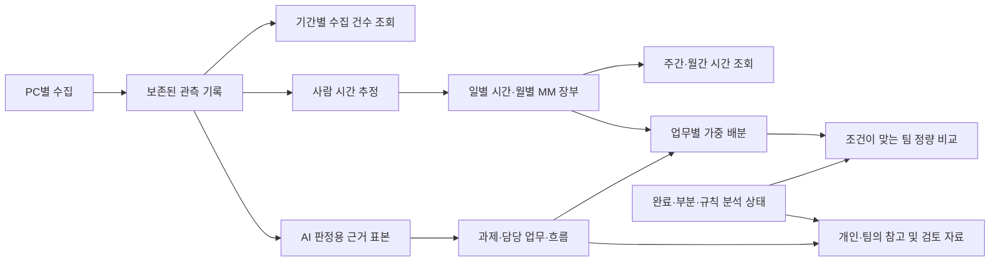

# LM25 목적 기반 재설계

2026-09-13 · v25.2. 사용자 지시에 따라 구조를 다시 검토하고 목적을 해치는 경계를 우선 교체했다. 제품 변경은 `LoadMonitor25/`에 한정한다. 원본 수집기와 사용자가 보관한 CSV·설정·보고서 형식은 계속 읽는다.

## 프로젝트가 제공해야 하는 결과

**여러 사내 PC의 업무 흔적을 보존하고, 개인과 팀의 실제 담당 업무·투입 추정·업무 흐름을 설명해 AI 적용 과제를 검토하는 도구**다.

원본 LM20 풀패키지, 보완2, 팀보완툴과 `D:\배포\LoadMoitor_tool\handover.md`를 직접 대조했다. 사용자에게 우선순위를 물었으며, 별도의 우선순위 지정이 없는 동안 이 목적을 작업 기준으로 사용했다.

1. 설치·네트워크 제약이 있는 Windows PC에서 내장 Python과 BAT로 실행하고 수집 실패를 진단한다.
2. PC A에서 모은 자료를 PC B로 옮겨 계속 모으고, 마지막 PC에서 한 사람의 근거를 합친다. 겹치는 기록은 한 번만 센다.
3. 어느 기간의 자료를 얼마만큼 확보했는지, 어디가 비었는지 확인한다. 수집 건수·PC 가동·사람 시간 추정·MM의 뜻을 구분한다.
4. 업무 성격 → 과제 → 실제 담당 업무를 읽고 활동 유형을 별도 축으로 확인한다.
5. 사용자가 과제 지정, 잘못된 귀속 제외, 별칭·병합 원복으로 결과를 교정할 수 있다.
6. 담당 업무의 역할·일의 순서·근거·Agent 활용 가능성을 읽어 AX 과제 기획에 사용한다.
7. 부분 실패가 나도 이미 모은 자료·성공한 기간·작성된 리뷰를 보존하고 필요한 단계만 회복한다.
8. 팀장은 사람·과제·담당 업무를 비교하고 참고 자료를 읽으며, 서버가 없는 곳에도 한 장 보고서를 공유할 수 있다.

직접 참조한 ZIP:

- [LM20 원본](<D:/배포_gpt/LoadMonitor20_풀패키지_20260825_0551 - 복사본.zip>): README의 다중 PC·업무 분류·보고서·MM 설명, `ui/app.py`의 수집량 추이.
- [보완2](D:/배포_gpt/LoadMonitor_보완2_20260901.zip): 기존 자료 재사용, 담당업무 흐름, 교정·원복, 실패 복구.
- [팀보완툴](D:/배포_gpt/LoadMonitor_팀보완툴_20260901.zip): 팀 업무 매핑·역할·단계·참고 보고서.

LM20은 추이에서 수집량을 셌지만 보완2는 판정 표본과 하루 파일 8건 상한을 명시했다. 이 상한을 GPT가 처음 발명한 것은 아니다. 문제는 이 정책의 목적과 사용자가 보려는 숫자를 구분하지 않고 계속 유지한 것이다. v25.1 이후 활동량은 전체 수집 기록으로 복구했고, AI 표본은 별도 지표로 남긴다.

## 새 책임 구분

### 1. 관측 기록

수집된 파일·메일·일정·커밋·Teams·수동 기록은 그 자체로 관측 자료다. 업무로 확정되지 않아도 조회할 수 있어야 한다. 창 샘플러의 반복 관측은 사건 건수와 단위가 달라 따로 표시한다.

- 기간 조회는 분석·AI 실행 없이 읽기 요청으로 수행한다.
- 현재 PC와 추가 PC, 파일 스냅샷과 관측 이력에 같은 사건이 있으면 중복 제거한다.
- 파일이 한 시각에 몰려도 건수는 보존한다. 사람이 그만큼 일했다는 뜻은 아니므로 몰림을 알린다.
- `ui/app.py`의 `activity_payload()`·`renderActivity()`는 수집 조회만 맡는다. 저장된 업무 MM을 이 요청으로 다시 계산하지 않는다.

### 2. 사람 시간 추정과 장부

관측된 PC 가동과 사람의 근무 추정은 서로 다른 값이다. 파일 개수나 AI 문장 수가 근무시간을 만들면 안 된다.

- 구간이 있다는 이유만으로 해당 날짜가 완전히 관측됐다고 판단하지 않는다. 일별 PC 총량 중 구간으로 설명되지 않는 잔여를 따로 기록한다.
- 부분 구간을 추가해도 기존 일별 하한 추정이 갑자기 축소되지 않도록 집계 기록과 구간의 완전성을 구분한다. 잔여 시간의 위치를 가짜 구간으로 채우지 않는다.
- 명백한 솔버 결과와 명시된 기계 산출은 업무 맥락으로 보존한다. 산출물 개수 39→40 같은 경계가 사람 시간의 유무를 뒤집지 않게 한다. 사람의 전경 활동·회의·수동 기록은 별도 근거다.
- `mm_meta_<기간>.json`의 `day_hours`, `mm_months`, `total_mm`을 저장된 시간 장부로 사용한다. 신호를 모두 제외한 재산정은 빈 일별 장부와 0시간을 실제로 저장한다.

### 3. 기간별 리뷰

새 `core/review_basis.py`는 장부를 읽어 주·월·전체 기간으로 투영하는 순수 계산 모듈이다. 수집기·AI를 호출하지 않는다.

- 날짜·유한한 비음수 시간·월 분모·월/전체 합계를 검증한다.
- 주가 두 달에 걸치면 각 달의 저장된 MM 기준으로 합친다. 부분월도 달력 전체 월 분모를 유지한다.
- 반올림 오차를 해당 월의 일별 비중에 나누어 주간 합과 월간 합이 같은 저장 총량으로 모이게 한다.
- 메타데이터가 없거나 서로 모순되면 미확인으로 표시한다. 월마다 1 MM을 만드는 달력 기반 대체 계산은 제거한다.
- 과제의 신호 비중은 근거 비중으로 표시한다. 이 비중에 달 길이를 곱해 과제 MM이라고 표시하지 않는다.
- 시간이 있지만 판정 신호가 없는 달도 시간 장부에서 확인할 수 있다.

### 4. 완료 상태와 게시

자료의 존재, AI 판정 완료, 시간 산정 가능, 팀 비교 가능은 별개의 조건이다.

- `teamup.make_payload()`는 해당 기간의 판정 기록과 같은 기간 실행 기록을 산출물과 함께 읽고 변조 여부를 재검증한다.
- `member.analysis_status`로 `complete`, `partial`, `rule_only`, `unknown`을 구분한다. 알려진 `partial`·`stub`는 팀에도 전달한다.
- 의도적으로 AI를 사용하지 않은 규칙 분석을 AI 실패로 처리하지 않는다. 기록이 없는 구판을 확인된 완료라고 쓰지도 않는다.
- 원문 실행 로그·프롬프트는 전송하지 않고 상태 요약만 게시한다. 게시 중 상태 원본이 바뀌면 묶음을 채택하지 않는다.
- 전송 세대 ID와 분석 실행 ID는 다르다. 이번 변경만으로 모든 단계가 같은 AI 실행에서 생성됐음이 증명되지는 않는다.

### 5. 팀의 비교와 참고

정량 비교 조건과 내용 열람 조건을 분리한다.

- 기존 비교 사유·MM·순위·후보 합계 규칙은 유지한다.
- 새 참고 흐름은 알려진 구성원의 자기 기간 JSON에서 읽는다. 다른 비교 기간, 설정 차이, 측정 부족, 부분 결과와 검토 초안도 소유자·원래 기간·사유와 함께 읽는다.
- 참고 자료에는 역할·단계·근거·설명을 제공한다. MM이나 후보 순위의 입력으로 전달하지 않는다.
- 소유자 이름이 같아도 구성원 ID와 자료 위치로 내부 항목을 구분한다.
- 손상·파일과 본문 기간 불일치·스텁은 사유를 알린다. 등록되지 않은 옛 HTML을 임의로 팀 구성원 자료에 연결하지 않는다.

## 사용자 흐름과 검증 기준

| 흐름 | v25.2에서 확인할 계약 |
|---|---|
| 수집만 한 뒤 지난 1~9월 조회 | AI 없이 전체 기간·추가 PC·중복 제외 수치 확인 |
| PC 이동 후 과거 자료에 부분 구간 추가 | 원자료 보존, PC 하한 급감 방지, 위치 미상 잔여 표시 |
| 사람이 없는 해석 실행 결과가 1/39/40개 | 수집량은 변하지만 사람 시간은 파일 개수 임계값으로 바뀌지 않음 |
| 같은 시간 장부에서 과제·신호 비중 변경 | 시간/MM 총량 유지, 근거 비중만 변경 |
| 월말~다음 달 초 주간 리뷰 | 주간 합=월간 합=저장된 전체 MM, 신호 없는 시간도 보존 |
| 신호는 있지만 시간 장부가 없음 | 근거는 열람 가능, 시간은 미확인으로 표시 |
| AI 1/400 판정 후 실패 | 부분 완료를 개인·게시·팀 비교까지 유지, 결과 참고 열람 |
| 이전 성공 결과를 보존한 채 일부 단계 실패 | 기존 전송 묶음 보존, 실패/부분 상태를 정상 완료로 승격하지 않음 |
| 팀원 비교 가능 0명·참고 흐름 존재 | 정량 합계는 제외하면서 업무 내용은 열람 가능 |
| 같은 이름 두 사람의 참고 자료 | 소유자·기간 표시와 별도 내부 항목 유지 |

합성 회귀와 정적 검사는 회사 Outlook·Copilot·공유망의 실동작 시험을 대신하지 않는다. 최종 실행 개수·로그·패키지 검증은 별도의 완료 기록에 남긴다.

## 후속 구조 작업

다음은 아직 구현 완료로 표시하지 않는 항목이다.

1. **분석 실행 전체의 식별자:** 단계별 입력 해시·설정·코드 버전과 `analysis_run_id`를 공통으로 전달하고, 같은 기간의 서로 다른 실행 산출물도 구분하는 방식.
2. **팀 비교 기간의 명시적 선택:** 현재 포인터뿐 아니라 보존된 전송 세대에서 팀장이 공통 기간과 구성원을 선택하는 방식. 최신 기간 한 사람의 업로드가 기본 비교 기간을 바꾸는 기존 동작이 남아 있다.
3. **정식 구성원 식별:** 표시 이름·경로와 별개로 동명이인·개명을 처리하는 조직 ID 등록.
4. **추가 참고 자료:** HTML-only 구판·미등록 자료·다른 기간 Agentic 설명을 사유와 출처를 확인하면서 불러오는 절차.
5. **범용 파일 생성원:** `.csv`·`.txt`·`.dat`처럼 사람이 쓰기도 하고 기계가 만들기도 하는 파일은 확장자만으로 결론내리지 않는다. 생성 과정과 전경 활동을 연결하는 추가 관측이 필요하다.
6. **실환경 대조:** 대표 업무의 수기 시간, 실제 PC 가동 자료, 회사 계정 수집 범위와 비교해 추정 편향을 측정한다.

이번 재설계는 원래 사용자 흐름을 유지하며 관측·산정·판정·게시·참고의 경계를 실제 코드로 분리한 단계다. 모든 저장 형식과 모든 화면을 처음부터 교체했다는 의미는 아니다.
